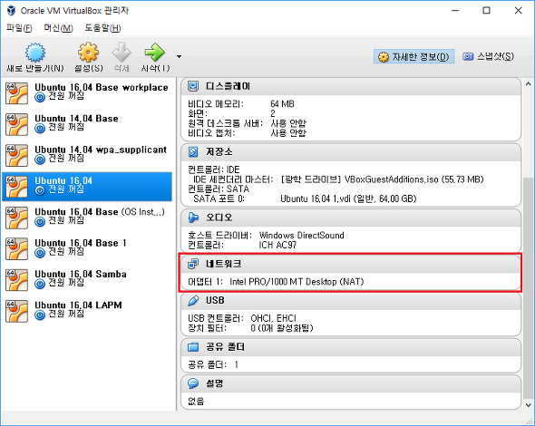
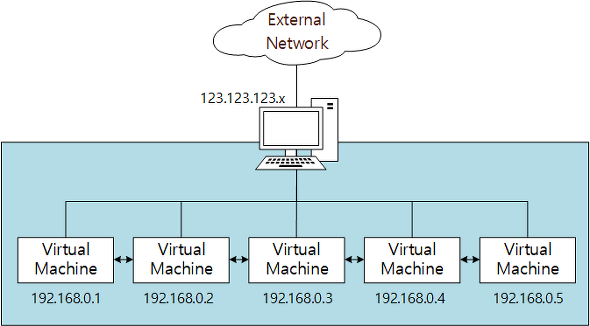
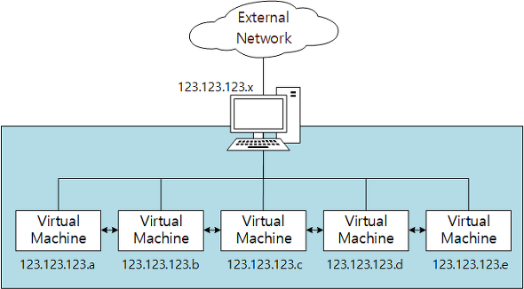
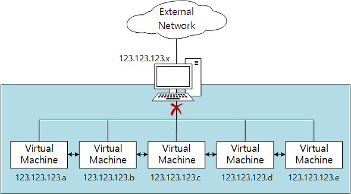
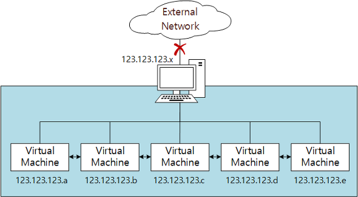

# Virtualbox 가상 네트워크 설정하기

<https://technote.kr/213>

- 매뉴얼에 따르면 가산 머신당 총 8개까지 가상 네트워크(가상 PCI 이더넷 카드) 생성 및 설정이 가능
- 4개는 설정 화면을 통해서 가능하고 나머지는 VboxManage command를 통해서 가능

가상 네트워크를 설정하기 위해서는 다음의 것들을 정해야 한다.

- 어떤 하드웨어를 통해 가상화할 것인가. : PC에 설치된 Ethernet 카드 중 어떤 카드를 통해 가상화하여 네트워크를 사용할 것인지 정한다.
- 어떤 가상화 모드로 설정할 것인가. : 설정가능한 6개의 가상화 모드 중 어떤 것을 사용할 것인지 정한다. 기본으로는 NAT가 설정되어 있다.

>> (참고로 VirtualBox의 네트워크라는 표현을 사용하기는 하였지만 정확히 말하면 virtualbox manual에서 볼 수 있듯이 virtual networking, 즉  virtualbox의 가상 네트워킹이다.)

우선 기본적으로 아래와 같이 NAT로 설정되어 있다.
> 처음 화면에서 확인할 수 있는 기본 설정

이를 변경하기 위해서 설정하기 원하는 가상 머신을 선택한 후 (위에서는 Ubuntu 16.04가 선택) "머신 > 설정 > 네트워크"를 선택한다.

- 연결되지 않음
- NAT
- NAT 네트워크
- 브리지 어댑터
- 내부 네트워크
- 호스트 전용 어댑터
- 일반 드라이버

## "연결되지 않음"

해당 모드는 네트워크 카드는 존재하지만 마치 케이블을 꼽지 않은 것과 같이 연결하지 않은 것과 같이 동작하는 것이다.

## NAT (Network Address Translation)

- 가상머신 내부 네트워크 -> Host PC 외부 네트워크 단방향 통신 가능
- Host PC 내의 가상 머신 간의 통신 불가능

해당 모드는 기본 선택사항으로 가상 머신 내에서 단순히 인터넷 사용이나 파일 다운로드와 같은 용도로만 사용할 경우 설정이 가능하다. 가상 머신 내에서는 자체 사설 IP 주소를 사용하지만 실제 외부로 나갈 때는 Host PC가 가진 IP 주소를 바꿔 달고 나가게 된다. Host PC의 외부 네트워크에서는 내부의 가상 머신에 접근 불가능하다. (일반적으로 통용되는 NAT의 개념을 적용한 부분이라 자세한 설명은 넘어간다.)

즉, 아래 그림과 같이 NAT 모드일 경우 192.168.0.1의 주소를 사용하는 가상 머신은 외부 네트워크와 통신할 때 123.123.123.x 주소를 달고 외부와 통신하게 된다. 반면 192.168.0.x 의 주소를 가진 다른 가상 머신들과는 통신이 불가능하다.

## NAT Network

- 가상머신 내부 네트워크 -> Host PC 외부 네트워크 단방향 통신 가능
- Host PC 내의 가상 머신 간의 통신 가능

해당 모드는 NAT와 거의 동일하지만 Host PC 내의 가상 머신끼리 통신이 가능하다는 점이 다르다. 가상 머신 간에 상호 통신이 필요한 작업이 있다면 해당 모드를 사용해야 한다.

NAT Network의 경우는 아래 그림과 같이 NAT 와 다 동일하지만 192.168.0.x 의 주소를 가진 다른 가상 머신들과도 통신이 가능하다는 점이 다르다

## 브리지 어댑터 (Bridged Adapter)

- Host PC와 동등한 수준의 네트워크 구성
- 추가의 IP 할당이 필요함

해당 모드는 가상 머신의 네트워크를 Host PC 와 동등 수준으로 구성할 수 있게 해준다. 즉, 예를 들어 Host PC의 네트워크가 192.168.0.2로 설정이 되어 있다면 가상 머신의 네트워크 또한 192.168.0.4 정도로 같은 네트워크로 설정할 수 있는 것이다. 근데 잘 생각해 보면 실제 물리적인 네트워크 인터페이스는 Host PC의 Ethernet 카드 하나밖에 없다. 그렇다면 어떻게 Host PC와 가상 머신의 네트워크를 구분해 내는 것일까. VirtualBox 의 Manual에 따르면 소위 "net filter"라 불리는 Host PC의 network device driver를 사용하여 구분해 낸다고 한다. 해당 net filter를 통해 가상 머신은 자신의 data를 Host PC의 네트워크 카드로 부터 분리해내고 삽입하기도 한다.

브리지 어댑터의 경우 아래 그림과 같이 물리적으로는 Host PC 내에 존재하지만 Host PC의 주소와 동등한 수준의 별도의 주소를 가지고 외부와 통신한다.

## 내부 네트워크 (Internal Network)

- Host PC와 독립적인 내부 네트워크
- 같은 Host PC 내의 가상 머신 간 연결이 가능

해당 모드는 브리지 어댑터와 많은 부분에서 유사하지만 가장 큰 차이점으로 외부와 통신이 되지 않는다는 점이 있다. 즉, Host PC의 네트워크와 분리되어 있고, Host PC 내 가상 머신 간에만 상호 연결하여 통신이 가능하다. Host PC의 물리적인 네트워크 인터페이스와 연결되어 있지 않다.

아래 그림과 같이 내부 네트워크는 Host PC 네트워크와 분리되어 있고, 가상 머신 간에만 통신이 가능하다.

## 호스트 전용 어댑터 (Host-only Adapter)

- Host PC를 포함한 내부 네트워크 (외부 네트워크와는 단절)
- 같은 Host PC 내의 가상 머신 간 연결이 가능

해당 모드는 "브리지 어댑터"모드와 같이 Host PC와 내부 가상 머신들과 통신이 가능하고, "내부 네트워크"모드와 같이 외부 네트워크와는 통신이 불가능하다. Host PC의 물리 네트워크 어댑터외에 별도의 Loopback 어댑터를 생성하여 해당 어댑터를 통해 통신한다.

호스트 전용 어댑터의 경우는 아래 그림과 같이 외부 네트워크가 단절되어 있다.

## 일반 드라이버 (Generic Driver)

- 거의 사용되지 않는 모드
- UDP Tunnel networking과 VDE(Virtual Distributed Ethernet) 지원

참고로 아래 6개 종류의 Ethernet card만 위의 가상화 모드 설정이 가능하다.

- AMD PCNet PCI II (Am79C970A)
- AMD PCNet FAST III (Am79C973, the default)
- Intel PRO/1000 MT Desktop (82540EM)
- Intel PRO/1000 T Server (82543GC)
- Intel PRO/1000 MT Server (82545EM)
- Paravirtualized network adapter (virtio-net)
