# Virtualbox 네트워크 설정 상세 분석

1. 서론
2. 네트워크 옵션
    2.1 내부 네트워크
    2.2 NAT
    2.3 NAT 네트워크
    2.4 호스트 전용 어댑터
    2.5 브릿지 네트워크

## 1. 서론

VirtualBox에 가상 이미지를 세팅하다 보면 다음과 같이 네트워크 설정을 해야 하는 상황을 맞이한다.

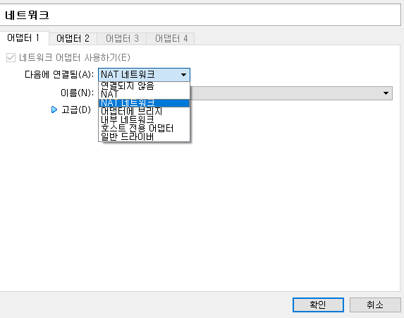

가상 이미지 마우스 오른쪽 버튼 -> [설정] -> [네트워크] 탭
보통 VirtualBox를 세팅하는 다른 포스트 강좌들을 보면 NAT를 사용하여 포트 포워딩하는 경우도 있고

- [2018/11/28 - [ETC] - [VM] Virtualbox 포트포워딩 & 호스트 네트워크 설정](https://cjwoov.tistory.com/3)

위 포스트처럼, 필자가 예전에 작성했던 글 처럼 호스트 네트워크를 설정하는 방법 등 다양한 방법이 있다.

VirtualBox 네트워크는 매우 유연하다고 할 수 있다.

이러한 유연한 네트워크 구성으로, 사용자는 자신이 원하는 네트워크 옵션을 선택하여 원하는 환경을 구축할 수 있다.

<table>
<tr><td>네트워크 옵션 별 관계</td><td>게스트->호스트</td><td>게스트<-호스트</td><td>게스트1<->게스트2</td><td>게스트->인터넷</td><td>게스트<-인터넷</td></tr>
<tr><td>호스트 전용 어댑터</td><td>O</td><td>O</td><td>O</td><td>X</td><td>X</td></tr>
<tr><td>내부 네트워크</td><td>X</td><td>X</td><td>O</td><td>X</td><td>X</td></tr>
<tr><td>브릿지 네트워크</td><td>O</td><td>O</td><td>O</td><td>O</td><td>O</td></tr>
<tr><td>NAT</td><td>X</td><td>포트포워딩</td><td>X</td><td>O</td><td>포트포워딩</td></tr>
<tr><td>NAT 네트워크</td><td>X</td><td>포트포워딩</td><td>O</td><td>O</td><td>포트포워딩</td></tr>
</table>

내 OS가 Windows고 가상 OS를 Ubuntu라고 가정하면 Windows가 호스트, Ubuntu가 게스트라고 이해하면 된다.
(게스트1, 게스트 2는 가상 OS를 2개 설치했다고 이해하면 된다)

네트워크 옵션 별 호스트, 게스트, 인터넷과 통신 할 수 있는 관계를 정리하면 위의 표와 같다.

## 2. 네트워크 옵션

### 2.1 내부 네트워크

#### 개요

 VirtualBox는 게스트 내에 네트워크 인터페이스를 생성한다.

만약 게스트가 여러 개라면 동일한 인터페이스(192.168.0.1)를 공유하고, 스위치처럼 연결되어있고 서로 통신도 가능하다.

#### 장점

- 사용하기 쉽다. 설정할 것이 거의 없다.
- VirtualBox 가상 호스트 네트워크 인터페이스(장치 + 드라이버)가 필요 없다.
- 게스트끼리 서로 접근이 가능하다.
- 안전하다. (바깥쪽에 있는 호스트에서 접근이 불가능하다)

#### 단점

- 호스트에서 게스트들로 접근이 불가능하다.
- 게스트들은 역시 호스트로 접근이 불가능하다.
- 게스트들은 인터넷에 접근이 불가능하다.
- VirtualBox 내부 DHCP 서버는 GUI를 지원하지 않고 오직 CLI만 지원한다.

#### 설정 예시

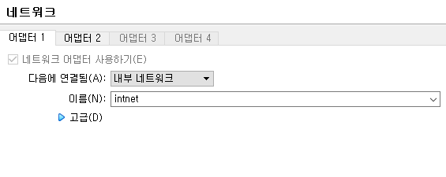

### 2.2 NAT

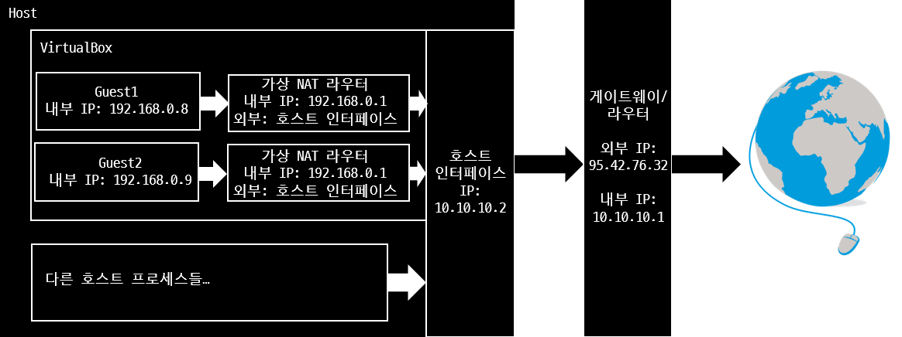

#### 개요

VirtualBox는 게스트 내부 네트워크 인터페이스에 하나의 독립된 가상 NAT 라우터를 생성한다.
각각 게스트들은 자기 자신의 가상 라우터를 가지고 다른 게스트는 접근하지 못한다.
인터페이스에 대한 DHCP 요청에 대한 응답은 게스트의 IP 및 게이트웨이인 NAT 라우터 주소가 된다.
DHCP 서버는 CLI를 통하여 설정될 수 있다. NAT 라우터는 호스트 네트워크 인터페이스를 사용한다.

VirtualBox 네트워크 인터페이스를 따로 만들 필요 없고, 외부의 요소들은 오직 하나의 호스트 인터페이스만 바라본다.
NAT 라우터는 호스트 인터페이스 쪽으로 포트를 개방할 수 있다.
(호스트의 특정 포트에 대한 요청을 게스트에게 전달할 수 있도록 포트 포워딩을 할 수 있다)

#### 장점

- 사용하기 쉽다. 설정할 것이 거의 없다.
- 독립되어있다. 각각 게스트들은 자기 자신의 가상 라우터를 가진다.
- VirtualBox 가상 호스트 네트워크 인터페이스(장치 + 드라이버)가 필요 없다.
- 인터넷에 접근 가능하다.
- 고정 IP가 가능하다.

#### 단점

- 게스트끼리 서로 접근이 불가능하며 호스트에도 접근 할 수 없다.
- 가상 NAT 라우터는 오직 CLI로 설정이 가능하다.
- 호스트로부터 게스트에 접근하기 위해서는 포트포워딩이 필요하다.

#### 설정 예시

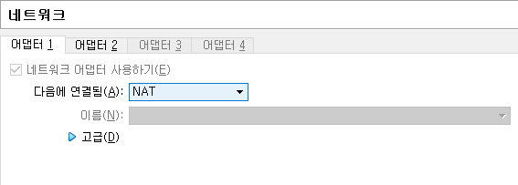

### 2.3 NAT 네트워크

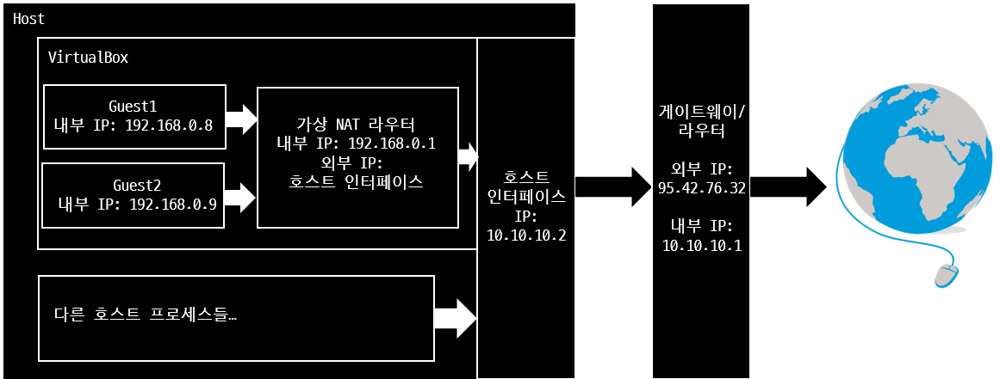

#### 개요

VirtualBox는 게스트 네트워크 인터페이스에 모든 게스트들이 사용 가능한 가상 NAT 라우터를 생성한다.
즉, 각각 게스트들은 서로 접근이 가능하다.
인터페이스에 대한 DHCP 요청에 대한 응답은 게스트의 IP 및 게이트웨이인 NAT 라우터 주소가 된다.
DHCP 서버는 CLI를 통하여 설정될 수 있다. NAT 라우터는 호스트 네트워크 인터페이스를 사용한다.

VirtualBox 네트워크 인터페이스를 따로 만들 필요 없고, 외부의 요소들은 오직 하나의 호스트 인터페이스만 바라본다.

NAT 라우터는 호스트 인터페이스쪽으로 포트를 개방할 수 있다.
(호스트의 특정 포트에 대한 요청을 게스트에게 전달할 수 있도록 포트 포워딩을 할 수 있다)

#### 장점

- 게스트끼리 서로 접근 가능하다.
- DHCP 서버는 GUI를 통해 설정 가능하다.
- VirtualBox 가상 호스트 네트워크 인터페이스(장치 + 드라이버)가 필요 없다.
- 인터넷에 접근 가능하다.
- 고정 IP가 가능하다.

#### 단점

- 호스트로부터 게스트에 접근하기 위해서는 포트포워딩이 필요하다.
- 추가적인 VirtualBox 네트워크와 DHCP 설정이 필요하다.

#### 설정 예시

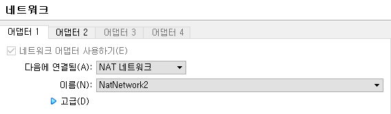
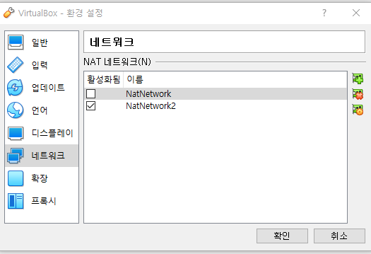
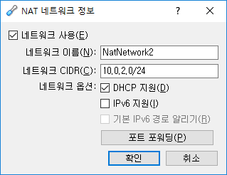
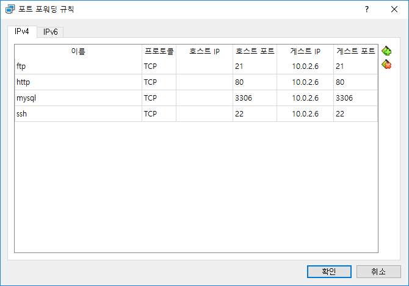

### 2.4 호스트 전용 어댑터

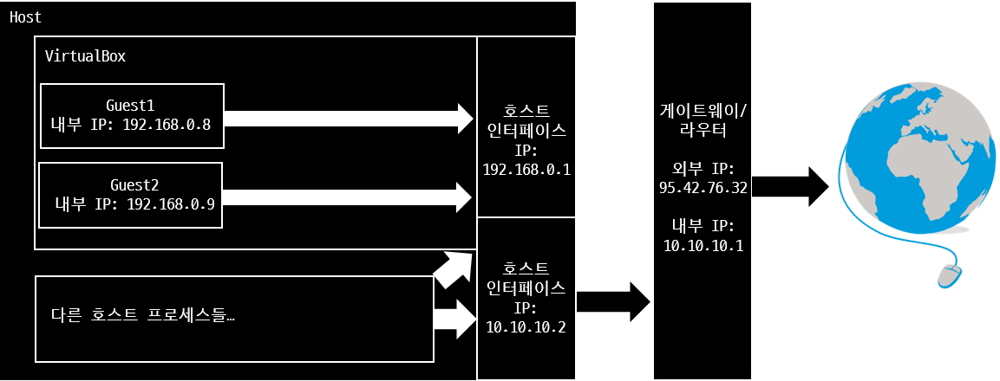

#### 개요

VirtualBox는 호스트 인터페이스(호스트에게 보이는 가상 장치)를 생성한다. 이 인터페이스는 게스트 간에 공유될 수 있다.
게스트는 서로 접근이 가능하며 인터페이스에 대한 DHCP 요청에 대한 응답은 게스트의 IP 및 호스트 전용 어댑터의 주소가 된다.

DHCP 서버는 VirtualBox GUI를 통해 설정이 가능하며 가상 호스트 인터페이스는 호스트 밖에서는 보이지 않는다.

게스트는 이 가상 호스트 네트워크 인터페이스를 통해 인터넷에 접근 할 수 없다.
호스트는 포트 포워딩을 하지 않아도 게스트의 IP를 통해 접근 할 수 있다.

#### 장점

- 게스트끼리 서로 접근 가능하다.
- 분리된 게스트 네트워크 구축이 가능하다.
- DHCP 서버는 GUI를 통해 설정 가능하다.
- 고정 IP가 가능하다.

#### 단점

- 추가적인 VirtualBox 네트워크와 DHCP 설정이 필요하다.
- 인터넷 접근이 불가능하다.

#### 설정 예시

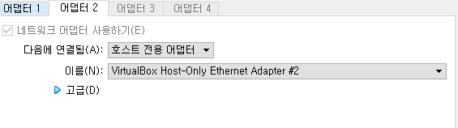
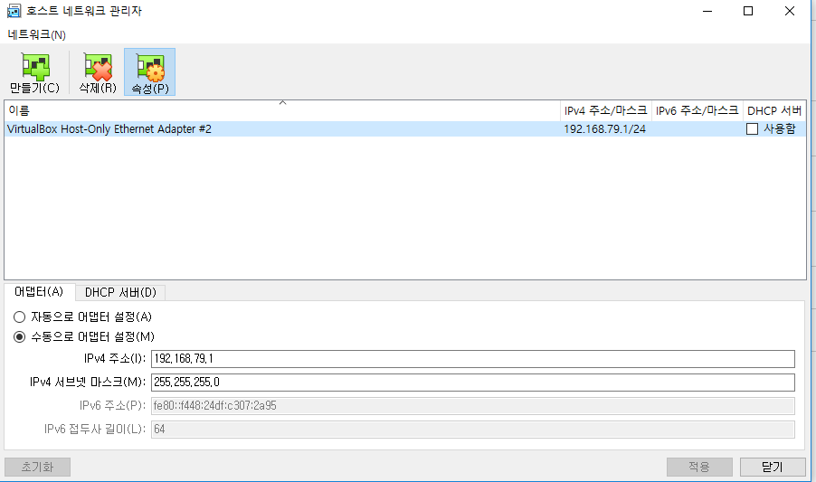

### 2.5 브릿지 네트워크

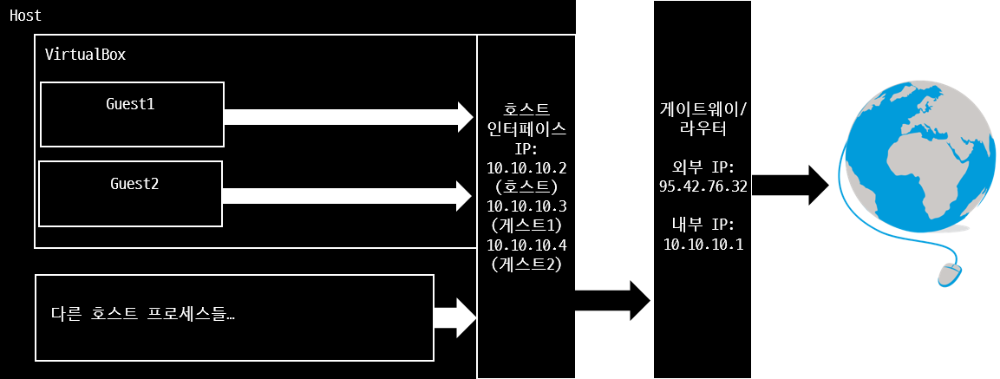

#### 개요

게스트는 호스트 인터페이스를 사용한다.
호스트 인터페이스에서 Net 필터 드라이버가 적용되어 VirtualBox가 게스트에 데이터를 보낼 수 있다.
이를 위해서는 어댑터에 의해 사용되는 무차별 모드가 필요하다.
(무차별 모드는 어댑터가 여러 MAC 주소를 가질 수 있음을 의미한다)

대부분의 무선 어댑터는 이 기능을 지원하지 않는데 이러한 경우에는 VirtualBox는 어댑터에서 볼 수 있는 패키지의 MAC 주소를 대체한다.
외부의 DHCP서버가 사용되며 같은 방식으로 호스트는 그것들의 IP의 게이트웨이를 얻는다.

추가적인 설정이 필요 없으며, DHCP 서버가 오직 등록된 MAC(몇몇 회사 네트워크)만 접근이 가능한 경우에는 동작하지 않을 수 있다.
포트 포워딩이 필요하지 않으며 호스트는 게스트의 IP를 통해 접근이 가능하다.
또한 게스트 역시 호스트의 IP를 통해 접근이 가능하다.

#### 장점

- 게스트끼리 서로 접근이 가능하다
- 호스트는 게스트에 접근 가능하며, 반대로 게스트도 호스트에 접근이 가능하다.
- 호스트 네트워크의 어느 누구나 게스트에 접근이 가능하다
- 가상 DHCP 서버가 필요 없다.
- 설정 및 사용이 간단하다.
- 호스트와 동일한 인터넷 접근 권한이 있다.

#### 단점

- 게스트는 분리된 네트워크를 가지지 못한다.
- 회사 네트워크가 인터페이스를 차단하는경우, 외부 DHCP 서버 및 호스트 네트워크 인터페이스에서 패킷을 어떻게 필터링하느냐에 따라 동작하지 않을 수 있다.
- 호스트 네트워크가 변수이기 때문에 고정 IP를 설정하기 쉽지 않다.
- 게스트가 호스트 네트워크에 노출되어있기 때문에 안전하지 않다.

#### 설정 예시

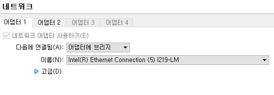
