# VMware 의 네트워크 구성과 연결의 이해

## VMware Workstaion 의 장비 구성

### Network Adapter

- VMware Workstation 의 네트워크의 구성 요소 중 첫 째로 흔히 랜 카드라 불리우는 장치. - VMware Workstation 의 네트워크 어댑터에는 크게 두 가지가 있는데 하나는 가상 머신에 장착된 네트워크 어댑터이고 다른 하나는 호스트 컴퓨터에 가상으로 장착된 네트워크 어댑터

가상 머신의 네트워크 어댑터
호스트 컴퓨터의 네트워크 어댑터

가상 머신의 네트워크 어댑터와 호스트 컴퓨터의 네트워크 어댑터는(VMware 의 네트워크 어댑터) 둘 모두 VMnet Network Switch 에 연결

※ Network Adapter, Ethernet Controller, Ethernet Card, NIC, Network Interface Card, Lan Card 는 모두 동일한 장치를 가르키는 입니다.

### VMnet Network Switch

VMware Workstation 은 내부적으로 VMnet 이라는 총 10 개의 네트워크 스위치를(이하 스위치) 제공(리눅스 버전의 경우 255 개의 네트워크 스위치를 제공합니다.)
흔히 스위치, 스위치 허브, 스위칭 허브라고 부르기도 합니다. 비슷한 기능을 수행하는 장치로는 허브(Hub)

아무튼 VMware 에서는 VMnet 이라는 스위치를 제공하며 스위치의 역할은 컴퓨터들을 서로 연결해주는 장치
가상 머신과 호스트 컴퓨터의 VMware 네트워크 어댑터들은 모두 이 VMnet 스위치에 연결이 됨

VMware 에서는 총 10 개의 스위치 중 세 개의 스위치를 전용 스위치로 설정해 놓았습니다. VMnet0, VMnet1, VMnet8 이 바로 그 전용 스위치들 입니다.

VMnet0 Switch - Bridged 연결을 사용할 때 사용되는 스위치로 호스트의 실제 네트워크 어댑터가 연결이 되어 있습니다.
VMnet1 Switch - Host-Only 연결을 사용할 때 사용되는 스위치로 DHCP Server 와 호스트의 VMnet1 네트워크 어댑터가 연결이 되어 있습니다.
VMnet8 Switch - NAT 연결을 사용할 때 사용되는 스위치로 DHCP 서버와 NAT Server 그리고 호스트의 VMnet8 네트워크 어댑터가 연결이 되어 있습니다.

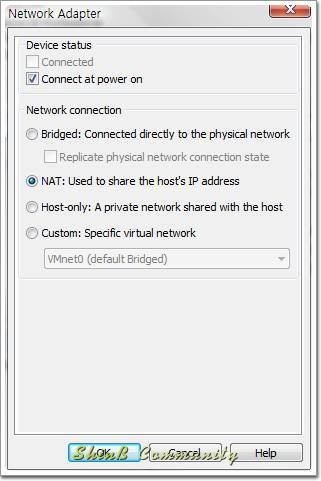

그 외에 VMnet2/3/4/5/6/7/9 스위치가 있으며 이들은 Custom 스위치로써 사용자가 직접 설정하여 사용할 수 있는 스위치입니다.

### DHCP Server

VMware Workstation 은 DHCP Server 를 제공하고 있습니다. DHCP 란 Dynamic Host Configuration Protocol 의 약자로써 동적 호스트 설정 통신 규약을 의미하며 TCP/IP 통신을 실행하기 위해 필요한 설정 정보를 자동적으로 할당, 관리하기 위한 통신 규약

간단하게 우리가 네트워크에 연결하여 인터넷을 하기 위해선 IP 주소와 서브넷 마스크, 게이트 웨이, DNS 주소 등을 모두 설정해 주어야 합니다. DHCP 란 바로 이러한 것들을 자동으로 할당하고 관리하기 위한 규약입니다. 컴퓨터가(DHCP 클라이언트) DHCP 서버에 이러한 것들을 요청하면 DHCP 서버는 자동으로 해당 컴퓨터에 IP 주소와 서브넷 마스크등을 할당해 주는 것

이렇게 연결된 클라이언트들의(컴퓨터) 아이피를 자동으로 할당하고 관리해주는 기능을 DHCP 서버

VMware Workstation 은 이 DHCP 서버를 자체적으로 운용하여 내부의 가상 머신들이 DHCP 를 요구할 때 자동으로 IP 와 같은 네트워크 설정을 할당해 주게 됨

VMware 의 DHCP 서버

이러한 VMware Workstation 의 DHCP 서버는 기본적으로 VMnet1, VMnet8 스위치에 연결이 되어 있음
이러한 DHCP 서버는 필요에 따라 다른 스위치에 더 추가할 수도 있고 제거할 수도 있음

### NAT

- NAT 란 Network Address Translation 의 약자로써 네트워크 주소 변환을 의미
- 기본적으로 192.168.x.x 와 같은 사설(Private) IP 주소로는 외부와 통신(인터넷 연결 등) 할 수 없음
- 외부와 통신할 수 있는 IP 주소는 오직 인터넷 IP 주소 관리 기관에서 공식적으로 발급한 공인(Public) IP 주소

하지만 이러한 제약을 뛰어 넘고자 개발된 기술이 바로 NAT. NAT 는 사설 IP 주소와 공인 IP 주소를 상호 변환해 주는 일종의 변환기
ex) 192.168.0.2 와 같은 사설 IP 주소를 통해 외부로 네트워크 패킷을 보내게 되면 NAT 는 이를 119.200.124.84 와 같은 공인 IP 주소로(현재 연결된 공인 IP 주소) 변환하여 패킷을 내 보냄으로써 외부에선 마치 공인 IP 에서 패킷을 보낸 것처럼 보이게 함
즉, 사설 IP 주소로는 원칙적으로 외부와 통신할 수 없기 때문에 이를 공인 IP 주소로 중간에 변환해 주어 외부와 통신(인터넷 연결) 할 수 있게 해주는 것
NAT 는 장비가 아니라 기능 즉, 프로그램을 의미합니다.
라우터 등에 NAT 기능이 포함되어 있습니다. 흔히 NAT 기능이 포함된 라우터를 NAT 라우터라고 부름

우리가 주변에서 흔히 볼 수 있는 NAT 라우터로는 바로 인터넷 공유기
공유기는 허브/스위치의 역할도 하면서 동시에 NAT 기능을 탑재하여 우리가 하나의 인터넷 회선으로(공인 IP) 다수의 컴퓨터에서(내부 사설 IP) 동시에 인터넷을 사용할 수 있게 해주는 것(공유기에는 DHCP 서버 기능도 내장이 되어 있지요.) NAT 를 가장 쉽게 이해하시는 방법은 NAT = 인터넷 공유기

VMware Workstation 은 이 NAT 라우터를 자체적으로 내장하여 내부 사설망으로 구성된 가상 머신들이 외부와 통신할 수 있게 해 줍니다.
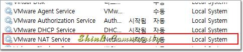

이러한 VMware Workstation 의 NAT 라우터는 VMnet8 스위치에 연결

## VMware Workstation 네트워크 연결의 이해

VMware Workstation 의 네트워크 연결에는 Bridged, NAT, Host-only, Custom 의 총 네 가지 연결

### Bridged Networking

브릿지 네트워킹이란 호스트의 네트워크와 게스트의 네트워크를 브릿지하여(연결하여) 게스트 컴퓨터가 네트워킹 하는 방식
호스트와 게스트를 하나로 연결하여 두 개의 네트워크를 마치 하나의 네트워크처럼 쓰는 것

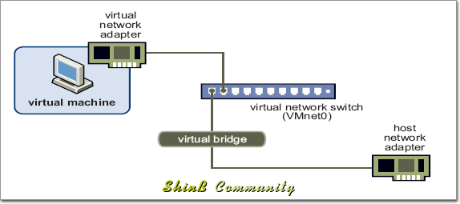

브릿지 네트워킹은 VMnet0 스위치에 게스트 컴퓨터의 네트워크 어댑터와 호스트 컴퓨터의 네트워크 어댑터가 연결되어 서로 브릿지된 상태
이렇게 게스트와 호스트의 네트워크가 브릿지 됨으로써 호스트 네트워크와 게스트 네트워크가 서로 동등한 수준의 네트워크를 제공

호스트와 게스트가 서로 동등한 자격을 가지기 때문에 게스트 컴퓨터에도 호스트 컴퓨터와 같이 공인(Public) IP 를 할당하거나 호스트 컴퓨터가 사설(Private)망에 연결된 경우 호스트와 동일한 IP 대역을 할당
이 때는 반드시 공인이든 사설이든 게스트 컴퓨터에도 할당할 수 있는 여분의 IP 가 존재해야 함

브릿지 네트워킹에서는 보시는 바와 같이 호스트 컴퓨터와 게스트 컴퓨터가 동일한 IP 대역을(192.168.0.x) 사용하는 것을 확인
이렇게 동일한 IP 대역을 할당받기 때문에 외부 네트워크에서는 호스트와 게스트 컴퓨터를 동등하게 바라봄

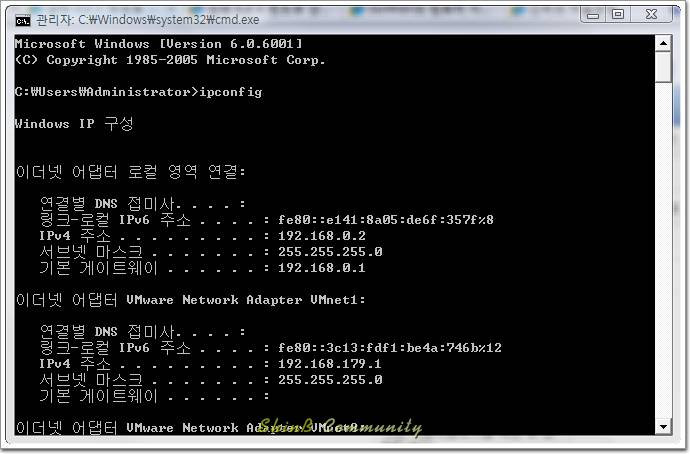

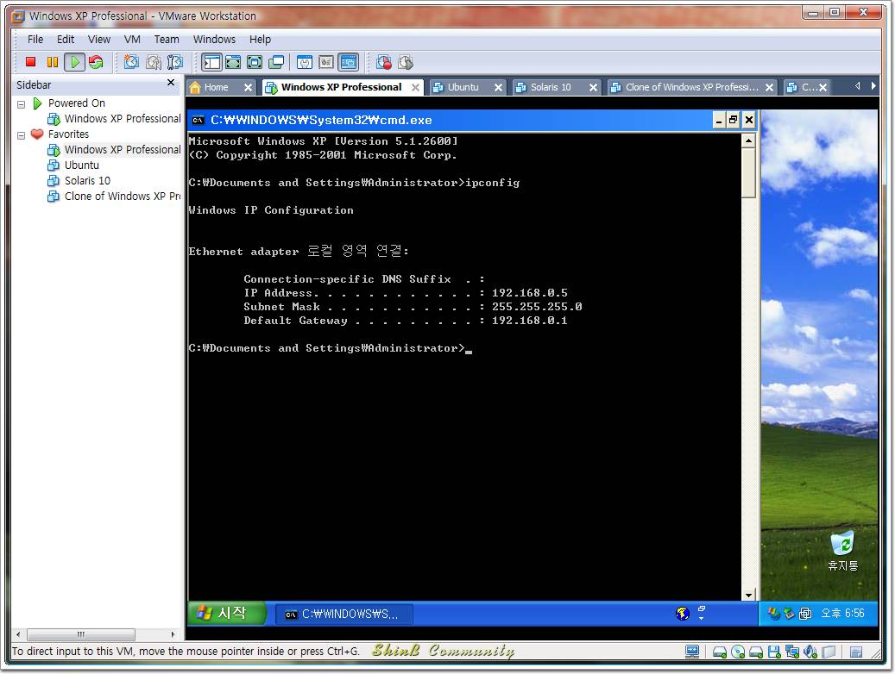

공유기에서는 가상 머신 또한 실제로 존재하는 하나의 컴퓨터로 인식을 하고 있는 모습
이는 비단 공유기 뿐만 아니라 외부의 네트워크에서도 동일하게 인식
즉, 외부의 입장에서는 어떤게 호스트 컴퓨터이고 어떤게 게스트 컴퓨터인지 구별을 할 수 없다는 말
그저 보여지는 그대로 실제로 두 대의 컴퓨터가 돌아가고 있는 것으로 인식을 하게 되는 것

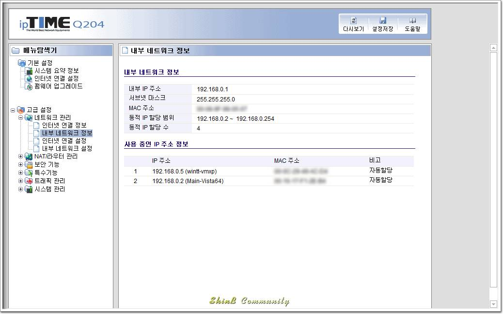

이러한 브릿지 네트워킹을 그림으로 표현하면 아래와 같습니다.
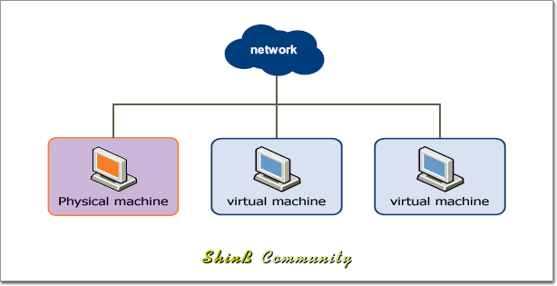

이러한 브릿지 네트워킹은 특성상 외부로 노출이 되기 때문에 외부에서 가상 머신으로 직접 접근하는 것이 가능
네트워크 상에서는 가상 머신도 네트워크에 물려있는 다른 컴퓨터들과 동등한 하나의 컴퓨터라는 것을 인지
그렇기 때문에 사설망에서(공유기 환경 등) 컴퓨터끼리 공유 폴더 등으로 접근이 가능하듯이 가상 머신에도 동일하게 접근이 가능
또한 가상 머신에도 공인 IP 를 할당 할 수 있는 환경이라면 별다른 제약이나 설정없이 바로 가상 머신을 서버로써 구성하는 것이 가능

그래서 브릿지 네트워킹은 서버를 구성할 때 외부와 1차로 연결되는 서버에(방화벽 서버 등) 많이 사용
공유기를 사용하는 가정 환경이라면 공유 폴더의 접근 등 다른 컴퓨터와 동등하게 사용하고자 할 때 사용

### NAT Networking

NAT 네트워킹이란 호스트의 네트워크 아래에 사설망을 꾸며 이 사설망에 가상 머신들을 두는 구조를 가지고 있는 방식
단 이 사설망은 NAT 라우터가 연결되어 있고 이를 통해 사설망 내부의 게스트 컴퓨터들도 외부에(인터넷) 연결하는 것이 가능

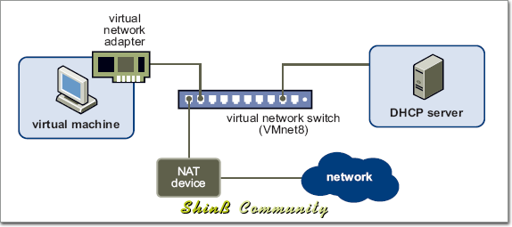

NAT 네트워킹은 VMnet8 스위치에 게스트 컴퓨터의 네트워크 어댑터와 DHCP Server 그리고 NAT 라우터가 연결이 되며 호스트 컴퓨터의 VMnet8 네트워크 어댑터가 이 NAT 라우터에 연결이 되어 있는 상태
NAT 네트워킹은 게스트의 네트워크가 호스트의 하위에 구성되는 방식이기 때문에 호스트의 네트워크와는 다른 IP 대역을 가지고 있음

보시는 바와 같이 호스트 컴퓨터와 게스트 컴퓨터가 서로 다른 IP 대역을(192.168.0.x, 192.168.17.x) 사용하는 것을 확인할 수 있습니다. 이러한 특성상 호스트가 속해있는 네트워크에서는 NAT 네트워크에 속해 있는 가상 머신들에 접근을 할 수 없음.
즉, 외부의 네트워크 상에서 NAT 네트워크에 속해 있는 게스트 컴퓨터들은 보이지 않는 것

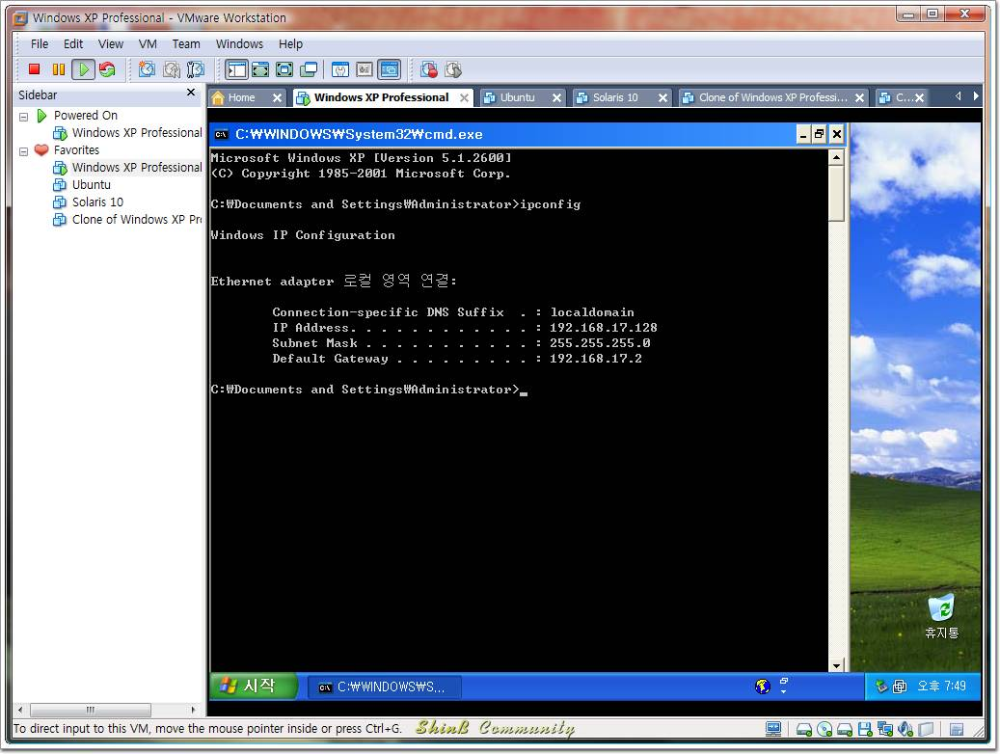

외부의 네트워크에서 NAT 네트워크에 속해 있는 가상 머신에 접속하기 위해선 NAT 의 포트 포워딩을 통해 호스트 컴퓨터를 거쳐야지만 접근
NAT 네트워크에 속해 있는 가상 머신들끼리는 서로 동일한 네트워크에 구성이 되어 있기 때문에 서로 간의 상호 접근은 가능

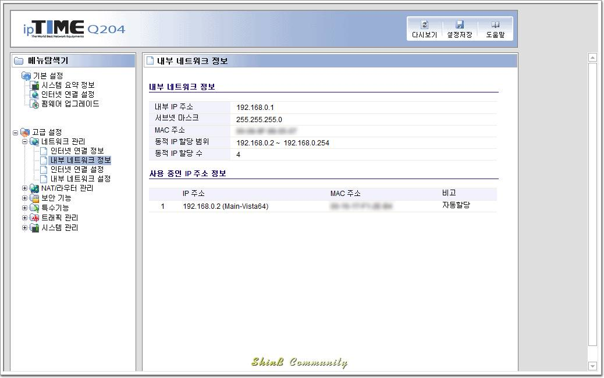

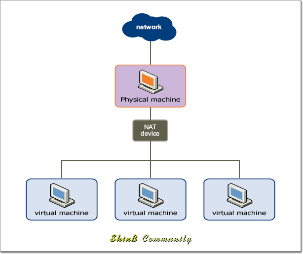

이러한 NAT 네트워킹은 특성상 외부로 노출이 되지 않기 때문에 NAT 의 포트 포워딩을 통하지 않고서는 외부에서 가상 머신으로 접근하는 것이 불가능합니다. 그렇기 때문에 외부에서의 접근을 차단해야 할 필요가 있지만 가상 머신에서도 외부로 접근이 가능해야 할 때 사용할 수 있는 연결 방식
또는 브릿지 네트워킹을 사용할 수 없을 때(추가 IP 를 확보할 수 없을 때) 사용할 수 있는 방식
단순히 인터넷에 연결하고자 할 때는 상관이 없지만 가상 머신에 서버를 구축하고자 할 때는 NAT 설정에서 포트 포워딩 작업을 통해 외부에서 가상 머신으로 접근이 가능하도록 해주어야 함

### Host-only Networking

Host-only 네트워킹이란 호스트의 네트워크 아래에 사설망을 꾸며 이 사설망에 가상 머신들을 두는 구조를 가지고 있는 방식
단 이 사설망은 NAT 네트워킹과는 달리 NAT라우터가 연결되어 있지 않기 때문에 게스트 컴퓨터에서는 호스트 컴퓨터를 제외한 외부로의 연결은 불가능

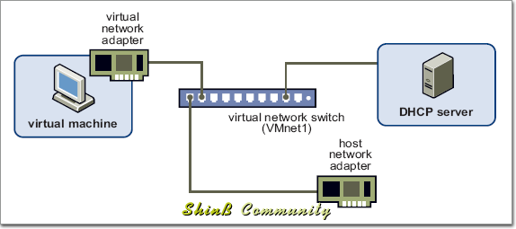

Host-only 네트워킹은 VMnet1 스위치에 게스트 컴퓨터의 네트워크 어댑터와 DHCP Server 가 연결이 되며 호스트 컴퓨터의 VMnet1 네트워크 어댑터가 연결이 되어 있는 상태
NAT 네트워킹은 게스트의 네트워크가 호스트의 하위에 구성되는 방식이기 때문에 호스트의 네트워크와는 다른 IP 대역을 가지고 있음
또한 NAT 라우터가 없기 때문에 Gateway 는 설정되지 않음

보시는 바와 같이 호스트 컴퓨터와 게스트 컴퓨터가 서로 다른 IP 대역을(192.168.0.x, 192.168.179.x) 사용하는 것과 Gateway 가 설정되지 않은 것을 확인

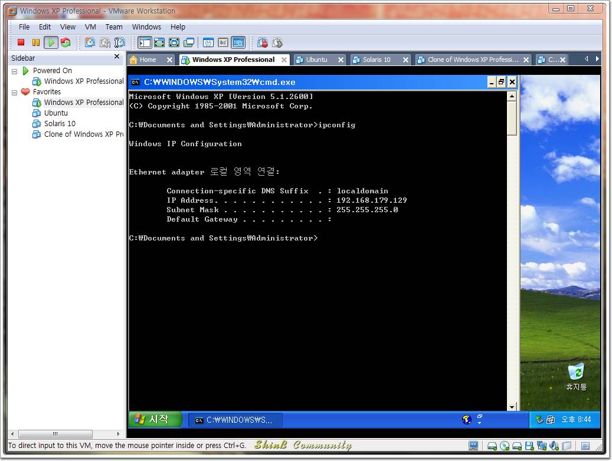

공유기에서 가상 머신을 인식 하지 못하는 모습
외부의 네트워크에서 Host-only 네트워크에 속해 있는 가상 머신에 접근하는 것이 불가능
Host-only 네트워크에 속해 있는 가상 머신들끼리는 서로 동일한 네트워크에 구성이 되어 있기 때문에 서로 간의 상호 접근은 가능

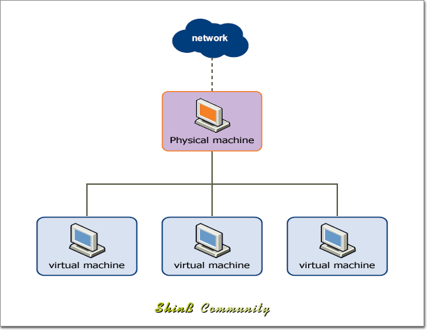

이러한 Host-only 네트워킹은 특성상 호스트를 제외한 외부와 단절된 네트워크가 구성
(호스트와 게스트를 조금 설정해주면 호스트 온리 연결에서도 외부와의 통신은 가능)
내부의 가상 머신들끼리는 접속이 가능
외부에서의 접근을 차단해야 할 필요가 있는 가상 머신을(또는 네트워크를) 구성할 때 주로 사용하는 연결 방식
1차로 외부와 연결된 서버와(방화벽,웹 서버 등) 연동되는 보안을 요구하는 서버들을(웹 서버, DB 서버 등) 구성하는데 사용

### Custom Networking

VMware Workstation 이 기본으로 설정한 세 가지 스위치 VMnet0/1/8 외의 스위치들을 사용하는 네트워킹으로 설정에 따라 Host-only, NAT, Bridged 네트워킹 구성이 가능
VMware 에서는 NAT 나 Bridged 네트워킹은 각각 하나의 스위치에만 설정이 가능하기 때문에 커스텀에서 NAT 나 Bridged 로 설정하는 경우 기본 VMnet0/8 스위치는 Host-only 로 변경
NAT 나 Bridged 를 구성하기 위해서가 아닌 Host-only 네트워크를 추가로 구성하고자 할 때 주로 사용

### 네트워크 연결 방식의 선택

||Bridged|NAT|Host-Only|
|---|:---:|:---:|:---:|
|호스트 -> 게스트 연결|가능|가능|가능|
|게스트 -> 호스트 연결|가능|가능|가능|
|게스트 -> 외부 연결|가능|가능|불가능|
|외부 -> 게스트 연결|가능|제한적 가능(포트 포워딩)|불가능|
|내부 네트워크 연결|가능|가능|가능|
|추가 IP 필요(공인,사설)|필요|불필요|불필요|

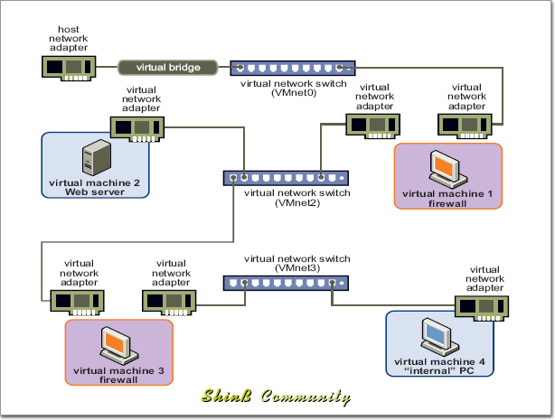