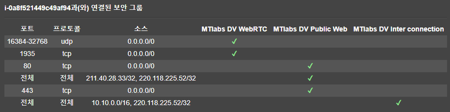
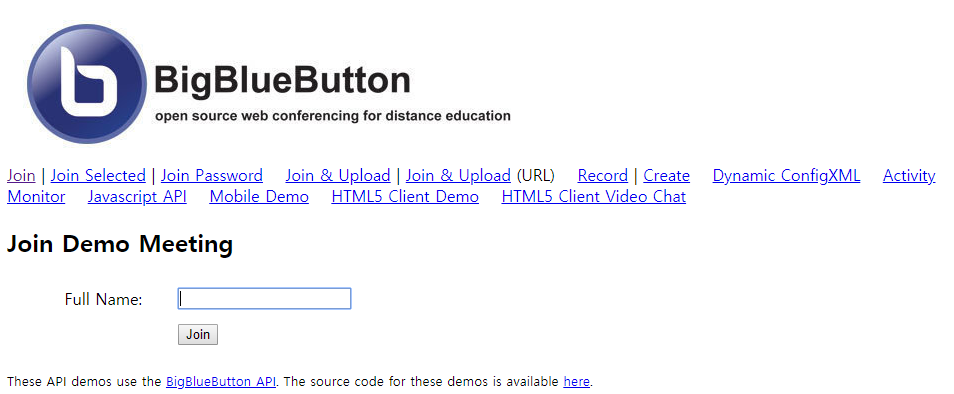
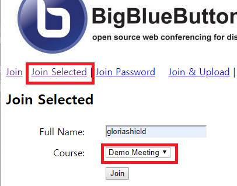
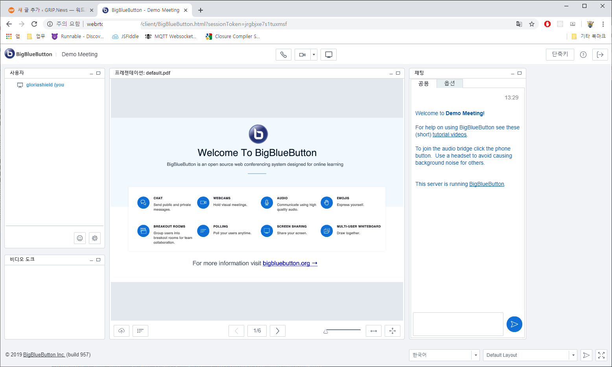

# BBB

<https://grip.news/archives/1215>

BigBlueButton (이하 BBB)는 Open Source 기반 실시간 협업도구로, 채팅 및 캔버스, 화상 및 음성을 공유할 수 있는 매우 유용한 도구다. BBB 는 메신저 또는 웹 서비스 등에 적용할 수 있으며, 해외에서는 교육 및 컨퍼런스에 매우 유용하게 사용하고 있다. 이는 기본적으로 가격이 무료라 부담이 적고, 기본 기능에 충실하기 때문. 주 경쟁상대로 더 우월한(?) Zoom 등이 있지만, 기본적으로 비용을 지출해야 한다는 부담이 있다.

기본적으로 Windows, macOS, Android, iOS 를 지원하고 있고, 일부 Platform 은 기능이 제한될 수 있다.

URL : [BigBlueButton](https://bigbluebutton.org/)

## 아키텍처

nginx, red5, FreeSWITCH, tomcat7, redis 조합으로 구성된 BBB는 HTML5 클라이언트 및 서버를 기반으로 하고 있다. 아쉬운건 Flash Application 을 그대로 사용하고 있기 때문에 보안에 취약하다는 평을 듣고 있다는 것. (이는 BBB 의 보안 문제가 아닌 Flash Player 의 문제다) 이러한 이유로, 상용 서비스를 제공 해야 하는 업체는 BBB 보다는 Zoom 을 사용하는 편이 더 나을지도.

SELF-HOST Install
BBB 를 ‘편하게’ 사용하려면 자체 서버를 구축 해야한다. BBB 서버를 임대하면 제약조건이 많기 때문. 기본적인 설치 조건은 다음과 같다.

- Linux 커널 4.x 기반 uBuntu 16.04 64 Bit
- 4GB 이상의 메모리 (8GB 이상 추천)
- 4개 이상의 CPU 코어 (8개이상 추천)
- TCP 포트 80/443/1935 개방
- 80번 포트는 독립 사용해야함
- SSL 사용시 7443 또는 5066 사용
- UDP 포트 16384~32768 개방

이 글을 작성하는 시점에서의 uBuntu LTS 는 18.04 이지만, BBB 를 ‘편하게’ 설치하려면 16.04 를 사용하는걸 권장한다. 설치 스크립트(https://ubuntu.bigbluebutton.org/bbb-install.sh)를 확인해 보면 16.04 이상이 아닌 16.04 인지 여부를 확인하기 때문. 메모리 부분도 동일하다.

만약 OS 버전이 다르고 메모리 용량이 다르다면 bbb-install.sh 를 로컬에 받아 스크립트를 수정 후 설치하면 된다.

```bash
# We're installing BigBlueButton
need_ubuntu 16.04
need_mem() {
  MEM=`grep MemTotal /proc/meminfo | awk '{print $2}'`
  MEM=$((MEM/1000))
  if (( $MEM < 3940 )); then err "Your server needs to have (at least) 4G of memory."; fi
}
```

## Install on AWS

기본 조건에서 메모리와 OS 버전은 필수다. (CPU 는 체크 조건이 없다) 현행세대에서 적합한 EC2 Instance 는 t3.medium 이며, Storage 는 50GB 면 충분하다. (Production 으로 넘어가면 500GB 라 하지만)

- uBuntu 16.04 LTS
- EC2 t3.medium
- EBS 50GB

기본적인 시스템 LANG Set 은 UTF-8 이어야 한다. AWS 는 UTF-8 이 기본이나, 만약을 위해 확인해 보자.

```bash
root@ip-10-10-102-122:/home/ubuntu# cat /etc/default/locale
#  File generated by update-locale
LANG=en_US.UTF-8
```

운영체제는  uBuntu 16.04 를 추천한다.

```bash
root@ip-10-10-102-122:/home/ubuntu# cat /etc/lsb-release
DISTRIB_ID=Ubuntu
DISTRIB_RELEASE=16.04
DISTRIB_CODENAME=xenial
DISTRIB_DESCRIPTION="Ubuntu 16.04.6 LTS"
```

CPU Core 수는 4 개 이상이나, 동작하는데 큰 지장은 없다.

## SSL 인증서 발급 및 Security Group 설정

SSL 을 사용하려면 반드시 독립형 인증서로 설치해야 하낟. ACM/CloudFlare 는 사용할 수 없다. AWS 의 LB 는 기본적으로 UDP 밸런싱 기능이 없고, CloudFlare 는 반드시 지정된 Port 만 사용해야 하기 때문. 참고로, SSL 을 사용하지 않는다면 Chrome 에서 카메라를 사용한 화상 채팅이 불가하다.



## Host IP 설정

External IP 를 hosts 에 추가하자.

```bash
root@ip-10-10-102-122:/home/ubuntu# vi /etc/hosts
.
.
54.199.236.228 webrtc.mtlabs.org
127.0.0.1 localhost
.
.
```

## 기본 패키지 설치

설치 Shell Script 에서 필요한 패키지를 설치하지만, 경우에 따라 정상적으로 설치가 불가해 오류가 발생하는 경우가 있다. Tomcat 을 위한 haveged 와 디코딩을 위한 ffmpeg 등을 미리 설치하자. dist-upgrade 까지 완료 되면 서버를 재부팅 하자.

```bash
# haveged
root@ip-10-10-102-122:/home/ubuntu# apt-get install haveged
# ffmpeg
root@ip-10-10-102-122:/home/ubuntu# add-apt-repository ppa:jonathonf/ffmpeg-4
root@ip-10-10-102-122:/home/ubuntu# apt-get update
root@ip-10-10-102-122:/home/ubuntu# apt-get install ffmpeg -y
#yq
root@ip-10-10-102-122:/home/ubuntu# add-apt-repository ppa:rmescandon/yq
root@ip-10-10-102-122:/home/ubuntu# apt update
root@ip-10-10-102-122:/home/ubuntu# apt install yq -y
root@ip-10-10-102-122:/home/ubuntu# apt-get dist-upgrade
root@ip-10-10-102-122:/home/ubuntu# sync && reboot
```

## BigBlueButton 설치

패키지 형태로 설치되기 때문에 어렵지 않게 설치가 가능하다. 종속된 패키지 까지 약 2GB 에 달하기 때문에 설치에 적잖은 시간이 소요된다.

```bash
# apt-get key 를 설치한다
root@ip-10-10-102-122:/home/ubuntu# wget https://ubuntu.bigbluebutton.org/repo/bigbluebutton.asc -O- | sudo apt-key add -
# 레파치토리를 추가하자.
root@ip-10-10-102-122:/home/ubuntu# echo "deb https://ubuntu.bigbluebutton.org/xenial-200/ bigbluebutton-xenial main" | sudo tee /etc/apt/sources.list.d/bigbluebutton.list
# 패키지 정보를 업데이트하자
root@ip-10-10-102-122:/home/ubuntu# apt-get update
# bbb 를 설치하자.
root@ip-10-10-102-122:/home/ubuntu# apt-get install bigbluebutton
# 구성을 확인하자.
root@ip-10-10-102-122:/home/ubuntu# apt-get install -f
```

>> 참고 : 설지 중 ttf-mscorefonts-installer 다운로드 실패가 나오는 경우 무시해도 무방하다. uBuntu 의 알려진 이슈

설치가 완료 되면 올바르게 설치되었는지 여부를 검사하자.

```bash
root@ip-10-10-102-122:/home/ubuntu#  bbb-conf --restart
Restarting BigBlueButton 2.0.0 ...
Stopping BigBlueButton
Starting BigBlueButton
** Potential problems described below **
...............
# Warning: found only 2 cores, whereas this sherver should have (at least) 4 CPU cores
# to run BigBlueButton in production.
#
#   http://docs.bigbluebutton.org/install/install.html#minimum-server-requirements
#
root@ip-10-10-102-122:/home/ubuntu#  bbb-conf --check
BigBlueButton Server 2.0.0 (1110)
                    Kernel version: 4.4.0-1079-aws
                      Distribution: Ubuntu 16.04.6 LTS (64-bit)
                            Memory: 3985 MB
/var/www/bigbluebutton/client/conf/config.xml (bbb-client)
                Port test (tunnel): rtmp://10.10.102.122
                              red5: 10.10.102.122
              useWebrtcIfAvailable: true
/opt/freeswitch/etc/freeswitch/sip_profiles/external.xml (FreeSWITCH)
                         websocket: :7443
                    WebRTC enabled: true
/etc/nginx/sites-available/bigbluebutton (nginx)
                       server name: 10.10.102.122
                              port: 80, [::]:80
                    bbb-client dir: /var/www/bigbluebutton
/var/lib/tomcat7/webapps/bigbluebutton/WEB-INF/classes/bigbluebutton.properties (bbb-web)
                      bbb-web host: 10.10.102.122
/usr/share/red5/webapps/bigbluebutton/WEB-INF/red5-web.xml (red5)
                  voice conference: FreeSWITCH
/usr/local/bigbluebutton/core/scripts/bigbluebutton.yml (record and playback)
                     playback host: 10.10.102.122
                            ffmpeg: 4.1.3-0york1~16.04
** Potential problems described below **
# Warning: found only 2 cores, whereas this sherver should have (at least) 4 CPU cores
# to run BigBlueButton in production.
#
#   http://docs.bigbluebutton.org/install/install.html#minimum-server-requirements
#
```

설치과정 또는 패키지에 문제가 있는 경우 오류 개수를 보여주며, 별도 조치가 필요할 수 있다. (대부분 무시해도 무방하며, 실제 사용하며 발생하는 오류에만 적당히 대응해도 무방하다) 위에서는 CPU 성능에 대한 경고만 있다.

## BigBlueButton Demo Package 설치

처음부터 메신저 등에 연결할 것이 아니기 때문에 API 를 테스트 하기 위한 Demo Package 를 설치하자. 웹 서비스로 JSP(Java Server Pages)로 구동된다. 추후 실제 서비스를 개시 하기 전까지 사용하게 된다.

```bash
root@ip-10-10-102-122:/home/ubuntu# apt-get install bbb-demo
root@ip-10-10-102-122:/home/ubuntu# bbb-conf --restart
# Warning: The API demos are installed and accessible from:
#
#    http://10.10.102.122/demo/demo1.jsp
#
# These API demos allow anyone to access your server without authentication
# to create/manage meetings and recordings. They are for testing purposes only.
# If you are running a production system, remove them by running:
#
#    apt-get purge bbb-demo
# Warning: found only 2 cores, whereas this sherver should have (at least) 4 CPU cores
# to run BigBlueButton in production.
#
#   http://docs.bigbluebutton.org/install/install.html#minimum-server-requirements
#
root@ip-10-10-102-122:/home/ubuntu# bbb-conf --check
```

앞서 restart 했을때와 달리 Demo 에 접근할 수 있는 URL 이 보인다.  이제 이 URL 을 통해 테스트가 가능하다.



이제 Public Domain 을 통해 접근할 수 있도록 변경하자. 이 설정은 /etc/nginx 하위 설정에서 직접 변경도 가능하지만, 부가 설정을 함께 변경하려면 명령어를 사용하는게 좋다.

```bash
root@ip-10-10-102-122:/etc/nginx/sites-enabled# bbb-conf --setip webrtc.mtlabs.org
Assigning webrtc.api.mtlabs.org for testing for firewall in /var/www/bigbluebutton/client/conf/config.xml
Assigning webrtc.api.mtlabs.org for rtmp:// in /var/www/bigbluebutton/client/conf/config.xml
Assigning webrtc.api.mtlabs.org for servername in /etc/nginx/sites-available/bigbluebutton
Assigning webrtc.api.mtlabs.org for http[s]:// in /var/www/bigbluebutton/client/conf/config.xml
Assigning webrtc.api.mtlabs.org for publishURI in /var/www/bigbluebutton/client/conf/config.xml
Assigning webrtc.api.mtlabs.org for web application URL in /var/lib/tomcat7/webapps/bigbluebutton/WEB-INF/classes/bigbluebutton.properties
Assigning webrtc.api.mtlabs.org for web application URL in /usr/share/bbb-apps-akka/conf/application.conf
Assigning webrtc.api.mtlabs.org for api demos in /var/lib/tomcat7/webapps/demo/bbb_api_conf.jsp
Assigning webrtc.api.mtlabs.org for record and playback in /usr/local/bigbluebutton/core/scripts/bigbluebutton.yml
Assigning webrtc.api.mtlabs.org for playback of recordings:
Restarting the BigBlueButton 2.0.0 ...
Stopping BigBlueButton
Starting BigBlueButton
```

## 테스트

데모 페이지를 이용해 쉽게 테스트가 가능하다.  누군가가 방을 만들면 Join Selected 를 통해 연결할 수 있다.



Flash 를 사용해야 한다는건 단점 중 단점.

설치 완료!


