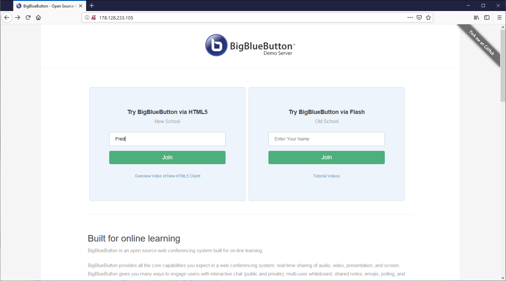
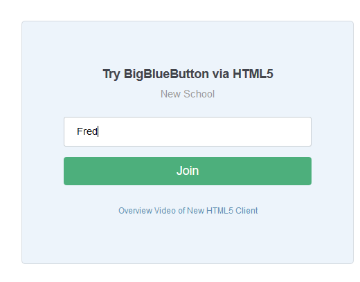

# BigBlueButton

- [API](https://docs.bigbluebutton.org/dev/api.html)
- [recording](https://docs.bigbluebutton.org/dev/recording.html)
- HTML5(iOS 12.2+ and Android 6.0+), fireFox,Chrome

[특징]

- 이전 버전보다 2배 빠른 로딩
- 고품질 오디오, 비디오 및 화면 공유 (WebRTC 사용)
- 다중 사용자 편집을 위한 공유 메모 (우수한 EtherPad 프로젝트 사용)
- 화면 판독기에 완전히 액세스
- 세션 중에 YouTube 비디오 공유

## Requirement

### 최소 서버 요구 사항

- Linux 커널 4.x를 실행하는 Ubuntu 16.04 64 비트 OS
- 스왑이 활성화 된 4GB 메모리 (8GB 메모리 권장)
- CPU코어 4개 (8개가 좋음)
- TCP 포트 80 및 443에 액세스
- UDP 포트 16384-32768에 액세스
- 다른 응용 프로그램에서 포트 80을 사용하고 있지 않습니다

### 제품용

- 녹화를 위한 500G 이상의 디스크 여유 공간
- 250Mbits / sec 대역폭 (대칭)이상
- 전용 (베어 메탈) 하드웨어
- SSL 인증서 설정을위한 호스트 이름 (예 : bbb.example.com)
- IPV4 및 IPV6 주소

>> 베어메탈 서버를 권장하는 이유 : BigBlueButton은 수신 오디오 패킷 처리에 FreeSWITCH를 사용하며 FreeSWITCH는 가상화되지 않은 환경에서 가장 잘 작동(FreeSWITCH 권장 구성 참조).

### 워크 스테이션에서 로컬 개발용

BigBlueButton을 설정하는 경우 서버를 사용하는 유일한 서버이기 때문에 서버 요구 사항을 약간 완화
BigBlueButton을 실행 가능

- 2개의 CPU 코어
- 로컬 VM 또는 LXC 컨테이너에 설치
- IPV4 주소 만 (호스트 이름 없음)

>> 서버에서 SSL을 구성하지 않으면 웹실시간 통신(WebRTC)을 사용하여 마이크, 웹캠 또는 화면을 공유 할 수 없음. 다시 말해 모든 브라우저는 HTML5 응용 프로그램이 미디어 공유를 위해 액세스를 요청하기 전에 HTTPS를 통해 페이지를 로드해야 함

### Cloud

Amazon EC2에 BigBlueButton을 설치하려면 c5.xlarge (또는 더 큰 CPU) 인스턴스에서 BigBlueButton을 실행(최신 컴퓨팅 인스턴스는 베어 메탈 성능에 매우 가깝움)

### 사용자

- 최종 사용자의 최소 요구 사항은 최신 버전의 Firefox 또는 Chrome과 다음 최소 대역폭 요구 사항을 권장

## Pre-installation 체크

### 로컬 encoding확인

```bash
cat /etc/default/locale
LANG = "en_US.UTF-8"
```

LANG = "en_US.UTF-8"이 표시되지 않으면 다음 명령을 입력하여 로컬을 en_US.UTF-8로 설정

```bash
sudo apt-get install language-pack-en
sudo update-locale LANG=en_US.UTF-8
```

>> 참고 : LC_ALL=en_US.UTF-8 행이 추가로 표시되면 '/etc/default/locale'에서 LC_ALL항목을 제거하고 로그아웃 한 후 다시 로그인

다음으로 'sudo systemctl show-environment'를 수행하고 출력에 LANG=en_US.UTF-8이 표시되는지 확인

```bash
sudo systemctl show-environment
LANG = ko_KR.UTF-8
PATH = /usr/local/sbin:/usr/local/bin:/usr/sbin:/usr/bin:/sbin:/ bin
```

표시되지 않으면 'sudo systemctl set-environment LANG=en_US.UTF-8'을 수행하고 위의 'sudo systemctl show-environment'를 다시 실행하고 출력에 LANG=en_US.UTF-8이 표시되는지 확인

그런 다음 free -h 명령을 사용하여 서버에 4G의 메모리가 있는지 확인

```bash
$ free -h
              total        used        free      shared  buff/cache   available
Mem:            31G        5.9G        314M        1.8G         25G         21G
Swap:           31G        360M         31G
```

4G 미만의 전체 열에 Mem : 값이 표시되면 (위의 예는 31G로 표시됨) 서버에 BigBlueButton을 실행하기 위한 메모리가 부족. 서버의 메모리를 4G 이상으로 늘려야 함

다음으로 서버에 Ubuntu가 16.04인지 확인

```bash
$  cat /etc/lsb-release
DISTRIB_ID=Ubuntu
DISTRIB_RELEASE=16.04
DISTRIB_CODENAME=xenial
DISTRIB_DESCRIPTION="Ubuntu 16.04.x LTS"
```

그런 다음 서버에서 64 비트 버전의 Ubuntu 16.04를 실행하고 있는지 확인

```bash
$ uname -m
x86_64
```

다음으로 서버가 IPV6을 지원하는지 확인

```bash
$ ip addr | grep inet6
inet6 ::1/128 scope host
...
```

'inet6 :: 1/128 범위 호스트'행이 표시되지 않으면 BigBlueButton을 설치 한 후 FreeSWITCH 구성을 수정하여 IPV6 지원을 비활성화 해야 함

그런 다음 서버에서 Linux 커널 4.x를 실행하고 있는지 확인

```bash
uname -r
4.15.0-38-generic

cat /proc/cpuinfo | awk '/^processor/{print $3}' | wc -l
4
```

>> 참고 : BigBlueButton은 2.6 커널 (예 : OpenVZ VPS의 x86_64의 Linux 2.6.32-042stab133.2)에서 실행되지 않음

### 커널 업데이트

```bash
uname -r
4.4.0-142-generic

apt-get update
...

# 패키지 관리자의 리스트에서 리눅스 커널 이미지 버젼을 검색
apt-cache search linux-image

apt-get install linux-image-4.15.0-15-generic
```

## OS 환경

### 한글폰트

```bash
# 1. fbterm(Frame Buffer Terminal) 설치
sudo apt-get install fbterm

# 2. 한글 폰트 설치(오픈 폰트인 나눔폰트)
sudo apt-get install fonts-nanum-coding

# 위의 명령어는 우분투 14버젼 기준인데 그 이상의 버젼에서도 잘 실행되나 설치하는 운영체제 버젼이 14.04 하위 버젼인 경우엔 아래의 명령어를 사용해 보세요.
sudo apt-get install ttf-nanum-coding

#3. 아래의 명령어를 입력해보고 한글이 제대로 출력되는지 확인
sudo fbterm
sudo apt-get update
```

### SSH

```bash
sudo apt-get install openssl-server

sudo service ssh start
sudo service ssh status
```

### Networking

```bash
vi /etc/network/interfaces

# DHCP로 설정
auto lo
iface lo inet loopback
auto eth0
iface eth0 inet dhcp

# STATIC

auto lo
iface lo inet loopback

auto eth0
iface eth0 inet static
address xxx.xxx.xxx.xxx
netmask xxx.xxx.xxx.xxx
gateway xxx.xxx.xxx.xxx
dns-nameservers xxx.xxx.xxx.xxx

# 네트워크 재기동
systemctl restart networking
```

## Install

1. 최소 사양을 충족하는 Ubuntu 16.04 64비트 서버
2. 서버가 방화벽 뒤에있는 경우 적절한 포트를 BigBlueButton 서버로 전달하도록 방화벽을 구성(방화벽을 통해 BigBlueButton 서버로 연결되는 외부 컴퓨터에서 테스트)
3. BigBlueButton 서버의 IP 주소(또는 방화벽의 IP 주소)로 확인되는 정규화된 도메인 이름(예 : bigbluebutton.example.com)
4. 호스트 이름에 유효한 SSL 인증서

### 1. 서버 업데이트

/etc/apt/sources.list에 xenail multiverse가 있는지 확인

```bash
grep "multiverse" /etc/apt/sources.list

# 주석처리 되지 않은 행 확인
deb http://archive.ubuntu.com/ubuntu xenial multiverse
deb http://archive.ubuntu.com/ubuntu xenial main restricted universe multiverse

# URL의 호스트 이름이 위와 다른 경우 걱정하지 마십시오. 중요한 것은 `multiverse`를 포함하는 주석 처리되지 않은 링크 확인
# 그렇지 않은 경우 다음 명령을 실행하여 `multiverse` 저장소를 /etc/apt/sources.list 파일에 추가
echo "deb http://archive.ubuntu.com/ubuntu/ xenial multiverse" | sudo tee -a /etc/apt/sources.list

# VM에 많은 엔트로피를 제공하려면 haveged라는 패키지 (간단한 엔트로피 데몬)를 설치
sudo apt-get install haveged
```

BigBlueButton에는 `ffmpeg` (녹화 작성) 및 `yq` (YAML 파일 업데이트)의 두 가지 응용 프로그램이 필요
Ubuntu 16.04에서 ffmpeg의 기본 버전은 이전 버전이며 yq는 기본 리포지토리에 없음
따라서 BigBlueButton을 설치하기 전에 서버에 다음 개인 패키지 아카이브(PPA)를 추가하여 올바른 버전을 설치

```bash
sudo add-apt-repository ppa:bigbluebutton/support -y
sudo add-apt-repository ppa:rmescandon/yq -y
```

다음으로 서버를 최신 패키지 (및 보안 수정 사항)로 업그레이드

```bash
sudo apt-get update
sudo apt-get dist-upgrade
```

BigBlueButton HTML5 클라이언트는 클라이언트 상태를 동기화하는 데 사용되는 매우 효율적인 데이터베이스 인 MongoDB를 사용합니다. MongoDB를 설치하려면 다음을 수행

```bash
wget -qO - https://www.mongodb.org/static/pgp/server-3.4.asc | sudo apt-key add -
echo "deb [ arch=amd64,arm64 ] http://repo.mongodb.org/apt/ubuntu xenial/mongodb-org/3.4 multiverse" | sudo tee /etc/apt/sources.list.d/mongodb-org-3.4.list
sudo apt-get update
sudo apt-get install -y mongodb-org curl
```

BigBlueButton HTML5 클라이언트에는 nodejs 서버가 필요

```bash
curl -sL https://deb.nodesource.com/setup_8.x | sudo -E bash -
sudo apt-get install -y nodejs
```

### 2. Install apt-get key for BigBlueButton repository

BigBlueButton을 설치하기 전에 프로젝트의 공개키를 서버의 키체인에 추가

```bash
wget https://ubuntu.bigbluebutton.org/repo/bigbluebutton.asc -O- | sudo apt-key add -
```

BigBlueButton 2.0(또는 이전 버전)에서 서버를 업데이트하는 경우 먼저 bbb-client 패키지를 제거

```bash
sudo bbb-conf --stop
sudo apt-get purge -y bbb-client
```

- bbb-client가 소유 한 일부 파일이 bbb-web이 소유한 것으로 이동했기 때문
- BigBlueButton 2.2로 업그레이드하기 전에 bbb-client 패키지를 삭제하면 bbb-web이 이전 버전의 bbb-client와 충돌하지 않고 이러한 파일을 작성

서버는 BigBlueButton 2.2 패키지를 다운로드할 위치 확인
패키지 저장소를 구성

```bash
echo "deb https://ubuntu.bigbluebutton.org/xenial-220/ bigbluebutton-xenial main" | sudo tee /etc/apt/sources.list.d/bigbluebutton.list
sudo apt-get update
```

### 3. custom configurations 백업

새로 설치 한 경우이 단계를 스킵

BigBlueButon2.0 또는 이전 버전의 BigBlueButton 2.2에서 업그레이드하고 다음과 같은 사용자 정의 변경 사항을 작성한 경우

- /etc/nginx/sites-available/bigbluebutton에 자체 SSL인증서를 설정
- [incoming phone calls](http://docs.bigbluebutton.org/2.2/customize.html#add-a-phone-number-to-the-conference-bridge)를 받도록 FreeSWITCH를 구성했습니다.
- `/var/www/bigbluebutton-default/default.pdf` 파일을 변경

`bbb-conf`를 사용하지 않는 다른 변경 사항이 있는 경우 BigBlueButton을 업그레이드하기 전에 이러한 변경 사항을 백업
BigBlueButton을 업그레이드 한 후 사용자 정의 구성을 서버에 다시 적용

### 4. 인스톨

참고 : BigBlueButton 2.0(또는 이전 버전)에서 업데이트하는 경우이 최신 버전을 설치하기 전에 `sudo apt-get purge bbb-client`를 제거하여 bbb-client를 제거

```bash
sudo apt-get install bigbluebutton
sudo apt-get install bbb-html5
```

1. `ttf-mscorefonts-installer` 패키지의 "Failure to download extra data files" 오류는 무시(우분투 16.04의 알려진 문제)

2. 완료하기 전에 설치가 오류와 함께 종료되면 설치하기 전단계를 확인. 구성 오류를 찾아서 해결하면 `sudo apt-get install -f`명령을 사용하여 설치를 완료

3. `sudo apt-get install -f` 후에도 여전히 오류가 발생하면 여기서 중지. 설치가 완료되지 않았으며 BigBlueButton이 실행 않음. [troubleshooting guide](http://docs.bigbluebutton.org/2.2/troubleshooting.html) 및 [getting help](http://docs.bigbluebutton.org/2.2/install.html#getting-help)이 필요한 옵션을 참조

설치가 완료되면 [HTML5를 기본 클라이언트](http://docs.bigbluebutton.org/2.2/customize.html#make-the-html5-client-default)로 만들 수 있음(Flash 클라이언트가 필요하지 않은 경우 권장).

```bash
sudo apt-get dist-upgrade
```

설치가 완료되면 HTML5를 기본 클라이언트 (권장)

다음으로 BigBlueButton을 다시 시작

```bash
sudo bbb-conf --restart
```

BigBlueButton 서버의 모든 구성 요소가 올바른 순서로 다시 시작

>> 참고 : 처음에 `# Not running: tomcat7 or grails` 또는 `Error: Could not connect to the configured hostname/IP address` 시작하는 데 약간의 시간이 걸림

다시 시작이 끝나면 bbb-conf --check를 사용하여 설정을 확인

```bash
$ sudo bbb-conf --check

BigBlueButton Server 2.2.0 (1571)
                    Kernel version: 4.4.0-142-generic
                      Distribution: Ubuntu 16.04.6 LTS (64-bit)
                            Memory: 16432 MB

/usr/share/bbb-web/WEB-INF/classes/bigbluebutton.properties (bbb-web)
       bigbluebutton.web.serverURL: http://178.128.233.105
                defaultGuestPolicy: ALWAYS_ACCEPT

/etc/nginx/sites-available/bigbluebutton (nginx)
                       server name: 178.128.233.105
                              port: 80, [::]:80
                    bbb-client dir: /var/www/bigbluebutton

/var/www/bigbluebutton/client/conf/config.xml (bbb-client)
                Port test (tunnel): rtmp://178.128.233.105
                              red5: 178.128.233.105
              useWebrtcIfAvailable: true

/opt/freeswitch/etc/freeswitch/vars.xml (FreeSWITCH)
                       local_ip_v4: 178.128.233.105
                   external_rtp_ip: stun:stun.freeswitch.org
                   external_sip_ip: stun:stun.freeswitch.org

/opt/freeswitch/etc/freeswitch/sip_profiles/external.xml (FreeSWITCH)
                        ext-rtp-ip: $${local_ip_v4}
                        ext-sip-ip: $${local_ip_v4}
                        ws-binding: :5066
                       wss-binding: :7443

/usr/local/bigbluebutton/core/scripts/bigbluebutton.yml (record and playback)
                     playback_host: 178.128.233.105
                 playback_protocol: http
                            ffmpeg: 4.1.1-0york1~16.04

/etc/bigbluebutton/nginx/sip.nginx (sip.nginx)
                        proxy_pass: http://178.128.233.105:5066


** Potential problems described below **
```

`Potential problems` 다음에 나오는 출력은 구성 오류 또는 설치 오류를 나타냄
많은 경우에, 메시지는 문제 해결 방법에 대한 권장 사항을 제공

`sudo bbb-conf --status`를 사용하여 모든 BigBlueButton프로세스가 시작되어 실행 중인지 확인

```bash
sudo bbb-conf --status
red5 ——————————————————► [✔ - active]
nginx —————————————————► [✔ - active]
freeswitch ————————————► [✔ - active]
redis-server ——————————► [✔ - active]
bbb-apps-akka —————————► [✔ - active]
bbb-transcode-akka ————► [✔ - active]
bbb-fsesl-akka ————————► [✔ - active]
tomcat7 ———————————————► [✔ - active]
mongod ————————————————► [✔ - active]
bbb-html5 —————————————► [✔ - active]
bbb-webrtc-sfu ————————► [✔ - active]
kurento-media-server ——► [✔ - active]
etherpad ——————————————► [✔ - active]
bbb-web ———————————————► [✔ - active]
bbb-lti ———————————————► [✔ - active]
```

이 시점에서 BigBlueButton 서버가 IPV4 주소를 청취하고 있음
예를 들어, 서버가 IP 주소 178.128.233.105 인 경우 http://178.128.233.105/를 열고 시작 화면



그러나 API데모를 설치하지 않으면 이 화면에서 로그인 할 수 없습니다.
시도하면 404 오류가 발생합니다. 다음 단계에서는 API데모를 추가하는 방법을 보여줍니다.

이 서버를 다른 프런트엔드와 함께 사용하려는 경우 API 데모가 필요하지 않습니다.
서버 주소와 공유 비밀을 통합하여 BigBlueButton을 타사 통합 중 하나와 통합 할 수 있습니다. bbb-conf --secret을 사용하여 bbb-conf를 사용하여이 정보를 표시 할 수 있습니다.

```bash
$ sudo bbb-conf --secret

       URL: http://178.128.233.105/bigbluebutton/
    Secret: 330a8b08c3b4c61533e1d0c5ce1ac88f

      Link to the API-Mate:
      http://mconf.github.io/api-mate/#server=http://178.128.233.105/bigbluebutton/&sharedSecret=330a8b08c3b4c61533e1d0c5ce1ac88f
```

### 5. Install API demos (optional)

API 데모는 BigBlueButton API를 테스트하기 위해 웹 기반 인터페이스를 구현하는 JSP (Java Server Pages) 세트

API 예제를 설치하려면 다음 명령을 입력하십시오.

$ sudo apt-get 설치 bbb-demo
설치되면 홈페이지에 이름을 입력하고‘가입’을 클릭하십시오.



그러면“Demo Meeting”이라는 기본 회의에 참여하게됩니다. 다음은 FireFox를 사용하여 합류, 공유 메모 패널 열기, 화이트 보드 그리기 및 웹캠 공유 스크린 샷입니다.

BigBlueButton 인터페이스

API 예제를 완료하면 다음과 같이 제거 할 수 있습니다.

$ sudo apt-bbb-demo를 제거하십시오

### 6. Restart your server

명령을 사용하여 언제든지 BigBlueButton 서버를 다시 시작하고 확인할 수 있습니다

```bash
sudo bbb-conf --restart
sudo bbb-conf --check
```

`bbb-conf --check`는 일부 로그 파일에서 오류 메시지를 검색
다시 `Potential problems`가 발생한 출력은 구성 오류 또는 설치 오류
많은 경우에, 메시지는 문제 해결 방법에 대한 권장 사항을 제공

`sudo bbb-conf --check`는 서버에 액세스 할 수 있는 모든 사용자가 세션을 시작할 수 있도록 API 데모가 설치되었음을 경고([API 데모 제거 참조](http://docs.bigbluebutton.org/2.2/customize.html#remove-the-api-demos)).

다른 경고 메시지가 표시되면 [troubleshooting installation.](http://docs.bigbluebutton.org/2.2/troubleshooting)를 확인

### 7. Final steps

#### 프로덕션용

- 서버에 호스트 이름을 지정
- HTTPS를 지원하기 위해 SSL인증서 설치
- 특정 포트에 대한 액세스 제한
- 방화벽 뒤에서 작동하도록 서버 구성(필요한 경우)
- API 데모 제거(테스트 용으로 설치 한 경우)
- TURN 서버 설정 (서버가 인터넷에 있고 사용자가 제한 방화벽 뒤에서 액세스 할 수있는 경우)

테스트에 사용할 수있는 공개적으로 액세스 가능한 두 서버를 제공
- https://demo.bigbluebutton.org-Greenlight 프론트엔드를 사용하여 최신 안정된 BigBlueButton 빌드를 실행
- https://test.bigbluebutton.org-BigBlueButton의 최신 개발자 빌드를 실행

BigBlueButton을 애플리케이션과 통합하는 방법에 대한 자세한 내용은 [BigBlueButton API 설명서](http://docs.bigbluebutton.org/dev/api.html)를 확인하십시오. BigBlueButton HTML5 클라이언트의 비디오를 보려면 <https://bigbluebutton.org/html5>를 참조하십시오.

## Assign a hostname

프로덕션 BigBlueButton 서버의 경우 호스트 이름을 지정해야합니다.

아직 그렇게하지 않은 경우 DNS (Domain Name Service) 공급자로부터 도메인 이름을 구입하고 공급자의 웹 인터페이스를 사용하여 서버의 IP 주소를 가리 키도록 A 레코드를 구성해야합니다 (DNS 설명서 참조). 이 단계를 수행하는 방법에 대해서는

A 레코드를 설정 한 후 BigBlueButton 서버의 호스트 이름으로 다음 명령과 EXTERNAL_HOST_NAME을 입력하십시오.

핑 EXTERNAL_HOST_NAME
demo.bigbluebutton.org를 사용한 출력 예는 다음과 같습니다.

핑 데모 .bigbluebutton.org
PING demo.bigbluebutton.org (146.20.105.32) 56 (84) 바이트의 데이터.
146.20.105.32에서 64 바이트 : icmp_seq = 1 ttl = 44 time = 27.5ms
참고 : 서버에서 ICMP 트래픽을 허용하지 않으면 바이트가 반환되지 않지만 호스트 이름 뒤에 괄호 ()로 서버의 IP 주소가 반환됩니다.

호스트 이름이 서버의 IP 주소 (또는 방화벽의 IP 주소)로 확인되는 경우 BigBlueButton 구성 유틸리티 bbb-conf를 사용하여이 호스트 이름을 사용하도록 BigBlueButton의 구성 파일을 업데이트하십시오.

$ sudo bbb-conf --setip 호스트 이름
예를 들어 호스트 이름이 bigbluebutton.example.com 인 경우 명령은

$ sudo bbb-conf --setip bigbluebutton.example.com
이 시점에서 BigBlueButton 서버가 IP 주소 (또는 호스트 이름)를 수신하고 API 요청에 응답합니다. 그러나 브라우저를 사용하여 서버의 기본 페이지에서 로그인하려고하면 HTTP 상태 404-/demo/demo1.jsp 오류가 발생합니다.

왜? BigBlueButton 서버는 API 호출을 나열 할 준비가되었지만 기본적으로 프런트 엔드가 설치되어 있지 않습니다. API 데모를 쉽게 설치하여 서버를 테스트 할 수 있습니다. 다음 단계에서 API 데모 설치를 다룰 것입니다.

그러나 Moodle 서버가 있고 BigBlueButton 서버에 액세스하도록 BigBlueButton Moodle Plugin을 구성하려는 경우와 같이 BigBlueButton 서버에 다른 프론트 엔드를 사용하려는 경우 API 데모가 필요하지 않습니다.

## Configure SSL on your BigBlueButton server

You’ll want to add SSL support to your BigBlueButton server to make it more secure. Also, as of Chrome 47, Chrome users will be unable to share their microphone via WebRTC unless BigBlueButton is loaded via HTTPS.

Configure BigBlueButton to use a domain nameAnchor link for: configure bigbluebutton to use a domain name
Please run all commands in this section as root.

In order to obtain a valid SSL certificate for your server, you must have already assigned a hostname to your BigBlueButton server.

For the purposes of documentation, we will be using the domain name “example.com”, with a BigBlueButton server hosted at “bigbluebutton.example.com”.

Once you have a domain name and have configured it with a DNS host, add an A record pointing to your server. You can then use the bbb-conf setip command to configure BigBlueButton to use that domain name, for example:

$ sudo bbb-conf --setip bigbluebutton.example.com
Obtain an SSL certificateAnchor link for: obtain an ssl certificate
Before you can configure nginx on BigBlueButton to server content via HTTPS, you need to have a valid SSL certificate. A domain validated (sometimes called “class 1”) certificate with a 4096 bit RSA key and SHA-256 checksum is the current recommended minimum, and it should be sufficient.

There are a number of providers that you could obtain a certificate from. Many domain name sales companies also offer certificates.

Some well known large providers of SSL certificates include Comodo, Symantec, GoDaddy, GlobalSign, and DigiCert. In addition, free SSL certificates are available from StartSSL and CACert, with some caveats: StartSSL certificates can’t be revoked without paying a service fee, and most people do not have the root for CACert installed in their web browser.

Each provider will give you a series of steps for generating the certificate, but they will normally include generating a private key and certificate request locally, sending the certificate request to be signed, and then receiving back the signed certificate after they have performed any required verification steps.

To install the certificate in BigBlueButton, you will need to have files for the certificate, private key, and any intermediate certificates in PEM format.

If you don’t yet have a SSL certificate and your server is on the Internet, you can use Let’s Encrypt to obtain a free renewable SSL certificate (expires after 90 days, but are automatically renewable). If you want to use Let’s Encrypt, then skip to setup using Let’s Encrypt.

Configure nginx to use HTTPSAnchor link for: configure nginx to use https
Depending on your certificate authority (CA), you should now have 2 or more files, as follows:

Certificate
Private key
Intermediate certificate (there may be more than one, or could be none)
The next step is to install the files on the server.

Create the directory /etc/nginx/ssl:

$ sudo mkdir /etc/nginx/ssl
And now create the private key file for nginx to use (replace the hostname in the filename with your own). In addition, fix the permissions so that only root can read the private key:

# cat >/etc/nginx/ssl/bigbluebutton.example.com.key <<'END'
Paste the contents of your key file here
END
chmod 0600 /etc/nginx/ssl/bigbluebutton.example.com.key
And the certificate file. Note that nginx needs your server certificate and the list of intermediate certificates together in one file (replace the hostname in the filename with your own):

# cat >/etc/nginx/ssl/bigbluebutton.example.com.crt <<'END'
Paste (in order) the contents of the following files:
  1. The signed certificate from the CA
  2. In order, each intermediate certificate provided by the CA (but do not include the root).
END
In addition, we’ll generate a set of 4096-bit diffie-hellman parameters to improve security for some types of ciphers. This step can take several minutes to complete, particularly if run on a virtual machine.

sudo openssl dhparam -out /etc/nginx/ssl/dhp-4096.pem 4096
Now we can edit the nginx configuration to use SSL. Edit the file /etc/nginx/sites-available/bigbluebutton to add the marked lines. Ensure that you’re using the correct filenames to match the certificate and key files you created above.

server {
  server_name bigbluebutton.example.com;
  listen 80;
  listen [::]:80;
  listen 443 ssl;
  listen [::]:443 ssl;

  ssl_certificate /etc/nginx/ssl/bigbluebutton.example.com.crt;
  ssl_certificate_key /etc/nginx/ssl/bigbluebutton.example.com.key;
  ssl_session_cache shared:SSL:10m;
  ssl_session_timeout 10m;
  ssl_protocols TLSv1 TLSv1.1 TLSv1.2;
  ssl_ciphers "ECDH+AESGCM:DH+AESGCM:ECDH+AES256:DH+AES256:ECDH+AES128:DH+AES:ECDH+3DES:DH+3DES:RSA+AESGCM:RSA+AES:RSA+3DES:!aNULL:!MD5:!DSS:!AES256";
  ssl_prefer_server_ciphers on;
  ssl_dhparam /etc/nginx/ssl/dhp-4096.pem;
  
For reference, note that the SSL settings used above are based on those proposed in https://hynek.me/articles/hardening-your-web-servers-ssl-ciphers/ and provide support for all modern browsers (including IE8, but not IE6, on Windows XP). Please note that recommended SSL settings are subject to change as new vulnerabilities are found.

Configure FreeSWITCH for using SSLAnchor link for: configure freeswitch for using ssl
If you have a firewall on your server and have opened port 5066, change the rule to now open port 7443 instead.

Also, if your BigBlueButton server is behind a firewall, you may need to specify the value with an external IP address EXTERNAL_IP_ADDRESS:7443 to avoid getting an error 1002 in the client. For more details see Configure BigBlueButton behind a firewall.

Next, the websocket forwarding address in nginx. Edit the file /etc/bigbluebutton/nginx/sip.nginx and change the protocol and port on the proxy_pass line as shown:

location /ws {
  proxy_pass https://203.0.113.1:7443;
  proxy_http_version 1.1;
  proxy_set_header Upgrade $http_upgrade;
  proxy_set_header Connection "Upgrade";
  proxy_read_timeout 6h;
  proxy_send_timeout 6h;
  client_body_timeout 6h;
  send_timeout 6h;
}
Configure BigBlueButton to load session via HTTPSAnchor link for: configure bigbluebutton to load session via https
With nginx now configured to use SSL, the next step is to configure FreeSWITCH to use HTTPS for initiating an audio connection.

Edit /usr/share/bbb-web/WEB-INF/classes/bigbluebutton.properties and update the property bigbluebutton.web.serverURL to use HTTPS:

#----------------------------------------------------
# This URL is where the BBB client is accessible. When a user successfully
# enters a name and password, she is redirected here to load the client.
bigbluebutton.web.serverURL=https://bigbluebutton.example.com
Next, edit the file /usr/share/red5/webapps/screenshare/WEB-INF/screenshare.properties and update the property jnlpUrl and jnlpFile to HTTPS:

streamBaseUrl=rtmp://bigbluebutton.example.com/screenshare
jnlpUrl=https://bigbluebutton.example.com/screenshare
jnlpFile=https://bigbluebutton.example.com/screenshare/screenshare.jnlp
You must also update the file /var/www/bigbluebutton/client/conf/config.xml to tell the BigBlueButton client to load components via HTTPS. You can do the update with a single command

$ sudo sed -e 's|http://|https://|g' -i /var/www/bigbluebutton/client/conf/config.xml
If you would ever need to revert this change, you can run the reverse command:

$ sudo sed -e 's|https://|http://|g' -i /var/www/bigbluebutton/client/conf/config.xml
Open /usr/share/meteor/bundle/programs/server/assets/app/config/settings.yml editing and change:

  kurento:
    wsUrl: ws://bbb.example.com/bbb-webrtc-sfu
to

  kurento:
    wsUrl: wss://bbb.example.com/bbb-webrtc-sfu
Also change:

  note:
    enabled: true
    url: http://bbb.example.com/pad
to

  note:
    enabled: true
    url: https://bbb.example.com/pad
Next, modify the creation of recordings so they are served via HTTPS. Edit /usr/local/bigbluebutton/core/scripts/bigbluebutton.yml and change the value for playback_protocol as follows:

playback_protocol: https
If you have installed the API demos in step 5, edit /var/lib/tomcat7/webapps/demo/bbb_api_conf.jsp and change the value of BigBlueButtonURL use HTTPS.

// This is the URL for the BigBlueButton server
String BigBlueButtonURL = "https://bigbluebutton.example.com/bigbluebutton/";
Finally, to apply all of the configuration changes made, you must restart all components of BigBlueButton:

$ sudo bbb-conf --restart
Test your HTTPS configurationAnchor link for: test your https configuration
In order to ensure you didn’t make any mistakes that could cause security compromises, please test your HTTPS configuration. A well-respected site that can do a series of automated tests is https://www.ssllabs.com/ssltest/ - simply enter your server’s hostname, optionally check the “Do not show results” check box if you would like to keep it private, then Submit.

At time of writing, the configuration shown on this page should achieve an “A” ranking in the SSL Labs test page.

Using Let’s EncryptAnchor link for: using lets encrypt
If you have a domain name assigned to your BigBlueButton server (i.e. bigbluebutton.example.com) and the server is on the Internet, then can use Let’s Encrypt to obtain a free SSL certificates.

First, install Let’s Encrypt configuration tool. Please run all commands in this section root.

$ sudo apt-get update
$ sudo apt-get install software-properties-common
$ sudo add-apt-repository universe
$ sudo add-apt-repository ppa:certbot/certbot
$ sudo apt-get install certbot
Next, generate a set of 4096-bit diffie-hellman parameters to improve security for some types of ciphers.

Before you can generate a certificate on your server, you need to configure BigBlueButton to use the intended hostname. If you have not already done so, use the following command (replace bigbluebutton.example.com with your own DNS name), to configure the BigBlueButton server with your hostname.

$ sudo bbb-conf --setip bigbluebutton.example.com
Next, request a SSL certificate from Let’s Encrypt using the certbot tool. Again, replace bigbluebutton.example.com with your hostname.

$ sudo certbot --webroot -w /var/www/bigbluebutton-default/ -d bigbluebutton.example.com certonly

IMPORTANT NOTES:
 - Congratulations! Your certificate and chain have been saved at
   /etc/letsencrypt/live/bigbluebutton.example.com/fullchain.pem. Your cert will
   expire on 20XX-YY-ZZ. To obtain a new version of the certificate in
   the future, simply run Let's Encrypt again.
 - If you like Let's Encrypt, please consider supporting our work by:

   Donating to ISRG / Let's Encrypt:   https://letsencrypt.org/donate
   Donating to EFF:                    https://eff.org/donate-le
This will generate the following files

$ ls /etc/letsencrypt/live/bigbluebutton.example.com/
cert.pem  chain.pem  fullchain.pem  privkey.pem
Next, edit the nginx configuration file /etc/nginx/sites-available/bigbluebutton and add the marked lines below. Ensure that you’re using the correct filenames to match the certificate and key files you created above (again, replace bigbluebutton.example.com with your hostname).

server {
  server_name bigbluebutton.example.com;
  listen 80;
  listen [::]:80;
  listen 443 ssl;
  listen [::]:443 ssl;
  ssl_certificate /etc/letsencrypt/live/bigbluebutton.example.com/fullchain.pem;
  ssl_certificate_key /etc/letsencrypt/live/bigbluebutton.example.com/privkey.pem;
  ssl_session_cache shared:SSL:10m;
  ssl_session_timeout 10m;
  ssl_protocols TLSv1 TLSv1.1 TLSv1.2;
  ssl_ciphers "ECDH+AESGCM:DH+AESGCM:ECDH+AES256:DH+AES256:ECDH+AES128:DH+AES:ECDH+3DES:DH+3DES:RSA+AESGCM:RSA+AES:RSA+3DES:!aNULL:!MD5:!DSS:!AES256";
  ssl_prefer_server_ciphers on;
  ssl_dhparam /etc/nginx/ssl/dhp-4096.pem;
  
The Let’s Encrypte certificates are good for 90 days and can be automatically renewed. To automatically request a renewal once a week, edit the crontab file for root.

$ sudo crontab -e
And add the following two lines at the bottom:

30 2 * * 1 /usr/bin/certbot renew >> /var/log/le-renew.log
35 2 * * 1 /bin/systemctl reload nginx
These two directives will execute the certbot renew command every Monday at 2:30 am, and then reload Nginx at 2:35am (so the renewed certificate will be used). The output will be piped to a log file located at /var/log/le-renewal.log, so you can always check it later.

To finish the SSL configuration, continue with the steps at Configure FreeSWITCH to user WebRTC.

## TroubleshootingAnchor

인스톨중에 문제에 직면했다면, [troubleshooting](http://docs.bigbluebutton.org/2.2/troubleshooting) 확인.