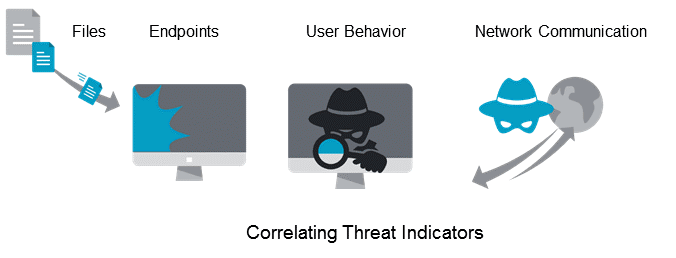

# EDR(Endpoint Detection and Response)

- EDR은 말 그대로 엔드포인트 위협 탐지 및 대응<https://poem23.com/3235>

## EDR 솔루션

- EDR 솔루션의 E는 엔드포인트의 약자로 영어로 쓰니까 뭐 있는 듯 보이지만 엔드포인트는 그냥 우리가 사용하는 단말기(서버 - 클라이언트의 관계에서의 클라이언트), 즉 PC, 스마트폰, 태블릿 등을 의미한다고 보면 된다. IoT 제품들도 이런 의미에서는 엔드포인트에 들어가기도 하지만 보통 EDR 솔루션의 범위는 앞서 얘기한 PC, 스마트폰, 태블릿 정도까지다.

- EDR 솔루션의 범위는 지금은 컨슈머 보안(일반 사용자들을 위한 보안) 보다는 엔터프라이즈 보안(기업 시스템을 사용하는 사용자들을 위한 보안)이 일반적이다. 물론 향후에는 엔터프라이즈 보안 영역에서 컨슈머 보안 영역까지 진출할 가능성이 높지만(단지 시간 문제일 뿐이다) 지금으로서는 대부분이 엔터프라이즈 보안 시스템으로서의 EDR 솔루션을 얘기한다. 엔터프라이즈 보안 시스템의 종류는 인증, 암호화, 악성코드 탐지, APT 공격 탐지, 해킹 방지 등 상당히 많은데 EDR 솔루션은 인증이나 암호화 부분은 아니고 주로 탐지와 그것에 대한 대응 영역으로 보면 된다.

## 백신이나 HIPS는 EDR이 아니다?

앞서 언급한 것처럼 EDR 솔루션이 하는 역할은 사용자가 사용하고 있는 단말기에서의 보안 위협을 탐지하고 그것에 대한 대응을 하는 것이다. 이렇게 얘기하면 떠오르는 보안 솔루션이 있다. 다름아닌 안티 바이러스 솔루션, 즉 바이러스 백신이다. 백신도 사용자가 사용하고 있는 단말기 안의 설치된 어플리케이션, 저장된 데이터 등을 검사해서 악성코드, 바이러스 등을 탐지하고 제거, 혹은 격리시키는 역할을 한다. 그런 의미에서 백신 역시 EDR 솔루션의 일부라고 해도 아주 틀린 말은 아니다. 하지만 EDR 솔루션 업체들은 백신은 EDR이 아니라고 얘기를 한다. 왜?

- 백신의 방식은 아직까지도 시그니쳐, 패턴 매칭 방식으로 악성코드 패턴, 혹은 바이러스 시그니쳐와 파일을 비교해서 맞거나 혹은 유사하면 악성코드, 혹은 바이러스라고 판단하고 제거하더나 격리하는 역할을 한다. 시그니쳐, 혹은 패턴 기반이며 이것들은 이미 피해를 입은 단말기를 분석해서 뽑아낸다. 즉, 사후처리 방식이기 때문에 시그니쳐, 패턴 DB에 없는 새로운 악성코드나 바이러스가 공격할 경우에는 꼼짝없이 당하게 된다.

- 물론 당한 이후 시그니쳐, 혹은 패턴이 만들어지고 DB에 업데이트가 된 이후에는 해당 악성코드나 바이러스의 공격에 대응할 수 있다. 하지만 미지의 공격에 대한 사전 대응은 어려운 구조다. 게다가 새로운 악성코드와 바이러스는 빠른 속도로 증가하고 있다. 이런 상황에서 백신 엔진을 만드는 업체들의 시그니쳐, 혹은 패턴을 만드는 속도가 상대적으로 느리다보니 악성코드, 바이러스에 대한 대응이 백신이 느리다는 얘기가 나오고 있는 상황이다. 물론 악성코드나 바이러스가 될 가능성이 높은 상황을 예측하는 능동적 백신들도 나오기는 하지만 오진율이 너무 높아서 거의 안쓰는 상황이기도 하다.

- 또 떠오르는 보안 솔루션이라고 한다면 호스트 침입 방지 시스템(HIPS)과 호스트 방화벽(윈도 OS나 백신 등에서 제공하는 방화벽 HFW) 솔루션도 있다. 특히 HIPS는 백신과 비슷한데 백신의 경우 파일을 기준으로 검사를 한다면 HIPS는 단말기로 들어오는 네트워크를 검사해서 대응하는 솔루션이다. HIPS도 백신하고 비슷하다. 트래픽 안의 패킷의 내용과 저장되어 있는 Rule DB 안의 위협 시그니쳐, 패턴을 비교해서 맞거나 비슷하면 차단하는 시스템이다. 보통 IPS가 서버 시스템 인프라에 설치해서 서버로 들어오는 트래픽을 감시, 차단하는데 쓰이는데 비해 HIPS는 PC에 설치되어 PC에 들어오는 트래픽을 감시, 차단하는데 쓰이는 것만 다르다. HFW도 비슷하다. 이 HIPS나 HFW도 백신처럼 저장되어 있는 룰(Rule), 정책을 기반으로 하기 때문에 룰, 정책이 업데이트 되는 속도보다 새로운 공격이 더 많이 늘어나기 때문에 요즘 시대에 대응하기 어렵다는 문제가 있다.

## 서버 인프라 보안도 어렵다

그리고 앞서 얘기한 것처럼 엔터프라이즈 보안 영역에는 사용자 단말기에 대한 보안 뿐만이 아니라 서버, 네트워크 인프라 보안도 있다. 앞서 얘기한 HIPS나 HFW는 사용자 단말기에 설치해서 돌아가는 보안 솔루션이지만 인프라 보안으로 가게 되면 IPS, IDS(침입 탐지 시스템), FW, NAC(네트워크 접속 제어 시스템), DLP(데이터 유출 방지), DRM(데이터 권한 관리) 시스템 등 다양한 보안 시스템을 사용하게 된다. NAC, DLP, DRM 시스템 등은 인증에 관련된 보안 솔루션이니 여기서는 언급하지 않을꺼고 IPS, IDS, FW는 서버에 유입되는 트래픽을 검사해서 지정된 정책, 룰에 위배되는 상황을 탐지하여 방어하는 역할을 하는데 이 역시 미리 지정된 정책, 룰, 시그니쳐, 패턴 등을 기반으로 하기 때문에 선제적인 대응이 어렵다는 문제가 있다.

즉, 기업에서 엔터프라이즈 보안 시스템을 적용하고는 있지만 지속적으로 늘어나는 다양한 위협으로부터 수동적으로밖에 대응할 수 없고 정책, 룰, 시그니쳐, 패턴 DB 업데이트가 늦게 되면 그 시간동안에 공격을 받으면 꼼짝없이 당하게 되는 이른바 제로데이 공격의 불안감이 지속적으로 기업의 시스템을 위협하는 상황이라는 얘기다. 그리고 서버에 접속하는 클라이언트에 대한 보안 역시 현재의 백신이나 HIPS, HFW 등은 서버 인프라 보안 시스템처럼 수동적인 대응 밖에 할 수 없다는 것이 문제다. 이런 상황에서 EDR 솔루션이 각광을 받고 있다는데 어떤 녀석이길레 그런지 좀 살펴보자.

## EDR 솔루션의 원리 및 방식

일단 앞서 언급한 것처럼 기업 입장에서는 기업 시스템을 구축하고 있는 서버의 보안이 무엇보다 중요하며 그것을 위해 인프라 보안 시스템(IDS, FW, IPS 등)을 많이 설치하고 운영하고 있다. 하지만 서버에 들어오는 트래픽에 대한 보안으로는 부족한 것이 많으며 결국 그 서버에 접속하는 클라이언트에 대한 보안이 중요하다는 결론이 나왔고 그래서 엔드포인트, 즉 클라이언트에 대한 감시, 탐지 및 대응에 대한 보안 시스템의 필요성이 부각되었다고 본다. 그런데 앞서 언급한 것처럼 클라이언트에 대한 보안은 백신 등이 존재하고 있는데도 불구하고 그것으로는 안된다고 한다. 그 이유는 앞서 다 얘기했기 때문에 생략하도록 하고 결국 방지 위주의 지금의 클라이언트 보안으로는 문제가 있으며 탐지를 선행적으로 하되 미리 만들어진 패턴이나 시그니쳐, 정책, 룰 기준이 아닌 능동적인 대처를 요구하게 되었고 그것이 지금의 EDR 솔루션으로 발전되었다고 보면 된다.

지금 나오고 있는 EDR 솔루션들이 아주 썡뚱맞은 새로운 솔루션은 아니다. 앞서 언급한 사용자 단말기에 설치하는 다양한 보안 솔루션들, 백신이나 HIPS, HFW를 이용하지만 그것만 이용하는 것이 아닌 그 전에 다양한 액션들을 취한다는 것이 다르다. 일단 EDR 솔루션의 특징은 탐지하는 방식이 한가지 방식이 아니라는 것이다. 물론 앞서 언급한 보안 솔루션도 탐지하는 방식이 2~3개 이상이 되지만 EDR 솔루션들이 탐지하는 방식은 외부의 트래픽이 유입되는 것이나 파일에 저장되는 것을 수동적으로 탐지하는 것이 아닌(물론 그것도 하지만) 사용자의 활동과 행동을 관찰하고 또 시스템의 백그라운드에서 동작하는 어플리케이션들의 활동을 관찰하면서 그 활동 패턴이 위협이 될 것인지를 판단하는 것이 들어간다. 이를 위해 빅데이터 기법도 들어가고 머신러닝 기법, 인공지능 기법 등도 함께 들어가게 된다.

이렇게 생각하면 이해가 쉬울 듯 싶다. 기업이 PC를 이용한다는 것을 전제로 예를 들면 EDR 솔루션은 각 PC에 에이전트를 설치하도록 하는데 이 에이전트가 하는 역할은 그 PC에서 진행되는 모든 액션들, 즉 어플리케이션이 실행되면서 만들어내는 파일, 메모리에 읽거나 기록하는 것, 혹은 네트워크를 통한 외부 송수신 등을 모두 감시하고 정리하는 것이다. 또한 어플리케이션을 통해 사용자가 취하는 모든 행동에 대해서도 감시하고 정리한다. 이 정리된 것을 바탕으로 자체적인 패턴 DB가 존재하면 그 패턴 DB에서 정리된 내용과 비교하여 문제가 되는 부분이 있다고 하면 막고, 혹은 격리하거나 제거한다.

그리고 패턴 DB에 존재하지 않으면 수집 및 분석 서버로 전송하고 수집 및 분석 서버는 각 PC에서 온 데이터(정리된 내용)를 빅데이터 시스템으로 모아서 분석하고 분석된 내용을 기반으로 머신러닝을 진행하며 이렇게 진행된 내용을 기반으로 위협 여부를 머신러닝을 통한 인공지능을 이용해 판별하게 되며 그 결과를 다시 해당 PC의 에이전트에 보내고 에이전트는 그 결과를 기반으로 막거나 격리, 혹은 제거를 한다.

혹은 에이전트는 탐지를 스스로 하지 않고 수집 및 분석 서버로 보내 거기서 결과를 받아서 액션을 취할 수도 있다. 이는 에이전트가 탐지를 위한 DB를 갖게 되면 에이전트가 무거워지기 때문에 에이전트는 관찰하고 정리만 하고 그 정리된 데이터를 서버로 보내 서버가 데이터를 자신의 DB와 비교하여 탐지를 진행하며 없으면 머신러닝 및 인공지능을 통해 위협 여부를 판단하도록 하는 방식이다. 수집 및 분석 서버를 기업 안에 자체적으로 설치할 수도 있고 아니면 EDR 솔루션에서 제공하는 클라우드 서비스를 통해서도 진행할 수 있다. 요즘은 수집 및 분석 서버를 기업 안에 설치하는 것이 아닌 EDR 솔루션에서 제공하는 EDR 클라우드 서비스를 이용하는 경우가 많다. 시스템의 규모가 훨씬 크며 기업 입장에서도 부담이 덜하기 때문이고 외부의 다양한 채널을 통해 데이터 수집이 용이하기 때문이다.

그리고 에이전트가 자신의 DB에 없다고 모두 다 수집 및 분석 서버, 혹은 EDR 클라우드 서비스로 보내게 되면 시스템의 부하나 트래픽이 엄청날 것이다. 그렇기 때문에 수집 및 분석 서버나 EDR 클라우드 서비스는 각 PC로부터 보내온 데이터를 기반으로 안전한 행동에 대해서는 이른바 화이트리스트를 만들어서 그 부분에 대해서는 각 에이전트들이 바로 넘어갈 수 있게 하는 기능도 있다. 물론 이 화이트리스트도 지속적으로 업데이트되면서 말이다.

또한, 수집 및 분석 서버나 EDR 클라우드 서비스는 각 에이전트에서 들어오는 데이터만 보는 것은 아니다. 외부의 다양한 채널을 통해 시그니쳐, 패턴, 정책, 룰 등을 업데이트 받아서 에이전트에 보내는 역할도 한다. 사건 대응에 대한 데이터나 포랜직 데이터를 받아서 머신러닝을 통해 인공지능의 성능을 높이기도 한다. 이런 식으로 수집 및 분석 서버나 EDR 클라우드 서비스는 지속적으로 들어오는 데이터를 기반으로 시그니처, 패턴, 혹은 정책, 룰을 만들어서 각 에이전트에 보내고 업데이트를 시켜서 제로데이 공격을 방지하도록 한다는 것이 EDR 솔루션의 원리라고 보면 된다.

즉, 탐지는 에이전트를 통해 수집된 데이터를 기반으로 머신러닝 및 인공지능을 통해 진행되며 탐지에 대한 대응은 수집 및 분석 서버, 혹은 EDR 클라우드 서비스에서 지속적으로 업데이트 되는 시그니쳐, 패턴, 정책, 룰 등을 통해 에이전트에 함께 존재하는 백신, HIPS, HFW 등을 통해 제거하거나 격리, 혹은 유입 거부 등을 진행한다. 즉, EDR 솔루션이 앞서 언급한 백신이나 HIPS, HFW와 완전 다른 솔루션이 아닌 이들 솔루션들을 적극적으로 활용하면서 그 시그니처나 패턴, 룰, 정책을 머신러닝과 인공지능을 통해, 또는 외부의 다양한 채널을 통해 들어온 데이터를 기반으로 만들어서 업데이트를 함으로 알려지지 않은 악성코드나 바이러스, 혹은 해킹 기법 등을 선제적으로 대응하게 하는 것이 EDR 솔루션이라고 보면 된다는 것이다.

## 기존 백신 업체들이 강세를 보이는데..

이런 이유로 인해 EDR 솔루션을 만드는 업체들을 보면 국내에서는 안랩, 하우리, 파이어아이,SGA 등의 업체가, 해외는 시만텍, 사일런스, 트랜드 마이크로 등의 업체가 보통 진행하는데 이들 업체들의 특징은 기존에 백신, HIPS, HFW 솔루션들을 만들던 업체라는 것이다. 물론 몇몇 업체들은 오픈소스로 되어 있는 백신(안티 바이러스),HIPS(호스트 침입 방지 시스템), HFW(호스트 방화벽) 솔루션을 가져와서 오픈소스로 되어 있는 빅데이터 시스템, 머신러닝 시스템 등을 결합해서 만들어서 제공하고 있기도 하지만 현재 두각을 나타내고 있는 업체들은 앞서 언급한 기존의 백신을 배포하던 업체, 혹은 방화벽이나 IDS(침입 탐지 시스템), IPS(침입 방지 시스템)를 만들던 업체들인데 어쩔 수 없는 것이 이들 업체가 갖고 있는 탐지에 대한, 또 분석에 대한 노하우를 결코 무시할 수 없기 때문이 아닐까 싶다. 아무리 빅데이터 시스템을 통해 머신러닝으로 인공지능을 구현했다고 하더라도 말이다.

## EDR 솔루션은 능동적 백신의 인공지능 버전

EDR 솔루션들을 지켜보면서 들었던 생각이 뭐냐면 EDR 솔루션이라는 것이 앞서 언급했듯 기존 백신이나 클라이언트에 설치된 보안 솔루션과 완전 그 궤를 달리하는 새로운 솔루션은 아니라는 것이다. 앞서 잠깐 언급을 하기도 했지만 백신들 중에서 보면 능동적 백신이라는 것이 존재하는데 지금까지는 오진 및 오탐이 워낙 많아서 시장에서 거의 사라지다시피 한 솔루션인데 EDR 솔루션은 그 능동적 백신의 고도화 버전

능동적 백신의 경우 기존의 패턴에 조금씩 번형을 가해 새로운 패턴을 만들어서 탐지한다는 것인데 이유는 보통 새로운 악성코드의 경우 기존 악성코드를 변형해서 만드는 경우가 많기 때문에 그것을 예측하여 백신이 자기가 저장한 패턴에 변형을 가해 그것으로 탐지를 하는 구조였고 그로 인해 오진과 오탐이 많은 것이 단점이었지만 그 단점인 부분을 빅데이터 시스템과 머신러닝, 그리고 인공지능으로 해결하려고 한다는 것이 다를 뿐 나머지는 비슷하다고 느꼈기 때문이다.

물론 이렇게 할 수 있게 된 배경 역시 빅데이터 시스템의 발전과 함께 머신러닝의 발달, 그리고 인공지능의 발달이 지금의 EDR 솔루션을 이끌어냈다고 봐도 과언은 아닐 것이다. 이 모든 것들을 클라우드 서비스 위에 운영하게 함으로 기업 입장에서는 시스템 유지에 대한 부담이 줄어들고 서비스 기업 입장에서는 다양한 채널에서의 데이터 수집이 가능해 데이터 풀이 커지게 됨으로 서로 윈윈하는 구조가 된 것도 한몫 했다고 본다. 거기에 이제는 서버 단에서의 보안이 아닌 진짜로 보안을 해야 할 부분은 클라이언트 단이라는 인식이 생김으로 보안의 대상이 변경된 것, 그리고 그것을 보안 업체 뿐만이 아니라 일반 기업들도 인지하게 되었다는 것이 EDR 솔루션이 각광
