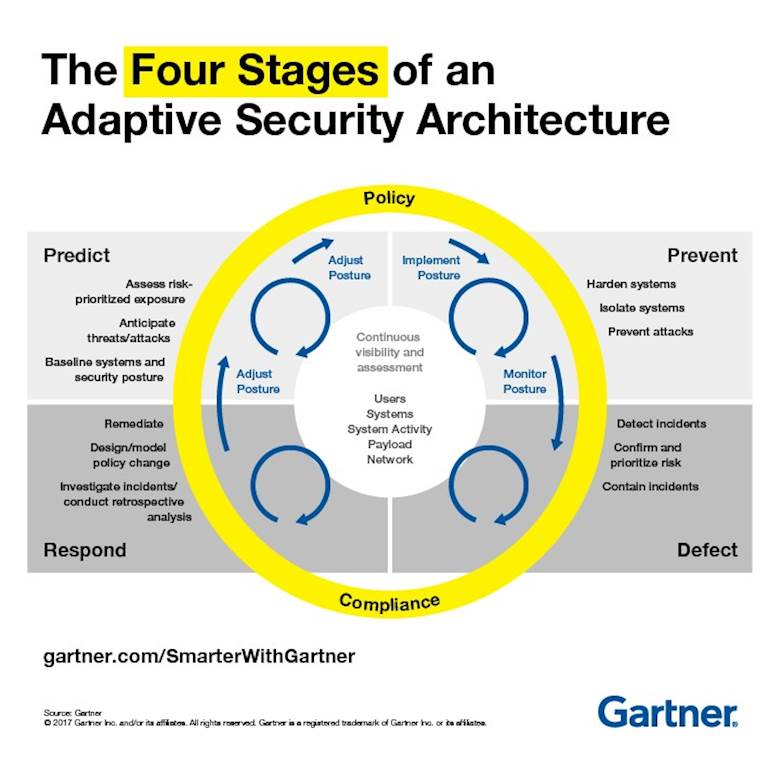

# EDR(Endpoint Detection & Response, 엔드포인트 탐지 및 대응)

## ▣ EDR (EndPoint Detection & Response, 엔드포인트 탐지 및 대응)

- 공격 탐지-대응-차단 최전선
- 엔드포인트에서의 즉각적인 탐지/차단 대응 만이 악성코드로 부터 내부의 정보를 보호할 수 있음
- 알려 지지 않은 공격방법 및 신/변종 악성코드에 대한 대응이 절심함

## 1. EDR(EndPoint Detection & Response) 개요

- EDR은 엔드포인트에서 행위기반으로 시스템을 탐지하고 대응하는 기술
- 엔드포인트 안티 바이러스 및 엔드포인트 관리 솔루션의 요소를 결합하여 네트워크 장치를 관통하는 악성 소프트웨어를 탐지, 조사 및 제거
  - 악성코드에 감염되어 사용자PC에서 일어 날 수 있는 악성 행위를 실시간 탐지 및 차단으로 안전한 환경구성
  - EDR 도구를 사용하여 엔드포인트 침투를 신속하게 완화하고 데이터 손실, 도난 또는 시스템 오류를 방지
- User System 지속적인 가시성 확보 및 검증
  - EDR 도구는 각 특정 장치의 상태를 포함하여 시스템의 전반적인 상태를 보다 잘 보여줌
- EDR은 전통적인 안티바이러스 시그니처로 차단하지 못하는, 알려지지 않은 위협을 분석하거나 탐지할 수 있는 차세대 엔드포인트 보안 기술
- 랜섬웨어와 지능형지속공격(APT) 등 고도화된 보안위협에 효과적으로 대응할 수 있는 강점

## 2. 주요기능

- 분석 및 이상 탐지
  - 행위기반 악성코드 탐지로 알려지지 않은 악성코드에 대해 신속 대응이 가능
  - ZERO-Day 공격에 효과적으로, 원천적으로 대응 가능
  - 네트워크를 우회해서 유입되는 악성코드에 대한 실시간 대응
- 악성 코드 제거
- 데이터 및 시스템에서 멀웨어 검색
- 기기가 손상된 경우 관리자에게 경고 기능

## 3. 가트너 (Gartner)  Research

- EDR이란 엔드포인트 레벨에서 지속적인 모니터링과 대응을 제공하는 보안 솔루션으로 정의

### ○ 예측 (Predict)

- 기본보안태세(Baseline Security Posture)
- 위협예측(Anticipate threats)
- 위험평가(Risk Assessment)

### ○ 탐지(Detect)

- 사고탐지(Detect Incidents)
- 사건포함(Contain Incidents)
- 위험확인 및 우선순위 지정(Confirm and Prioritize Risk)

### ○ 방어 (Prevent)

- 시스템강화(Harden System)
- 시스템 격리(Isolate System)
- 공격방지(Prevent Attacks)

### ○ 대응 (Respond)

- 치료(Remediate)
- Design Policy change
- 사건조사(Investigate incidents)

## 4. EDR(EndPoint Detection & Response) 운영 Flow

- EDR은 미묘하지만 근본적인 방법으로 EPP 보호 모델과 다르며, 악의적인 소프트웨어로 나타나는 방식이 아닌, 자신이하는 일에 따라 위협을 탐지, 식별 및 처리하는 고급 보안 계층을 추가합니다.
- EDR 솔루션은 일반적으로 특정 엔드포인트 활동 및 이벤트를 기록하도록 설계되며 엔드포인트 또는 서버의 중앙에 로컬로 저장됩니다.
- 그런 다음 이러한 솔루션은 이러한 이벤트 데이터베이스를 검색하여 위반에 대한 지표를 식별합니다.
- 이는 공개적으로 사용 가능한 연구, 커뮤니티 기고 및 벤더 연구소를 비롯하여 알려진 IOC (Indication Indicator) 또는 고급 분석을 통해 위협 정보를 적용하는 등 다양한 방법으로 달성 할 수 있습니다.
- 악의적인 IP 주소, URL 및 파일과 같은 단순한 개념에서 공격자가 목표를 달성하기 위해 사용하는 방법과 같은 공통 개념과 같은 잠재적인 위험 활동을 표시합니다.
- 일부 EDR 솔루션은 행동 분석 및 기계 학습과 같은 기타 고급 기술을 적용하여 위험을 식별합니다.
- 따라서 EPP 솔루션과 EDR 솔루션의 주요 차이점은 EPP 솔루션이 자동화 된 엔드포인트에서의 위협을 차단하는 정적 탐지 방법에 중점을 두는 반면 EDR 솔루션은 여러 IOC를 활용하여 고급 공격 및 위협 요소를 식별하고자한다는 것입니다.
- 많은 종단점 (서버 포함)에서 정보를 수집하는 EDR 솔루션은 가능성이있는 잠재적 위협을 식별하는 데 도움이되는 분석을 적용합니다.(조직의 모든 합법적인 트래픽, 엔드포인트 이벤트 및 사용자 활동 중에서 숨어있을 수 있습니다.)
- 일반적으로 엔드포인트 자체에 대한 분석은 수행되지 않지만 엔드포인트 데이터는 서버에 대한 추가 분석을 위해 업로드됩니다.
- 그런 다음 EDR 솔루션은 데이터 과학 모델 및 기계 학습을 포함하는 자체 위협 탐지 방법을 적용하여 의심스러운 잠재적인 악의적인 엔드포인트 활동을 매우 정확하게 탐지합니다.
- 일반적으로 이 시점에서 EDR 솔루션은 예상되는 "위험 수치"를 할당하여 보안 분석가가 이러한 위협을 우선적으로 조사하고 대응할 수 있도록 도와줍니다.

### ■ 참고 : EPP (Endpoint Protection Platform)

>> EPP는 기업 보안 플랫폼으로 PC, 스마트폰, 태블릿 등과 같이 기업의 업무 환경에서 사용하는 엔드포인트의 디바이스를 다양한 위협으로 보호하는 솔루션들을 의미한다.
>> 가트너는 엔터프라이즈 EPP는

- 안티멀웨어(Anti-malware)
- 개인방화벽(Personal firewall)
- 포트&디바이스 컨트롤(Port and devicecontrol)
- 취약점 관리(Vulnerability assessment)
- 애플리케이션 컨트롤 & 애플리케이션 샌드박싱(Application control and applicationsandboxing)
- EMM(Enterprise mobility management)
- 메모리 보호(Memory protection)
- EDR(Endpoint detection and response)
- 데이터 보호(Data protection such as full disk and file encryption)
- DLP (Endpoint data loss prevention) 등을 포함해야 한다고 정의하고 있다.

## 5. EDR(EndPoint Detection & Response) 솔루션의 핵심 요소

- They enable detection
- They cross-correlate data across the whole environment
- They combine whitelisting and blacklisting with behavioral analysis
- They are able to observe endpoint activity without interfering
- They empower IR and forensics investigation
- They enable effective cleanup and remediation
- They work with your antivirus

## 6. 기타 참고 자료

- 엔드포인트 상의 커널 레벨까지 모니터링 해야 하기 때문에 엔드포인트의 안정성이 우선시 돼야 한다
- 기존 백신이나 네트워크 APT 보안 툴로는 부족했던 엔드포인트 보안을 강화할 수 있어야 한다
- EDR 설치 후 네트워크나 USB 등의 모든 경로를 통해 새로 유입되는 파일을 모두 탐지할 수 있어야 한다
- 알려지지 않은 위협에도 확실하게 대응
  - 변종이 많은 악성위협에 대해 즉각적 대응이 가능해야 한다
  - 신종 랜섬웨어와 같은 지능형 공격의 사전차단
- 다양한 탐지 기술(호스트 IPS, 메모리 취약점, 행위분석, 머신러닝, 평판 등)을 통한 이벤트를 생성해야 하며, 추가적인 분석 및 대응, 엔드포인트단 설치에 따른 제품 간 충돌로 인한 시스템 문제를 고려해 단일 에이전트에서 포괄적인 기능을 제공해야 한다
