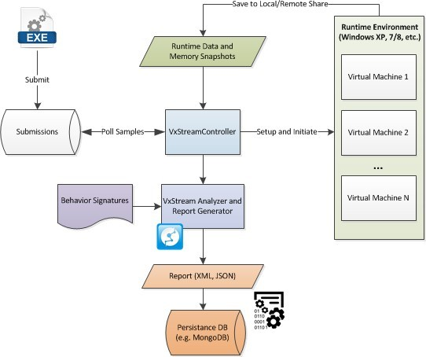

# 인스톨

## 소개



## 환경구성

### Initial Setup

- Falcon Sandbox 사용자 계정
- sudo 그룹추가 : `sudo usermod -aG sudo <vxstreamuser>`

### Package Files

- __VxAnalysisController__
  - VM을 시작/중지, 보고서 생성 프로세스를 시작하는 ‘Controller’를 관리하는 곳.
  - "load-balancer"이며, 주 구성 파일은 vxstreamcontrol.properties
- __VxAnalysisProcessor
  - 정적 분석 엔진뿐만 아니라 "보고서 생성기"가 존재하는 곳
  - 보고서 생성기는 샘플의 동적 분석("런타임 분석")이 완료되고 그 출력이 결과 폴더에 저장되면 호출가장 중요한 파일은 vxstreamcontrol.properties
- __VxAnalysisMonitor__
  - 모든 작업 스크립트와 동적 분석 모니터 코드가 포함,폴더 내용은 각 VM의 공유 폴더에 복제
  - 런타임 동작을 제어하는 옵션은 config.properties 파일을 참조
  - 분석을 위한 커스터마이즈 액션 스크립트를 지정
- __VxAnalysisResults__
  - 분석을 위한 결과를 포함
  - 분석 결과는 분석된 샘플의 SHA256 해시 값(고유 식별자)으로 지정된 폴더에 저장
- __VxAnalysisData__
  - 구성이 필요한 "공유 폴더"(다음 장의 설정 단계 참조).
  - 호스트(외부)와 VM 간의 중요한 브리지, 사용자가 이 폴더에 대한 읽기/쓰기 및 실행 권한을 가지고 있는지 확인
- __VxAnalysisSamples__
  - 이 폴더는 파일 시스템의 "입력 대기열". 분석하고자 하는 샘플을 이 폴더에 떨어뜨리면 실행 중인 경우 컨트롤러가 자동으로 샘플을 잡을 수 있음
- __Extras\VxFuzzer__
  - 게스트 VM을 준비하고 강화하는 데 도움이 되는 스크립트 모음
  - 이 기능을 사용하는 방법에 대한 README.md 파일을 참조
- __Extras\VxPhantom__
  - "Phantom" 조정 플랫폼 애플리케이션

#### 암축해제

```bash
sudo apt-get install p7zip-full p7zip-rar
7z x <name>
```

### Fix Permissions

```bash
sudo find . -type f -exec chmod 664 {} \;
sudo find . -type d -exec chmod 775 {} \;
sudo find . -regex '.*\.\(so\|dll\|exe\|jar\|au3\|bat\|sh\)' -exec chmod 774 {} \;
```

### Update LD_LIBRARY_PATH

"~/.bashrc"

```properties
LD_LIBRARY_PATH=/path/to/VxAnalysisProcessor export LD_LIBRARY_PATH
```

Ldconfig를 이용해 라이브러리 캐시를 업데이트

```bash
sudo ldconfig
```

VxAnalysisProcessor 폴더로 이동하여 libStaticStream.so이 해결되는지 확인

```bash
ldd libStaticStream.so

# (정상)
user@host~/VxAnalysisProcessor$ ldd libStaticStream.so
linux-gate.so.1 =>  (0xf7755000)
librt.so.1 => /lib/i386-linux-gnu/librt.so.1 (0xf76b8000) libpthread.so.0 => /lib/i386-linux-gnu/libpthread.so.0 (0xf769c000)
libBeaEngine_stdcall.so => /VxAnalysisProcessor/libBeaEngine_stdcall.so (0xf7659000) libstdc++.so.6 => /usr/lib/i386-linux-gnu/libstdc++.so.6 (0xf7570000)
libm.so.6 => /lib/i386-linux-gnu/libm.so.6 (0xf752a000) libgcc_s.so.1 => /lib/i386-linux-gnu/libgcc_s.so.1 (0xf750d000)
libc.so.6 => /lib/i386-linux-gnu/libc.so.6 (0xf735d000)
/lib/ld-linux.so.2 (0xf7756000)
```

### 인스톨 Java

- Openjdk7을 적어도 32bit 버전에 설치
- 64bit 시스템을 사용하는 경우 64bit 및 32bit 버전을 모두 설치

Apt로 openjdk를 설치

```bash
sudo apt-get install openjdk-7-jre

## 64bit 배포판을 실행하는 경우 다음 명령을 사용하여 32bit openjdk를 설치
sudo apt-get install openjdk-7-jdk:i386
```

32bit 버전은 jAREE가 메모리 덤프를 통해 정적 분석을 실행하는 데 필요

>> 참고 : 추가 java패키지가 존재하지 않으며 "java"명령 자체가 JDK 7 패키지에 연결되어 있는지 확인
다음 명령을 실행하는 자바 이전 버전을 설치할 수 있다. (이경우 JRE/RDK 6 제거)

  ```bash
  sudo apt-get remove openjdk-6-\* icedtea-6-\*
  ```

### 가상화 환경

#### VirtualBox

#### VMWare

## 분석환경 설정

### VirtualBox상에 생성

### VMWare상에 생성

### Windows 추가 설정

### Network Sniffer 설정

### PCAP 설정

### TOR 설정

## Falcon Sandbox 설정

## Webservice 설정

## 추가 설정

## Best Practice

## Troubleshooting


