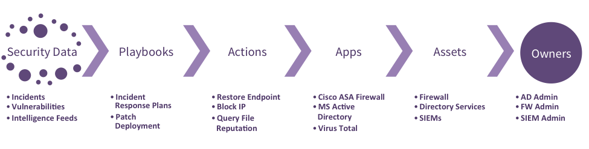

# Phantom Overview

## Key Concepts

Phantom is a first of its kind Programmable Security Controller, intended to allow companies to automate and orchestrate their internal security operations. This section explains a number of high level concepts that will help you to better understand the Phantom platform and how it works.

We have attempted to build as much of Phantom in an open and transparent fashion where possible, leveraging tools and concepts that security engineers already rely on - Python being one prime example.

The below diagram describes the end-to-end flow of how Phantom views the world of security automation.

There are six key components of the Phantom platform that each play a role in delivering end-to-end security automation.

### PLAYBOOKS

PLAYBOOKS are written in Python and define a series of automation tasks - the 'codification' of your security operations plan. PLAYBOOKS operate on new data as it enters Phantom. A typical deployment involves setting up an ingest source to receive data from a number of supported SIEMs, such as IBM QRadar, HP ArcSight, or Splunk. Phantom expects to receive correlated and normalized security events that would be considered "high fidelity". Each event (or incident, or offense) is then processed by a series of Phantom PLAYBOOKS. This event data is stored and handled by Phantom as JSON, and Rules operate on this JSON data. While much of the sample PLAYBOOKS operate on defined SIEM data, this JSON can be anything; in principal, Phantom allows you to write security automation playbooks for any unstructured data that you would like to send to it.

### ACTIONS

ACTIONS are high level primitives that are used throughout the Phantom platform. These are simple, short, and obvious verbs that are used to execute ACTIONS in PLAYBOOKS and manually through the user interface. ACTIONS are vendor and product agnostic. Examples include get process dump, block ip, suspend vm, and terminate process.

### APPS

Phantom APPS extend the Phantom platform by adding connectivity to third party security technologies in order to execute actions. They provide an abstraction layer to the hundreds of possible security products that Phantom may interface with. Phantom APPS are developed by engineers knowledgeable in Python and modern web technologies. APPS expose a list of ACTIONS that they support. APPS MAY also provide a visual component, a widget, that can be used to render data that the App produces. APPS also define which types of assets that they can operate on. Detailed documentation on writing APPS can be found here.

### ASSETS

ASSETS are specific instances of physical or virtual devices within your organization. These may include servers, endpoints, routers, and firewalls among others. ASSETS must be configured within Phantom in order to automate actions on them. ASSETS typically also possess primary and secondary OWNERS.

### OWNERS

OWNERS are those who are responsible for the management of ASSETS within the organization. OWNERS receive APPROVALS. An APPROVAL is a request to execute a particular ACTION on a particular ASSET. APPROVALS are sent to the asset OWNER(s). APPROVALS contain an SLA - dictating the expected response time. APPROVALS are first sent to the primary ASSET OWNERS. If the SLA is breached, then the APPROVAL is redirected to the secondary ASSET OWNER. SLAs can be set on events, phases, and tasks.