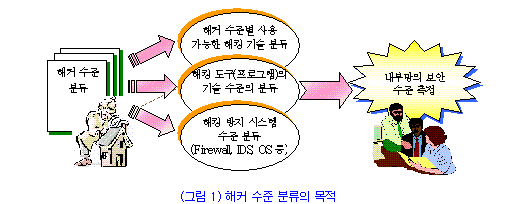
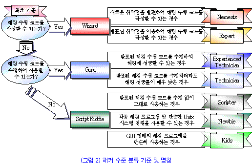
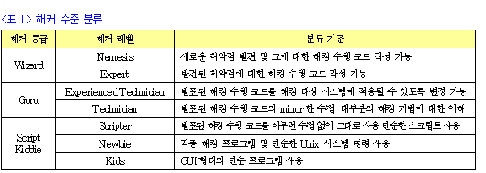
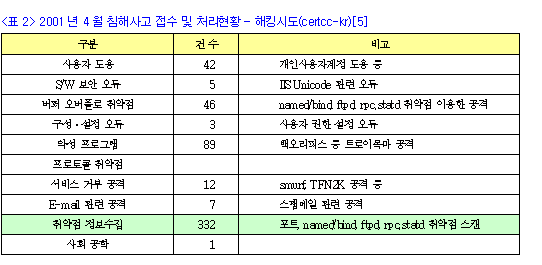
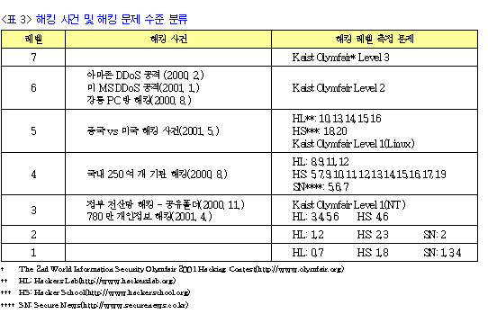

# 공격기법

## 종류

<https://howau.tistory.com/155>

1. 스니핑 : 네트워크 상의 정보를 엿보기
2. 스누핑 : 네트워크 상의 정보를 탈취
3. 스푸핑 : 네트워크 상의 정보를 탈취하여 변조 또는 도용
   - IP주소를 속이면(변조) IP스푸핑
   - DNS를 속이면(변조) DNS스푸핑
   - 스푸핑을 통해 개인정보를 수집하면 파밍
4. 피싱(phishing, Private + Fishing)
    - 이메일을 이용해 가짜 우베사이트에 접속하여 금융정보를 입력하도록 유도
5. 파밍(pharming)
    - 금융기간의 DNS를 탈취하여 가짜 웹사이트에 접속하게하여 개인정보를 탈취
    - 유형 : DNS변조(DNS서버 해킹), 호스트파일 변조, 브라우저 변조(정상 URL을 입력하여도 피싱 사이트로 접속되도록 변조)
6. 비싱(vishing, VoIP + Phishing)
    - 인터넷 전화(VoIP)를 이용하여 사용자가 비밀번호를 입력하면 중계기로 이를 탈취
7. 스미싱(smishing, SMS + Fishing)
    - 인터넷이 가능한 휴대폰 사용자에게 문자를 보내 웹사이트 접속하면 트로이 목마를 주입하여 휴대폰을 통제
8. 스피어피싱
    - 거래처나 지인을 사칭하여 특정 기업이나 개인 정보를 탈취
9. DDos
    - C&C : 좀비PC에게 명령을 내리는 프로그램 서버
    - 좀비PC : bot이라는 악성코드에 감염된 PC. C&C서버와 연결되어 명령을 받고 수행.
    - bot : 좀비PC를 만들기 위한 악성코드. 공격자의 명령에 따라 DDos공격을 수행
10. 지능형 지속위협(APT, Advanced Persistence Threat)
    - 장시간동안 특정목적을 위해 공격진행
    - 침투-검색-수집-유출
11. 웜
    - NW을 통해 자신을 목제(트로이목마는 복제기능 없음)
12. 키로거(key logger)
    - 키보드 입력값을 탈취하는 프로그램
13. 스파이웨어(spyware)
    - 프로그램, 웹브라우저 홈페이지 설정이나 검색설정 정보를 무단으로 수집하여 광고나 마케팅에 이용하기 위해 정보를 불법적으로 탈취
14. FAKEAV
    - 백신을 가장하여 결제를 유도
15. 게임핵
    - 게임에 특화된 악성코드, 계정정보 등을 탈취
16. 루트킷
    - 시스템에 정통한 공격자에 의해 만들어지는 악성코드
    - 자기자신을 은닉하는데 탁월한 기능
17. 랜섬웨어(Ransom-ware)
    - 사용자 정보를 획득한 후 암호화하여 금품을 요구
18. 트랩도어(Trap doors, 백도어)
    - 정상적인 인증절차를 거치지 않고 시스템에 접근하기 위한 방법을 미리설정해놓은 기법
19. 논리폭탄(Logic bomb)
    - 특정 조건이 만족되면 특정 형태의 공격을 하는 기법

## 가장 보편적인 해킹 기법

<http://www.itworld.co.kr/news/113898#csidxcc1496a6f2f98ef9cf6ba785294db49>

1. 소셜 엔지니어링 악성코드

    - 소셜 엔지니어링 악성코드는, 제 1위의 공격 기법이다(버퍼 오버플로우나 구성 오류나 고급 익스플로잇이 아니다).
    - 최근에는 데이터 암호화 랜섬웨어가 주류다.
    - 최종 사용자는 어쩌다가 트로이목마 프로그램을 실행하도록 속아 넘어가는데, 이는 종종 자신이 신뢰하고 빈번히 방문하는 웹사이트에서 일어난다.
    - 다른 경우라면 무해한 웹사이트가 일시적으로 훼손되어 정상적인 웹사이트 코딩이 아닌 악성코드를 전달하는 것이다.

    악성 웹사이트는 사용자에게 웹사이트에 액세스하기 위해 새 소프트웨어를 설치하거나, 허위 안티바이러스를 실행하거나, 불필요하고 악성인 다른 중요 소프트웨어 부분을 실행하도록 종용한다.
    흔히 사용자는 브라우저나 운영체계로부터 나오는 보안 경보를 클릭해 지나치도록, 그리고 방해가 될 수 있는 까다로운 방어 수단을 중지시키도록 지시받는다.  

    트로이목마 프로그램은 정당한 무언가를 하는 척 가장하거나 백그라운드로 사라져 사기 행위를 실행한다.
    소셜 엔지니어링 악성코드는 매년 수억 회의 성공적 해킹에 이용된다.
    수치로만 보면 다른 모든 해킹 유형은 단순히 잡음에 불과하다.

    [대책]
    - 소셜 엔지니어링 악성코드는 최신 위협을 알리는, 예컨대 신뢰성 있는 웹사이트가 뜻밖의 소프트웨어를 실행하라고 종용하는 경우, 지속적인 최종 사용자 교육을 통해 가장 잘 대처할 수 있다.
    - 기업은 강화된 인증서를 이용해 웹을 서핑하거나 이메일에 답장하지 못하도록 해 추가적 보호를 할 수 있다.
    - 최신 안티 악성코드 프로그램은 필요 악이지만, 강력한 최종 사용자 교육이 더 나은 대책이다.

2. 비밀번호 피싱 공격

    - 1위에 버금가는 2위 해킹 기법은 비밀번호 피싱 공격이다.
    - 대략 60–70%의 이메일이 스팸이고, 이 가운데 다수는 사용자를 속여 로그온 인증 정보를 빼내려는 피싱 공격이다.
    - 다행스럽게도, 안티-스팸 사업자 및 서비스 업체가 크게 발전했고, 이에 따라 대다수 사용자의 받은 편지함은 적절히 깨끗한 편이다.
    - 그럼에도 불구하고, 필자는 매일 여러 개의 스팸 이메일을 받고 있으며, 일주일에 최소한 몇 개는 정당한 이메일을 대단히 교묘히 흉내 낸 피싱 메일이다.

    필자는 효과적인 피싱 이메일을 왜곡된 예술 작품이라고 생각한다. 정말 대단해 보인다. 심지어 사기성 이메일에 속지 말라는 경고까지 한다. 정체를 드러내는 유일한 것이라면 인증 정보를 요구하는 허위 링크이다.

    [대책]
    - 비밀번호 피싱 공격에 대한 근본 대책은 그냥 알려줄 수 없는 로그온 정보를 갖는 것이다. 예컨대 이중 인증(2FA), 스마트카드, 생체 정보, 전화통화나 SMS 메시지와 같은 여타 개별 인증 기법이다.
    - 로그온 시 단순한 로그온 이름/비밀번호 조합 이외의 무언가를 활성화할 수 있고, 더욱 강력한 방법을 요구할 수 있다면, 비밀번호 피싱 공격은 끝난 것이다.
    - 하나 또는 그 이상의 시스템에 대해 단순한 로그온 이름/비밀번호 조합을 계속한다면 최대한 정확한 안티-피싱 제품 또는 서비스를 이용하고, 최종 사용자 교육을 강화해 위험을 줄여야 한다.
    - 또한 필자는 URL 줄 안에 호스트의 정확한 도메인 이름을 강조 표시하는 브라우저를 좋아한다. 예를 들어, windowsupdate.microsoft.com.malware.com 같은 주소는 더욱 명확하다.  

3. 패치되지 않은 소프트웨어

    - 소셜 엔지니어링 악성코드 및 피싱의 바로 뒤에는 패치되지 않은 취약점을 가진 소프트웨어가 있다. 패치되지 않아 악용되는 프로그램은 어도비 리더 같은 브라우저 애드-인과 여타 웹 서핑을 용이하게 하는데 흔히 쓰이는 프로그램이다.
    - 여러 해 동안 이런 식이었지만, 이상하게도, 필자가 감사한 회사 가운데 소프트웨어가 완벽하게 패치된 곳은 단 한 곳도 없었다. 패치가 불량한 것이 보통이었다. 도저히 이해할 수 없을 따름이다.
  
    [대책]
    - 실행 중인 것을 즉시 중단하고, 패칭을 완벽하게 실행하라. 이게 가능하지 않다면 일정 기간 내에 무엇이 되었든 가장 악용되는 제품만큼은 완벽하게 만들라.
    - 양호한 패칭이 위험을 줄이는 좋은 방법이라는 것은 누구나 알고 있다. 이를 실천하는 얼마 안 되는 기업이 되도록 하라.
    - 그러나 실현하기 더 좋은 것은, 모든 소프트웨어를 일일이 무리하게 패치하려는 것이 아닌 악용 소지가 가장 높은 소프트웨어를 100% 패치하는 것이다.  

4. 소셜 미디어 위협

    - 온라인 세계는 페이스북, 트위터, 링크드인, 여타 국가별로 유명한 유사 사이트에 의해 주도된다. 소셜 미디어 위협은 허위의 친구 또는 애플리케이션 설치 요청으로 다가오는 것이 보통이다. 운 나쁘게 이런 요청을 수락했다면 자신의 소셜 미디어 계정에 애초 의도했던 것보다 훨씬 더 많은 액세스를 허용한 경우가 흔하다.

    기업 해커들은 소셜 미디어 사이트와 기업 네트워크에서 공통으로 쓰일 수 있는 비밀번호를 수집하기 위해 기업 소셜 미디어 계정을 즐겨 공격한다. 오늘날 최악의 해킹은 다수가 단순한 소셜 미디어 해킹으로 시작되었다. 이를 과소평가해서는 안 된다.

    [대책]
    - 소셜 미디어 위협에 대한 최종 사용자 교육이 필수적이다.
    - 또한 외부 웹사이트에서 기업 비밀번호를 사용하지 않도록 주지시켜야 한다.
    - 좀 더 정교한 2FA 인증 역시 유용할 것이다.
    - 마지막으로, 소셜 미디어 사용자라면 누구든지 해킹된 소셜 미디어 계정을 스스로나 다른 사람 대신 신고하는 법을 알고 있어야 한다.
    - 때에 따라 친구가 뭔가 잘못되었음을 먼저 알아차리는 경우가 있다.

5. APT

    - 필자는 지적 재산을 탈취하는 지능형 지속 위협(Advanced Persistent Threat, APT)으로 인해 막대한 피해를 입지 않은 대기업을 단 한 곳만 알고 있다.
    - APT는 소셜 엔지니어링 트로이목마나 피싱 공격을 통해 교두보를 확보하는 것이 보통이다.

    APT 공격자에게 매우 인기가 좋은 방법은 스피어피싱으로 알려진, 특정한 피싱 공격으로 여러 직원 이메일 주소로 발송하는 것이다. 피싱 이메일에는 트로이목마가 첨부되어 있고, 최소 한명의 직원이라도 속아 넘어가면 프로그램이 실행된다. 최초 실행 및 1차 컴퓨터 점유가 끝나면 수시간 내에 APT 공격자는 회사 전체를 초토화할 수 있다. 감행하기 쉬운 공격이지만, 깨끗이 제거하는 데에는 엄청난 고통이 따른다.

    [대책]
    - APT를 검출하고 예방하는 일은 쉽지 않고, 공격자가 집요한 경우라면 특히 그러하다.
    - 앞에서 언급한 모든 조언이 적용되고, 거기에다 정상적 네트워크 트래픽 패턴을 이해하고 예상을 벗어난 흐름에 대해 경고하는 법을 배워야 한다.
    - APT는 어떤 컴퓨터가 어떤 다른 컴퓨터에게 일상적으로 소통하는지 알지 못하지만, 내부인이라면 이를 안다.
    - 네트워크 흐름을 추적하는 것을 시작해 어떤 트래픽이 어디로부터 어디로 가야 하는지를 확실히 이해하라.
    - APT는 소란을 피우면서 한 서버로부터 데이터를 대량 복사해 해당 서버가 평소에 소통하지 않는 서버로 이를 전송하려고 할 것이다. 이 때 이들을 잡아낼 수 있다.

    다른 유명한 공격 유형들, 예컨대 SQL 인젝션(SQL injection), XSS(cross-site scripting), 패스-더-해시(pass-the-hash), 비밀번호 추측(password guessing) 등은 앞서 언급한 5가지 유형의 공격에 상당하는 수준까지는 아니다. 상위 5가지 유형의 위협으로부터 스스로를 보호한다면, 기업 환경 내의 위험이 크게 줄어들 것이다.
  
    무엇보다도, 필자가 언급한 상위의 위협에 대응해 방어와 완화를 정렬시키도록 강력하게 권고한다. 값비싸고 화려한 보안 프로젝트에 지출을 했지만, 정작 쉽게 차단할 수 있는 라우터를 통해 침투 당하는 그런 기업이 되지는 말자.
  
    마지막으로, APT 유형의 공격을 검출하는 전문 제품이나 서비스를 이용하라. 이들 제품 또는 서비스는 호스트 기반 침입 탐지 서비스처럼 회사의 모든 컴퓨터에서 실행되거나, 아니라면 악성 징후를 찾아 이벤트 로그를 대조한다. APT를 검출하기 까다로운 시절은 이미 지났다. 여러 보안 공급업체가 초기의 공백을 메웠고, 구매하기도 용이한 편이다.

    결론적으로, 가장 유력한 위협이 무엇인지 파악하고, 해당 위협에 대비하라. 잘못되고 가능성 낮은 시나리오에 자원을 낭비하는 기업이 너무 많다. 위협에 대한 정보를 회사 환경의 구성 및 취약점과 대조해보자. 그리고 가장 유력한 위협에 대비하기 위해 무엇을 할 것인지 결정하라. editor@itworld.co.kr  

## 해커 및 해킹 기법 수준 분류

<https://www.itfind.or.kr/WZIN/jugidong/1010/101002.htm>

최근 인터넷을 이용한 각종 해킹 및 사이버 범죄가 크게 증가하고 있으나, 아직까지 공격의 주범인 해커들의 수준을 파악하지 못한 상황이다.
과거에 해커 분류를 시도한 경우가 있었지만 적용한 분류 기준은 대부분 해커들의 행동 양식이었다.
이에 본 문서에서는 해킹 수행 코드를 작성할 수 있는가의 여부를 바탕으로 해커의 능력을 분류하고 그들이 사용할 수 있는 해킹 기법과 그 수준을 확인해 보도록 한다.
이러한 해커 수준에 따른 해킹 기법 분류를 기반으로 내부망의 보안성 평가에 활용할 수 있을 것이다.

### I. 서 론

1990년대에 들어서면서 WWW(World Wide Web)를 이용하여 다중 매체에 대한 서비스가 제공되기 시작하면서 인터넷 사용이 급증하기 시작하였다.
인터넷 사용의 급증에 편승하여 일반 기업 및 공공 기관에서도 인터넷을 이용하여 각종 서비스를 제공하기 시작하였고, 사용자들은 더 많은 서비스를 요구하게 되었다.
서비스를 제공하는 기관들의 목표는 보다 빠르고 안정적인 서비스 제공에 맞춰지게 되었고, 시스템의 보안성 강화를 위한 투자는 서비스의 양적 질적 향상을 위해 투자하는 비용에 비해 상대적으로 매우 적은 상황에 놓이게 되었다.
따라서 많은 취약점들이 서버에 존재하게 되었고, 해커들은 이러한 보안 취약점을 이용하여 해킹을 시작하였다.
서비스 제공 업체들은 시스템 보안의 중요성을 인식하고 과거에 비해 많은 비용을 투자하며 자사의 시스템과 네트워크를 보호하기 위해 노력하고는 있으나, 해커들은 간단한 시스템 취약점을 이용하는 해킹기법부터 최근 분산화, 암호화, 에이전트화 기법 등이 적용된 복잡하면서도 고도화된 다양한 해킹방법을 동원하기 때문에 쉽게 방어하지 못하고 있는 상황이다.

인터넷을 이용하여 접근 가능한 거의 대부분의 시스템들이 취약점을 가지고 있다고 볼 수 있는 상황에서, 그리고 해킹 시도를 막기 위해 사용하는 각종 보안 강화시스템(IDS, Firewall 등) 역시 완벽하다고 할 수 없는 상황에서 고도의 해킹 기술을 사용할 수 있는 해커들에게는 무방비 상태로 개방되어 있다고 말할 수 있다.

해커의 공격으로부터 자신의 시스템과 네트워크를 보호하기 위해서는 해커들이 어떠한 방식으로 해킹을 시도하는지를 파악하여 그에 대비할 수 있어야 한다.
이것을 위해서는 해커의 수준을 분류하고 각각의 수준에 따른 해커의 해킹 기법을 분류하여 효과적인 공격자 파악이 절실하다.
그러나 현재까지는 해커의 행동 양식을 기준으로 분류한 해커 분류안은 존재하나 해커의 구체적인 해킹 수준을 기준으로 분류한 해커 분류안은 부족한 상태이다. 이에 본 문서에서는 구체적인 기준을 바탕으로 해커의 수준을 분류해보고 각각의 수준에 해당하는 해킹 기법에는 어떤 것들이 있는지 알아보도록 한다.
해커의 수준 분류는 해커의 해킹 시도를 효과적으로 파악할 수 있게 하고, 내부망의 보안성 평가에도 활용될 수 있을 것이다.

본 문서는 다음과 같이 구성되어 있다.
II장에서는 기존 해커 수준 및 해킹 기법 분류안을 확인해 보도록 하고,
III장에서는 구체적인 분류기준을 사용하여 해커의 수준을 분류하고,
IV장에서는 해킹 기법을 분류하고 분류된 해킹 기법에 수준을 부여하도록 한다.
그리고 V장에서 결론을 내리도록 한다.

### II. 기존 해커 수준 및 해킹 기법 분류

기존의 해커 분류는 해커의 수준을 통한 분류가 아닌 해커의 행동 양식에 따른 분류만이 이루어진 상태이거나 해커와 크래커를 분류하기 위해 그 단어의 의미만을 강조하여 설명한 것이 대부분이었다[1,2].
이에 반해 본 문서에서는 해커 능력에 대한 구체적인 기준을 제시하고 이 기준을 바탕으로 해커의 수준을 분류하도록 한다.

여기서 사용하는 “해커”라는 단어의 의미는 해킹을 시도하는 모든 사람을 의미한다.
흔히 알고 있는 “크래커(cracker)”와 반대되는 좋은 의미나 뛰어난 실력의 고수를 의미하는 뜻으로는 사용하지 않는다.

#### 1. Gilbert Alaverdian의 분류 기법

기존에 발표된 해커 분류안 중에 해커의 수준을 감안한 분류안은 Gilbert Alaverdian에 의해 발표된 분류기법이 대표적이다[1]. Gilbert Alaverdian은 해커를 다음과 같이 총 5가지로 분류하고 있다.

가. Elite

- 엘리트 해커는 해킹하고자 하는 시스템에 존재하는 취약점을 찾아내고 그것을 이용해 해킹에 성공하는 최고 수준의 해커
- 해킹을 시도하는 목적은 단지 자신이 해당 시스템을 아무런 흔적 없이 해킹할 수 있다는 것을 확인하기 위함

나. Semi Elite

- 세미 엘리트 해커들은 컴퓨터에 대한 포괄적인 지식이 있고, 운영체제 시스템을 이해하고 있으며, 운영체제에 존재하는 특정한 취약점을 알고, 그 취약점을 공격할 수 있는 코드를 만들 수 있을 정도의 최소한의 지식으로 무장
- 이들은 해킹 흔적을 남겨서 추적을 당하기도 함

다. Developed Kiddie

- 이들은 보통 십대 후반의 학생들로 대부분의 해킹 기법들에 대해 알고 있음
- 해킹 수행 코드가 적용 될 수 있을 만한 취약점을 발견할 때까지 여러 번 시도해 일단 시스템 침투에 성공하는 경우
- 성공된 해킹에 대해 자랑하고 다님
- 보안상 취약점을 새로 발견하거나, 최근 발견된 취약점을 주어진 상황에 맞게 바꿀만한 실력이 없음

라. Script Kiddie

- 네트워킹이나 운영체제에 관한 약간의 기술적인 지식이 부족한 이들은 GUI 운영체제 바깥 세상으로 나와본 적이 없음
- 이들에게 있어 해킹은 보통 잘 알려진 트로이 목마를 사용해 평범한 인터넷 사용자를 공격하고 괴롭히는 것
- 이들은 대부분 학생으로 컴퓨터 수업시간에 선생님이 모르는 것이 있으면 이들에게 물어본다. 때문에 이들보다 낮은 레벨의 학생들은 이들을 엘리트 레벨로 착각하고 우러러보게 됨

마. Lamer

- 해커는 되고 싶지만 경험도 기술도 없는 이들
- 이들은 네트워크와 운영체제에 관련해 기술적인 지식이 없다.
- 이들이 컴퓨터를 사용하는 유일한 목적은 게임과 IRC 채팅, 와레즈 사이트를 찾거나 크레디트카드 사기 등
- 신문 잡지 등의 대중매체를 통해 해커에 익히 들은 바 있는 이들은 스스로를 엘리트로 착각하는 그릇된 우월감에 빠져 있음
- 트로이 소프트웨어, 누킹, DoS 툴만 있으면 크래킹을 할 수 있다는 생각에 트로이 목마나 GUI 운영 체제용 해킹 도구를 내려 받음

#### 2. 기존 해킹 기법 분류

현재 대부분의 해킹 대응을 위한 서비스를 제공하는 각종 업체 및 기관에서 주로 사용하고 있는 해킹 기법 분류안은 침입차단 시스템을 가장 처음으로 만든 Marcus J. Ranum에 의해 분류된 것으로 다음과 같다[3].

- 사용자 도용(Impersonation)
- SW보안오류(SW Vulnerability)
- 버퍼 오버플로 취약점(Buffer Overflow)
- 구성설정오류(Configuration Vulnerability)
- 악성프로그램(Malicious Codes)
- 프로토콜취약점(Protocol Infrastructure Error)
- 서비스거부공격(Denial of Service Attack)
- E-mail 관련 공격(E-mail Vulnerability)
- 취약점정보수집(Vulnerabilities Probing)
- 사회공학(Social Engineering)

- 위 해킹 기법 분류안은 대부분의 해킹 기법을 포함하고 있고, 아직까지 이 분류를 그대로 사용하는 것에 큰 문제는 없으나, 과거 자주 사용되던 여러 해킹 기법 중에 현재는 거의 사용되지 않거나 하나의 큰 분류로 나누기에는 무리가 있는 부분이 있다.
- 특히 비슷한 종류의 다른 해킹 기법들이 존재하기 때문에 통합시키고 다시 분류해야 할 부분이 존재한다.
- 예를 들어 E-Mail 관련 공격의 경우는 해킹이라고 보기에는 문제가 있으며, 전자우편 폭탄과 같은 방법은 일종의 서비스 거부공격이라고 할 수 있다.
- 또한 버퍼 오버플로의 경우에는 버퍼 오버플로 자체뿐만 아니라, 포맷 스트링 공격이나, 경쟁 조건을 이용한 공격 등을 하나의 공격 형태로 분류하여 프로그래밍 상의 오류를 이용한 해킹 기법으로 분류해야 한다.

### III. 해커 수준 분류안

#### 1. 해커 수준 분류의 목적

해커 수준 분류의 목적은 해커의 수준을 분류함으로써 각 수준의 해커가 사용하는 해킹 기술과 해킹 도구의 기술 수준을 분류하고, 해킹을 방지하기 위한 보안 시스템의 수준을 분류한 후, 모든 것들을 종합하여 내부망의 보안 수준을 측정하기 위한 기반을 마련하기 위함이다.

본 고에서는 해커의 수준 분류와 해당 수준의 해커가 활용할 수 있는 해킹 기법에 대한 분류 만을 설명한다.

#### 2. 해커 수준 분류

앞서 살펴본 Gilbert Alaverdian의 분류 방법은 해커의 행동양식에 중점을 두고 그 수준을 분류하였다. 즉 해커의 수준을 구분한 구체적인 기준을 제시하지는 못하였다. 그러나 본 문서에서는 여러 가지 구체적인 기준을 제시하여 크게 3가지로, 작게 7가지로 분류한다. 각각의 분류를 쉽게 이해하기 위해 각 수준별 호칭을 결정하였다.

본 고에서는 해킹 수행 코드(exploit code)를 스스로 작성할 수 있는가 여부를 최초 기준으로 삼기로 한다. 여기서 말하는 해킹 수행 코드라는 것은 어떤 취약점이 발표되었을 때 해당 취약점을 이용하여 해킹에 성공할 수 있도록 작성한 일종의 프로그램을 의미하는 것으로, 취약점의 종류와는 상관없이, 즉 취약점의 난이도와는 상관없이 해당 해킹 수행 코드를 작성할 수 있는지 여부에 따라 구분하도록 한다.

본 고에서 큰 분류에 사용하는 명칭(Wizard, Guru, Script Kiddie)은 이미 많은 분야에서 수준을 나타내기 위해 사용하던 명칭이다. 특히 Wizard, Guru는 유닉스의 사용 능력을 나타내는 것으로 “What is the Guru?”라는 문서에 잘 나타나 있다[8]. Script Kiddie는 “Know Your Enemy”라는 문서에 그 정의가 설명되어 있다[9].

가. Wizard – 해킹 수행 코드 작성 가능

앞서 언급한 바와 같이 해킹 수행 코드 작성 가능이란 의미는 난이도가 낮은 간단한 취약점을 이용하는 해킹 수행 코드 뿐만 아니라 버퍼 오버플로 공격이나 포맷 스트링 공격 등과 같은 프로그래밍 상의 오류를 이용한 공격과, 각종 프로토콜 상의 문제점을 이용한 해킹 수행 코드를 작성할 수 있는 경우를 의미한다. 이렇게 해킹 수행 코드를 직접 작성하여 해킹할 수 있는 수준의 해커를 “Wizard”라고 부르도록 한다. 해킹 수행 코드를 작성할 수 있는 수준의 해커는 다음의 2가지 수준으로 나누어 볼 수 있다.

① Nemesis - 새로운 취약점을 발견하고 그에 대한 해킹 수행 코드 작성 가능

새로운 취약점을 발견하고 그에 대한 해킹 수행 코드를 만들 수 있는 해커는 최고 수준의 해커라고 볼 수 있다. 이 수준의 해커는 자동화, 에이전트화, 은닉화, 분산화된 해킹 도구를 제작할 수 있는 능력을 가지고 있으며, 시스템에서 수행되는 여러 작업간의 유기적인 문제를 이해하고 있다. 다른 수준의 해커들과 구별되는 가장 큰 특징은 창의적인 생각을 할 수 있고, 문제가 생기면 스스로 해결책을 찾아나갈 수 있는 능력이 있다는 것이다. 이 수준의 해커를 “Nemesis”라고 부르도록 한다. “Nemesis”라는 것의 원래 의미는 고대 그리스 신화에 나오는 여신의 이름으로, 악한 짓을 저지르거나 오만한 행동을 하는 인간이나 신을 처벌하는 복수의 여신이다.

② Expert - 기존에 발견된 취약점에 대한 해킹 수행 코드 작성 가능

기존에 발견된 취약점에 대한 해킹 수행 코드를 작성할 수 있는 해커는 여러 OS에 대해 각각의 시스템 구조를 자세하게 이해하고 있으며, 복잡한 네트워크 프로그래밍이 가능하고, 시스템에서 제공하는 서비스 및 각종 프로토콜과 프로그램 등의 구조적인 문제를 이해하고 분석할 수 있는 능력이 있다. 이 수준의 해커를 “Expert”라고 부르도록 한다.

나. Guru - 해킹 수행 코드의 수정 사용 가능

발표된 해킹 수행 코드를 수정하여 해킹하고자 하는 시스템에 적용할 수 있고, 이를 통해 해킹 성공률을 높일 수 있는 수준의 해커를 “Guru”라고 부르도록 한다. 이 수준의 해커들은 이미 발표된 해킹 수행 코드를 해킹하려는 시스템에 적용 가능하도록 수정하여 해킹 성공률을 상당히 높일 수 있는 수준인가, 성공을 위해 해킹 수행 코드를 변경시키더라도 성공확률이 높지 않은 수준인가에 따라 2가지 수준으로 나누어 볼 수 있다.

① Experienced Technician - 발표된 Exploit Code 수정으로 해킹 가능 수준

이 수준의 해커는 기 발표된 해킹 수행 코드를 해킹하려는 시스템에 적용되도록 수정하여 해킹에 성공할 수 있는 수준의 해커를 의미한다. 이 수준의 해커는 여러 가지 운영체제에 대한 낮은 수준의 시스템 구조를 이해하고 있으며 각종 프로토콜을 이해하고 있다. 또한 어느 정도 수준의 네트워크 프로그래밍이 가능한 수준으로 해킹 수행 코드자체를 이해하고 각각의 코드들이 어떤 동작을 하는지 알고 있다. 만약 원하는 해킹 대상 시스템에 기존에 발표된 취약점이 존재하고, 이에 대한 해킹 수행 코드가 존재한다면 해킹이 가능하다. 이 수준의 해커를 “Experienced Technician”이라고 부르도록 한다.

② Technician - 발표된 해킹 수행 코드를 수정하더라도 해킹 성공률이 낮은 수준

이 수준의 해커는 해킹하고자 하는 시스템에 해킹 수행 코드를 적용하기 위해 몇 가지 간단한 내용을 수정하지만 해킹 성공 가능성은 매우 희박한 수준이다. 비록 해킹 대상 시스템에 대한 취약점 점검을 통해 어떤 취약점이 있는지 확인하고, 해당 취약점에 대한 해킹 수행 코드를 찾을 수 있는 능력은 있지만, 만약 얻은 해킹 수행 코드가 해킹하려는 시스템에 정확히 일치하는 것이 아니면 해킹에 성공할 확률이 낮은 해커이다. 그러나 이러한 수준의 해커는 일반적인 시스템 프로그래밍이 가능하고 대부분의 해킹기법을 이해하고 있다. 그리고, 시스템 설정과 관련된 간단한 취약점을 이용하여 해킹이 가능하며, 기본적인 시스템 구조를 이해하고 있고, 간단한 네트워크 프로그래밍이 가능한 능력을 가지고 있다. 이러한 수준의 해커를 “Technician”이라고 부르도록 한다. 해킹 기법을 연구해본 사람은 알 수 있겠지만, 해킹 기법을 이해하는 것과 그 해킹 기법을 이용하여 실제 해킹에 성공하는 것은 크게 다르다.

다. Script Kiddie - 해킹 수행 코드 및 해킹 프로그램의 단순 사용

발표된 해킹 수행 코드나 각종 해킹관련 사이트에서 얻을 수 있는 각종 프로그램을 단순히 사용하는 수준의 해커를 말한다. 물론 이 수준의 해커는 해커라고 불리지 않는다. 대부분 크래커라고 불리거나 과거 분류에 따라 스크립트 키디(script kiddie), 혹은 워너비(want to be, wannabe, 해커가 되고 싶은 사람)라고 불린다[4]. 본 문서에서는 이와 같이 이미 알려진 간단한 시스템 설정 문제나 소프트웨어 자체의 취약점을 이용하거나, 기 발표된 해킹 프로그램을 아무런 수정 없이 사용하는 수준의 사람을 “Script kiddie”라고 부르도록 한다.

① Scripter - 발표된 해킹 수행 코드를 수정 없이 그대로 사용하는 수준

이 수준의 해커는 획득한 해킹 수행 코드를 수정 없이 실행하거나, 단순한 스크립트들을 수행시키는데, 이러한 수준의 해커는 해커라고 불리지 않는다. 이들은 획득하게 되는 각종 GUI 형태 및 UNIX 기반 해킹 프로그램을 단순히 설치하여 실행할 뿐이다. 기존에 알려져 있는 시스템이나 각종 서비스의 취약점에 대해 여러 명령어들을 이용하거나 웹 브라우저 상의 단순한 코드 조작으로 해킹할 수 있는 능력은 있으나, 해킹 수행 코드 자체를 이해하지는 못한다. 이러한 수준의 해커를 “Scripter”라고 부르도록 한다. 물론 이 수준의 해커 역시 해킹 수행 코드가 적용될 수 있는 시스템에 대한 해킹을 시도하는 경우에는 해킹이 가능하다.

② Newbie –각종 해킹 프로그램 및 단순한 Unix 명령 사용 가능 수준

이 수준의 해커는 해킹 수행 코드라는 것이 무엇인지 이해하지 못하는 수준으로 해킹 사이트 등에서 얻어낸 각종 해킹 프로그램을 단순히 사용하는 수준이다. 이제 막 해킹 기법을 익히기 시작한 이들은 Unix시스템을 사용해본 경험이 있고, 몇몇 시스템 명령어를 사용할 수 있으며, 네트워크와 시스템에 대한 약간의 지식을 가지고 있지만 해킹에 적용시킬 능력은 없다. 사용하는 명령어 자체에 대한 이해 역시 부족하다. 대부분 GUI 형태의 해킹 프로그램을 사용한다. 이러한 수준의 해커를 “Newbie”라고 부르도록 한다. “Newbie”는 초보, 신참을 의미한다.

③ Kids - GUI 형태의 해킹 프로그램을 단순히 사용하는 수준

이 수준의 사람은 DoS 프로그램이나 패스워드 크랙 도구만 있으면 모든 사이트를 해킹할 수 있다고 생각하는 사람으로, 네트워크나 시스템에 대한 지식이 전무하며, 단순히 얻게 된 해킹 프로그램을 설치하여 실행해 본다. 또한 이런 류의 사람이 사용하는 프로그램은 GUI형태의 해킹 프로그램으로, PC방 등에 트로이잔 형태의 프로그램을 설치하고 해킹에 성공했다고 생각하는 사람이다. 해킹과 관련된 지식이 전무한 상태이다. 이러한 수준의 해커를 “Kids”라고 부르도록 한다.

현재 활동중인 거의 대부분의 해커들이 “Technician” 수준을 벗어나지 못한다. 이는 Gilbert Alaverdian의 분류에서도 언급된 Developed Kiddie 수준으로 이들은 단순히 발표된 해킹 수행 코드의 작은 수정을 통해 해킹에 종종 성공하기도 하는 수준이다. 매스컴을 통해 보고되는 거의 대부분의 해킹 사건들은 이 수준의 해커에 의해 시도되는 사건들이다.

### IV. 해킹 기법 분류 및 수준 부여

해킹은 시스템에 존재하는 각종 취약점을 이용하여 이루어진다. 따라서 시스템 관리자에 의해 기존에 발표된 취약점들이 패치된 경우에는 해당 취약점을 이용할 수 없지만 그렇지 않은 경우에는 오래된 해킹 기법을 그대로 사용할 수 있게 된다. 따라서 현재 해커들에 의해서 사용되고 있는 해킹 기법에는 오래 전에 사용되던 기법에서부터 최근에 발표된 복잡하고 고도화된 기법 등 매우 다양한 형태가 존재한다. 이번 장에서는 이러한 해킹 기법을 몇 가지로 나누어 분류하고 해당 분류안에 포함될 수 있는 해킹 기법들의 수준을 분류하도록 한다. 그리고 이러한 해킹 기법 수준 분류를 이용하여 몇몇 해킹 사건의 레벨을 부여하고, 현재 각종 사이트에서 제공하고 있는 해킹 레벨 측정 문제들의 수준을 부여한다. 해킹 사건의 경우 하나의 해킹 사건에 여러 가지 해킹 기법이 포함되는 것이 일반적이기 때문에 적용될 수 있는 가장 높은 레벨을 부여하였다.

#### 1. 해킹 기법 및 수준 분류의 기준

가. 해킹 기법 분류의 기준

해킹 기법들은 현재 알려져 있는 여러 해킹 기법들의 동작방식이나 목표, 사용하는 취약점 등을 기준으로 하여 분류하도록 한다. 적용되는 분류 기준의 우선 순위를 다음과 같이 정의한다.

- 기준 1: 공격의 목적
- 기준 2: 사용하는 취약점의 종류
- 기준 3: 일련의 해킹 과정에 포함될 수 있는 여러 방법

공격의 목적으로는 특정 권한 획득, 정보수집, 서비스 거부 공격(시스템 마비) 등이 있을 수 있고, 해킹에 사용되는 취약점의 종류로는 시스템 및 서비스 설정과 관련된 취약점, 프로그램 상의 오류로 인한 취약점, 각종 프로토콜 상의 취약점 등이 있을 수 있다. 그리고 일련의 해킹 과정에 포함될 수 있는 여러 방법으로는 악성 코드, 기타 여러 방법이 포함될 수 있다.

실제로 해킹 기법을 분류할 때, 하나의 해킹 기법은 여러 해킹 분류에 포함되어 질 수 있다. 예를 들어, 분산 서비스 거부 공격의 경우에는 프로토콜 상의 문제점을 이용하여 공격을 수행하게 되는 것이 대부분인데, 이 경우 사용하는 취약점의 종류에 따른 분류와 공격의 목적에 따른 분류에 포함될 수 있다. 또한 정보 수집에 이용되는 Banner Grabbing의 경우에는 시스템 설정과 관련된 취약점을 이용하여 정보 수집을 하게 되므로 2가지 분야에 포함되어 질 수 있다. 이러한 경우, 우선 순위에 따라 해킹 기법을 분류하도록 한다.

현재 대부분의 해킹 기법들은 해킹 대상 시스템의 특정 권한(루트 혹은 특정 사용자 권한)을 얻는 데 사용되어지는 기법들이다. 따라서 많은 해킹 기법들이 특정 권한 획득 분류에 포함되어 지게 되는데, 이런 경우 그 분류의 효율성이 매우 떨어지게 되므로 기준 1에서 특정 권한 획득으로 분류되는 해킹 기법에 대해서는 기준 2를 적용하여 다시 재 분류하도록 한다. 또한 프로토콜의 취약점을 이용한 정보수집, 예를 들어 패킷 훔쳐보기(packet sniffing) 등은 정보 수집의 목적보다는 프로토콜 취약점을 이용한 해킹에 더 큰 비중이 있다고 판단하여 프로토콜 취약점을 이용한 해킹 분류에 포함시키도록 한다. 따라서, 본 문서에서는 서비스 거부 공격, 정보 수집, 시스템 및 서비스 설정 취약점, 프로그램 상의 취약점, 프로토콜 상의 취약점, 악성 코드, 기타의 총 7가지 분류를 사용하도록 한다.

이와 같이 분류하게 되면 앞서 II장에서 설명한 기존의 분류기법과 약간의 차이를 보이게 된다. 기존의 버퍼 오버플로 취약점은 다른 여러 프로그래밍 상의 오류 및 프로그램 자체의 문제점을 이용하는 해킹 기법에 포함되어 삭제되고, 사용자 도용 해킹 방법은 특정 권한을 획득하기 위한 해킹 기법으로 분류되어 사용자 도용 해킹 방법들의 특징에 따라 여러 해킹 기법으로 분산된다. 또한 사회 공학 방법은 특정 권한을 얻기 위한 해킹 기법이지만 특별한 시스템, 프로그램, 혹은 기타 프로토콜의 취약점을 이용하는 것이 아니기 때문에 기타에 포함된다.

나. 해킹 기법 수준 분류의 기준

해킹 기법에 수준을 부여하기 전에 먼저 해킹 기법에 대한 수준을 부여하는 것의 목적은 앞서 언급했던 내부망의 보안성 평가의 기초가 되기 위한 작업이라는 것을 다시 한번 강조한다. 따라서 해킹 기법 수준 분류는 이미 정의한 해커의 수준 분류와 호환성을 유지하여야 하므로 해킹 기법 수준 분류 역시 총 7개의 레벨로 분류하도록 하고, 다음과 같은 기준을 바탕으로 해킹 기법에 대한 수준 분류를 시도한다.

- 기준 1: 해킹 기법의 수준은 어느 레벨의 해커가 사용할 수 있는 가에 따라 결정
- 기준 2: 프로그램을 이용하여 높은 수준의 해킹 기법을 사용하는 경우는 해당 프로그램에 적용된 해킹 기법의 수준을 이용하여 수준 분류

이와 같은 기준을 사용하는 이유는 첫째, 해커의 수준 분류와 호환되도록 분류하기 위해서 이고, 둘째 비록 낮은 수준의 해커라 할지라도 높은 수준의 해커에 의해 제작된 높은 기술 수준의 해킹 기법을 사용할 수 있는데, 이런 경우 해당 해킹 기법을 낮은 수준의 해킹 기법으로 분류해서는 안되기 때문이다. 레벨 7의 경우, 이미 알려져 있는 해킹 기법은 레벨 6의 해커에 의해서도 쉽게 사용되어질 수 있으므로, 현재 알려져 있는 레벨 7에 포함되는 해킹 기법은 없다고 판단했다.

해킹 프로그램을 이용하여 해킹하는 경우에 대해서는 악성코드 분류에서 유명한 몇몇 해킹 프로그램들에 대해 프로그램 자체의 수준 분류를 한다. 해킹 프로그램을 사용할 수 있는 해커의 수준과 관련된 보다 자세한 내용은 생략한다.

#### 2. 해킹 기법 및 수준 분류

가. 시스템 및 서비스 설정 취약점

이 분류에는 시스템 및 시스템에서 제공하는 각종 서비스의 설정과 관련된 취약점을 이용한 해킹 기법이 포함된다. 시스템 및 서비스 설정 문제를 이용한 해킹은 그 수준이 그리 높지 않은 경우가 대부분이다. 이는 일반적인 시스템 보안 취약점 분석도구를 이용하여 발견할 수 있고, 해킹을 위해 특별한 해킹 수행 코드가 필요 없는 경우가 대부분이기 때문이다.

본 분류에서는 레벨 3에는 파일 시스템의 쓰기 권한 취약점을 이용하는 경우와, suid 프로그램 관리상의 문제를 이용하는 경우, 환경 변수를 이용하는 경우가 포함된다. 이는 시스템 명령어들을 사용할 수 있고, 이를 이용하여 시스템 설정들을 확인할 수 있는 경우 해킹에 쉽게 적용시킬 수 있는 방법들이다. 레벨 4에는 r-series 프로그램의 설정 문제, ftp, nfs/nis, dns, sendmail, http 서버 설정 문제, X윈도 설정 및 인증 문제, 기타 데몬의 권한 설정 및 쉘 수행 가능 여부를 포함시켰다. r-series 프로그램이라는 것은 rlogin 과 같이 알파벳 ‘r’로 시작하는 각종 프로그램들을 의미한다. 이는 특별한 인증과정 없이 다른 시스템에 접속할 수 있기 때문에 잘못된 설정으로 인해 간단히 해킹당할 수 있다. 패스워드 암호방식을 이해하여 간단한 프로그램을 작성할 수 있어야 패스워드 크래킹이 가능하므로 패스워드 크래킹 역시 레벨4에 포함시킨다. 패스워드 크래킹은 패스워드 설정 시 취약한 패스워드를 사용하는 경우에 발생할 수 있기 때문에 본 분류에 포함시켰다. 그 외에 각종 서비스들에 대한 설정 문제를 이용한 해킹은 해당 서비스에 대한 충분한 지식이 필요하기 때문에 레벨 4에 포함시켰다.

나. 프로그램 상의 취약점

프로그램 상의 취약점에는 프로그래밍 상의 보안 오류와 프로그램 동작 상의 보안 오류로 인하여 발생하는 취약점이 있을 수 있다. 후자의 경우에는 프로그램 단독으로 문제가 일어나는 경우도 있지만 여러 프로그램이 동시에 수행될 경우에 문제가 발생하는 경우도 있다. 프로그램 동작 상의 오류로 인한 문제는 특정 프로그램에 대한 문제로 권고문의 형태로 알려지고 패치가 가능하게 된다.

프로그램 오류를 이용한 기법은 해킹의 핵심이라고 할 수 있는데, 본 분류에는 레벨 3에 CGI/JAVA 스크립트 취약점, ASP, PHP 스크립트 취약점을 포함시켰다. 각종 스크립트 언어의 취약점은 기본적으로 각종 소스 파일들을 읽을 수 있는 능력이 있어야 하기 때문이다. 일반적으로 각종 스크립트의 취약점들은 스크립트 자체의 문제만으로 해킹에 이용되는 경우 보다는 다른 해킹 기법과 연관되어 이용되는 경우가 대부분이다. 레벨 4에는 버퍼 오버플로 공격, 힙 오버플로 공격, Race Condition을 포함시켰다. 이는 가장 기본적이면서도 가장 널리 사용되는 해킹 기법들이다. 이러한 해킹 기법을 익히고 이해하는 것과 실제 해킹 수행 코드를 작성할 수 있는 수준은 확연히 다르다. 여기서는 이러한 해킹 기법을 이해하고 간단한 해킹 수행 코드를 이해할 수 있는 수준으로 판단하고 레벨 4를 부여하였다. 레벨 5에는 Win32 버퍼 오버플로, 포맷 스트링 공격, OMEGA 프로젝트, Frame Pointer 오버플로 공격을 포함시켰다. 이는 기존에 알려져 있는 해킹 기법과 그 수준 차이는 크게 나지 않지만 널리 알려지지 않아 일반적인 버퍼 오버플로 해킹 기법보다 이해하기가 어려운 해킹 기법들이기 때문이다. 포맷 스트링 공격이나 Frame Pointer 오버플로 공격의 경우에는 최근 널리 활용되기도 하는 공격기법이다. 이 수준의 해커들은 위 해킹기법에 대한 이해뿐만 아니라 이를 이용한 해킹 수행 코드를 이용하여 실제 해킹을 수행할 수 있는 수준이다. 레벨 6에는 프로그램 설계 상의 보안 문제, 각종 보안 강화도구 회피, Shared Library Redirection, 종료되지 않은 인접 메모리를 이용한 오버플로 해킹 기법을 포함 시켰다. 레벨 6에 해당하는 해킹 기법은 프로그램 설계 상의 보안 문제를 활용할 수 있는 수준의 해킹 기법으로 프로그램의 흐름을 파악하고 취약점을 이해할 수 있는 능력이 있어야 한다. 또한 보안 강화도구 회피 기법은 각종 보안 강화 프로그램들의 동작방식을 이해하고 있어야 하므로 레벨 6에 포함시켰다.

다. 프로토콜 취약점

프로토콜의 취약점이란 TCP/IP뿐만 아니라 각종 인터넷 프로토콜(ICMP, ARP, RARP, UDP 등등)의 설계 상의 취약점을 말한다.

프로토콜의 취약점을 이용하는 경우 해커는 각종 프로토콜 자체를 이해하고 있어야 한다. 따라서 다른 해킹 기법보다 높은 수준이 된다. 일반적으로 프로토콜 취약점을 이용한 해킹은 기 작성된 해킹 프로그램을 이용하는 경우가 대부분이다.

본 분류에서 레벨 4에는 Packet Sniffing, Connection Reset(ICMP)을 포함 시켰는데, 이 해킹 기법은 단순한 네트워크 프로토콜 상의 취약점을 이용하는 것으로 특별한 능력이 필요한 것은 아니기 때문이다. 즉, 네트워크 상에서 다른 호스트로 전송되는 패킷을 수집하여 확인하거나 전송되는 패킷에 대해 reset 패킷을 전송하는 것 만으로 수행 가능한 해킹 기법이기 때문이다. 레벨 5에는 IP Spoofing 을 포함 시켰는데, IP Spoofing은 전송되는 패킷의 헤더 부분의 IP 주소만을 변경시키는 것이 아니라 통신하고자 하는 대상 시스템의 SYN 번호를 guessing하는 것이 필요하기 때문이다. 레벨 6에는 Session Hijacking, Packet Redirection(ICMP), Routing Table 변경, ARP를 이용한 MAC Address 조작, Port Redirection을 포함시켰다. 이는 각종 프로토콜에 대한 구조적인 문제를 완벽히 이해해야 하고 상당한 수준의 네트워크 프로그래밍이 가능해야 하기 때문이다.

라. 정보 수집

정보 수집이라는 것은 취약점 분석 도구 혹은 시스템 명령어 등을 이용하여 해킹하고자 하는 시스템에 대한 정보를 수집하는 행위를 말한다. 최근 보고되는 대부분의 해킹 시도가 정보 수집과 관련된 것이다

일반적으로 정보 수집에 활용되는 도구로는 각종 취약점 전체를 확인해 주는 취약점 분석 도구뿐만 아니라 단순히 특정 취약점이나 포트만을 검색하는 도구들도 존재한다. 최근에 가장 많이 사용되는 프로그램으로는 nmap과 nessus등이 있다. 최근에는 취약점 점검 방법의 다양화로 인해 IDS와 같은 보안 강화도구 조차 취약점 점검을 당하고 있다는 것을 탐지하지 못하는 경우가 발생하기도 한다.

정보 수집이라는 것은 시스템에 침투하고 시스템 내부에서 일정 권한을 얻어내는 일반적인 해킹 기법은 아니다. 그러나 최근에는 시스템의 취약점을 수집하는 정보수집 자체도 해킹의 일부로 판단하고 해킹으로 구분하고 있다. 낮은 수준의 해커라도 다양한 보안 스캐너를 인터넷 상에서 쉽게 얻어 사용할 수 있다. 물론, 일반적으로 해킹을 하려하는 높은 수준의 해커들 역시 정보 수집을 위해 기 제작된 보안 스캐너를 그대로 사용하는 경우가 많은데, 이는 빠르고 정확하며 손쉽게 사용할 수 있기 때문이다. 특히 nessus1)나 nmap2)의 경우에는 decoy scan, stealth scan등을 구현하여 사용할 수 있게 함으로써 비록 낮은 수준의 해커라 하더라도 높은 수준의 정보 수집 기술을 사용할 수 있는 상황이다.

정보 수집과 관련된 해킹 기법에 대해 단순 포트 스캔, 간단한 시스템 명령을 이용한 정보수집은 레벨 2에 포함시켰다. 단순 포트 스캔이라는 것은 해당 포트로 접근을 시도하여 포트가 열려있는가를 확인하는 작업으로 이는 정상적인 행위로 받아들여지게 되므로 IDS등에 로그가 남지 않게 된다. 물론 이러한 방법은 시스템 자체의 로그에는 기록되게 된다. 이 기법은 간단한 시스템 명령어인 ping, traceroute 등의 명령을 이용하여 정보를 수집하게 된다. 레벨 3에는 복잡한 시스템 명령을 이용한 정보수집, 각종 서비스에서 제공하는 명령을 통한 정보 수집, Banner Grabbing을 포함시켰다. 시스템 명령을 자세히 알고 있는 경우에는 각종 보안 스캐너를 이용하지 않더라도 포트 스캔이나 취약점을 확인할 수 있다. 이런 경우에 활용되는 명령으로는 rpcinfo, showmount 등이 있다. 레벨 4에는 Finger Printing, SNMP를 이용한 정보 수집을 포함 시켰는데, 이 경우는 telnet, ftp, http 등 각종 서비스에서 제공하는 각종 메시지를 확인함으로써 정보를 확인하는 경우와, SNMP를 이용하여 정보를 얻어내는 경우이다. 특히 SNMP를 이용하는 경우에는 시스템 설정에 따라 해당 시스템에서 현재 수행되고 있는 모든 process들에 대한 정보도 얻을 수 있다. 레벨 6의 경우에는 Combined Scan/Distributed Scan/Stealth Scan/Decoy Scan, TCP/IP 스택을 이용한 스캔을 포함시켰다. 최근 발표되고 있는 각종 IDS들이 해당 네트워크에 대한 스캔 공격을 탐지하고 있다. 그러나 레벨 6에 포함되어 있는 기법을 사용하는 경우 효과적으로 탐지하지 못하게 된다.

마. 서비스 거부 공격

최근 들어 가장 큰 문제가 되고 있는 해킹 기법 중의 하나가 서비스 거부 공격이다. 특히 분산 서비스 거부 공격의 경우에는 그 피해 정도가 매우 크기 때문에, 많은 보안 관련 업체들이 관심을 가지고 해결하려는 부분이다. 서비스 거부 공격이란 간단히 말해서 시스템이 정상적으로 동작하지 않도록 만드는 공격 기법으로 시스템의 관리자 권한을 얻기 위해 시도되는 일반적인 해킹과는 차이가 있다.

특히 문제가 되는 것은 네트워크를 통하여 원격지에서 시스템이 정상적으로 동작하지 않도록 공격하는 경우인데, 이런 경우에는 공격 대상 시스템뿐만 아니라 공격 대상과 같은 네트워크 상에 있는 다른 시스템에도 피해를 줄 수 있기 때문에 더 큰 문제가 되고 있다.

본 분류의 레벨 3에는 간단한 프로그래밍으로 수행할 수 있는 로컬 시스템 상에서의 서비스 거부 공격을 포함시켰는데, 이는 비교적 쉬운 공격 방법으로, 디스크 채우기, 메모리 고갈 시키기, 프로세스 무한 생성 등이 있다. 레벨 4에는 SYN Flooding/Ping Flooding, Mail Storm, Java Applet Attack/UDP Storm를 포함시켰다. 이 레벨은 TCP/IP, ICMP 등의 각종 프로토콜을 이해하고 있는 경우에만 사용할 수 있는 방법이지만, 그 난이도가 그리 높지 않은 방법이다. 레벨 5의 경우에는 Tear Drop, 일반 DDoS, Smurfing을 포함시켰는데, Tear Drop의 경우는 IP Fragmentation 기법에 대한 이해가 필요하고, 일반 DDoS의 경우 에이전트 형태의 백도어를 설치하는 것과 같은 수준의 기술이 필요하기 때문이다. 레벨 6에는 암호화된 DDoS를 포함시켰는데, 실제로 암호화된 DDoS는 거의 모든 해킹 기법이 포함되어 있다고 볼 수 있기 때문이다.

바. 악성 코드

악성 코드에는 바이러스, 트로이잔, 백도어 등이 포함되고, 여러 해킹 기법이 포함되어 스스로 시스템을 해킹하고 자기복제를 실시하는 웜 역시 악성 코드에 포함된다. 본 문서에서는 주로 백도어와 트로이잔에 대해서 설명하도록 한다. 웜의 경우에는 웜 자체의 기술 수준이 매우 높기 때문에 단순히 높은 수준으로 분류하도록 하기 위함이며, 바이러스에 대해서는 실제로 해킹과는 거리가 있기 때문이다. 본 분류에서 바이러스와 관련된 내용에 대해서는 안철수 바이러스 연구소에서 분류한 바이러스 분류안을 이용하여 수준을 분류한다[6,7].

최근에는 트로이잔이나 백도어에 매우 다양화되고 고도의 기술이 포함되어지고 있다. 뿐만 아니라 일반 초보 해커들 조차 쉽게 사용할 수 있을 만큼 간단하고 편리한 사용자 인터페이스를 갖춘 프로그램들이 발표되고 있다.

레벨 3의 경우에는 인터넷 서비스를 이용한 루트 권한의 shell bind, 파일 및 부트 바이러스를 포함시켰다. 인터넷 서비스를 이용한 루트 권한의 shell bind의 경우에는 일단 로컬 시스템 내부에서 루트 권한을 얻은 후에 inetd.conf 파일을 조작하여 루트 권한의 shell을 bind시키는 것으로 매우 간단한 일이다. 레벨 4에는 단순한 백도어 프로그램과 암호화 바이러스를 포함시킨다. 단순 백도어 프로그램이란 각종 시스템 프로그램에서 특정 ID와 패스워드를 입력하는 경우 루트 권한의 쉘을 실행시키도록 만든 것이다. 그러나 이러한 백도어는 파일 크기와 생성 일시가 원본 파일과는 다르기 때문에 쉽게 찾아 낼 수 있는 백도어 이다. 레벨 5에는 은폐형 바이러스, 매크로 바이러스와 원본과 동일한 크기와 생성 일시를 갖는 백도어를 포함시켰다. 레벨 6에는 Raw Socket을 이용한 shell bind, 에이전트형 백도어, Reverse telnet, ssh, 커널 레벨 백도어, Stealth Backdoor, 각종 웜, 다형성 바이러스를 포함시켰다. Raw Socket을 이용하여 shell을 bind시키는 경우에는 시스템 명령(netstat 등)을 통해 시스템에 연결되어 있는 커넥션을 확인할 수 없게 된다. 커널 레벨 백도어의 경우도 기존의 백도어 확인 프로그램을 이용하여 존재여부를 확인하는 것이 매우 어려워진다. 이에 위 백도어 기술들을 레벨 6에 포함시킨다. 그리고 윈도용 각종 트로이잔 프로그램(Back Orifice, Sub7 등)을 레벨 6에 포함시킨다.

사. 기타(사용자 도용)

“가”~“바”까지 설명된 분류에 포함되지 않지만 해커의 수준을 측정하는 데 유용한 몇가지 해킹 기법들을 이 분류에 포함시켰다. 본 분류에서는 레벨 3에 일부 로그 삭제를 포함 시켰는데, 이는 시스템에 기록되는 각종 로그 기록이 어느 위치에 저장되는지를 알지 못하는 수준이기 때문이다. 레벨 4에 간단한 암호화 알고리즘의 decryption과 모든 로그 삭제를 포함시켰는데, 로그가 기록되는 모든 파일을 삭제함으로써 로그 삭제가 이루어진 것을 시스템 관리자가 확인할 수 있게 되는 수준이기 때문이다. 레벨 5에는 사회공학적인 방법과 패스워드 추측, 레벨 6에는 다른 로그에 영향 없이 자신의 흔적 제거를 포함시켰다. 로그가 기록되는 파일 내에서 해커 자신과 관련된 로그 기록만 삭제하는 것으로 시스템 관리자는 아무런 흔적도 찾을 수 없게 된다.

#### 2. 해킹 레벨 분류 예제

이번 절에서는 과거 발생했던 해킹 사건에 사용된 해킹 기법을 토대로 레벨 분류한다. 대부분의 해킹 사건들이 보도되는 경우, 해킹 여부에 초점이 맞춰지고 사용된 해킹 기법에 대해서는 자세한 설명이 없어서 많은 해킹 사건을 포함시키지 못하였다.

해킹 레벨 측정을 위해 각종 사이트에서 제공하는 문제는 모두 해결한 후에 그 수준을 부여하였다. 해킹 레벨 측정 문제 중 “Kaist Olymfair”로 표시한 문제는 지난 2001년 5월에 있었던 “제2회 정보보호 올림페어”의 일환으로 실행되었던 해킹 컨테스트에 제출된 문제를 의미한다.

### V. 결 론

21세기가 시작되면서 인터넷이라는 매체는 없어서는 안될 존재가 되었지만, 인터넷을 통한 각종 범죄 역시 급증하고 있어 그 역기능 또한 심각한 수준이 되었다. 이런 사이버 범죄에는 많은 종류가 있으나 허가되지 않은 시스템 접근을 통해 불법적인 행위를 저지르는 경우가 대부분이다. 그러나 아직까지 정보보호관련 업계에서는 각종 사이버 범죄를 저지르는 해커들이 과연 어떠한 기법을 이용하여 해킹을 시도하고 그들의 수준은 어느 정도 되는지를 구체적으로 정의하지 못한 상태이다. 이에 본 문서에서는 해커의 수준을 “해킹 수행 코드를 작성할 수 있는가?”, “해킹 수행 코드를 수정할 수 있는가?”라는 기준을 이용하여 크게 3가지로 분류하고, 취약점 발견 가능 여부, 발견된 취약점을 이용한 해킹 수행 코드작성 가능 여부, 발표된 해킹 수행 코드의 수정 가능 여부, 각종 해킹 프로그램의 단순한 사용 여부, Unix 형태의 OS사용 경험 등의 기준을 이용하여 세부적으로 분류하였다. 이에 크게 Wizard, Guru, Scrip Kiddie로 나누고, 세부적으로는 Nemesis, Expert, Experienced Technician, Technician, Scripter, Newbie, Kids의 총 7가지로 구분하였다.

또한 해커들이 사용하는 해킹 기술을 분야별로 정리하여 분류하였으며, 각 분야에 따른 해킹 기술의 수준을 부여하여 분류하였다. 단, 각각의 해킹 기술에 대한 레벨을 부여할 때, 해당 수준의 해커가 사용할 수 있는 기술을 염두에 두지 않은 것은 아니나 낮은 수준의 해커들도 높은 수준의 해커가 작성한 각종 해킹 프로그램들을 이용하여 높은 수준의 해킹 기법을 사용할 수 있기 때문에, 해킹 기술 자체의 수준을 가지고 레벨 분류를 수행하였다.

본 문서에서 제시한 해커 및 해킹 기술 수준 분류를 이용하는 경우 각종 해킹 프로그램의 수준을 정의할 수 있으며, 또한 이를 이용하여 보안 강화 시스템들의 수준을 분류할 수 있을 것으로 생각된다. 이 모든 것을 이용하는 경우, 실제로 운영되는 특정 네트워크의 보안 수준을 측정하는 유용한 방법이 될 것이다.

<https://m.blog.naver.com/PostView.nhn?blogId=jhs941009&logNo=220846231277&proxyReferer=http%3A%2F%2Fwww.google.com%2Furl%3Fsa%3Dt%26rct%3Dj%26q%3D%26esrc%3Ds%26source%3Dweb%26cd%3D2%26ved%3D2ahUKEwikhaX_18vmAhURfd4KHQoqAkwQFjABegQICxAG%26url%3Dhttp%253A%252F%252Fm.blog.naver.com%252Fjhs941009%252F220846231277%26usg%3DAOvVaw2Tjt9qS2a2WYgm9ki2nN0M>