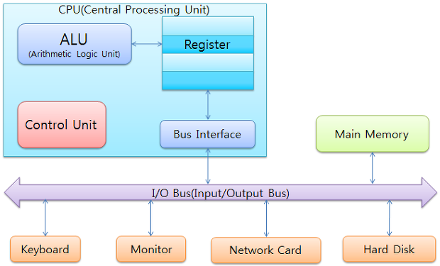
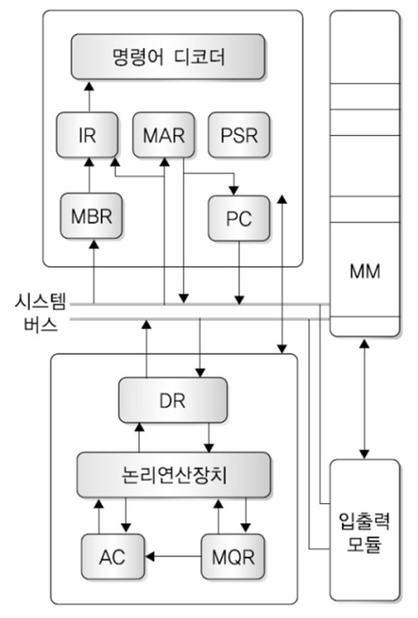

# 시스템 보안

## 운영체제 이해 및 관리

CPU - 입력장치로부터 자료를 받아 연산하고 그 결과를 출력장치로 보내는 일련의 과정을 제어 조정하는 장치

ALU(연산장치) - 산술연산, 논리연산
Register - 고속의 전용 영역
Control Unit(제어장치) - 프로그램 명령어 해석, 제어신호들 발생
내부 CPU버스 - ALU와 레지스터 간의 데이터 이동을 위한 경로

내부레지스터

PC(Program Counter) - 다음에 수행할 명령어가 저장된 주기억장치의 번지를 지정(프로그램 수행을 제어하는 명령어의 실행 순서를 보관)
MAR(Memory Address Register) - 주기억장치에 접근하기 위한 주기억장치의 번지를 기억
MBR(Memory Buffer Register) - 주기억장치에 입/출력할 자료를 기억하는 레지스터(버퍼레지스터)
IR(Instruction Register) - 주기억장치에서 인출한 현재 명령코드를 기억하는 레지스터(현재 수행중인 명령어를 저장하는 레지스터)
PSR(Program Status Register) - 프로그램 매순간 수행상태와 프로세스 상태를 저장하는 레지스터
DR(Data Register) - 연산에 필요한 피연산자를 저장하는 레지스터
AC(Accumulator) - 연산장치의 입출력 데이터를 임시적으로 기억하는 레지스터
MQR(Multiplier Quotient Register) - 곱셈에서 곱수를 나눗셈에서 몫을 저장

버스 - 시스템에 많은 장치를 공유하여 데이터, 주소, 제어정보를 전달하는 전송 라인(주기억장치:명령어와 자료 저장 -- 중앙처리장치:명령어처리)

내부버스 - 프로세스 내부에서 레지스터, 연산장치를 연결, 외부버스(External bus)와 연결
외부버스 - 프로세스와 메모리, 프로세서와 입출력장치, 입출력장치와 입출력장치를 연결

데이터버스(Data Bus) - 시스템 컴포넌트 간 처리 데이터를 전송(양방향)
주소버스(Address Bus) - 기억장소의 위치 또는 장치 식별을 지정하기 위한 라인(단방향)
제어버스(Control Bus) - CPU와 기억장치 또는 I/O 장치 사이의 제어 신호를 전송하는 라인(단방향)

CPU 명령어 실행 주기(Instruction Cycle)
패치(fetch) - 인출단계는 메모리에서 데이터를 로드하여 CPU에 있는 레지스터에 적제하는 과정
간접(indirect) - 메모리를 참조할 때 간접주소 방식을 사용하는 경우에 실행
실행(execution) - 명령과 데이터로 CPU가 산술 및 논리연산을 수행하는 것
인터럽트(interrupt) - 하드웨어 인터럽트(기계착오 인터럽트, 외부 인터럽트, 입출력 인터럽트, 프로그램 검사 인터럽트), 소프트웨어 인터럽트(CPU 명령에 관련된 모듈변화일때 발생)

기억장치 계층구조

크기, 속도, 가격당 성능에 따라 분류된 기억장치를 계층적으로 구성함

- 액세스 속도가 높아질수록 비트당 가격도 높아진다.
- 용량이 커질수록 비트당 가격은 낮아짐
- 용량이 커질수록 엑세스 속도는 낮아짐

레지스터 > 캐시 > 주기억장치 > 보조기억장치

캐시메모리
중앙처리장치가 읽어들인 데이터(명령, 프로그램)들로 채워지는 버퍼형태의 고속 기억장치
직접사상(Direct Mapping)
연관사상(Associate Mapping)
직합 연관사상(Set Associate Mapping)

캐시메모리 관리방식

캐시메모리 인출방식

- Demand Fetch
- Pre-Fetch

캐시메모리 교체 알고리즘
Random
FIFO(First In First Out)
LFU(Least Frequently Used)
LRU(Least Recently Used)
Optimal
NUR(Not Used Recently)
SCR(Second chance Replacement)

페이지교체 관리시 문제점
Page Fault발생
Demand Paging
Thrashing 발생

페이지교체 관리 문제 해결 방안
Load Control
Locality(구역성)
Working Set(워킹셋)
PFF(Page Fault Requency)

캐시메모리 일관성(Cache Coherence)
Write-Through
Write-back

가상 메모리(Virtyal Memory)

- Paging 기법
- Segment 기법

- 할당기법(Allocation)
- 호출기법(Fetch Policy)
- 배치기법(Placement)
- 교체기법(Replacement)

할당 정책(Allocation Policy)

- 연속할당(고정분할,가변분할)
- 비연속할당(Paging,Segment)

- Paging 메모리 관리 기법
- Segmentation 메모리 관리 기법
- Paged Segmentation 기법

I/O 인터페이스

입출력 방법
CPU 경우 : 프로그램에 의한 I/O, 인터랩터에 의한 I/O
CPU 비경유 : DMA(Direct Memory Access Controller), Channel I/O

프로그램에 의한 I/O
인터랩터에 의한 I/O

DMA(Direct Memory Access)
CPU개입 없이 I/O 장치와 기억장치 사이의 데이터를 전송하는 접근 방식
Cycle Stealing
Burst Mode

I/O Processor
Multiplexer Channel
Selector Channel
Block Multiplexer Channel
Byte Multiplexer Channel

## 운영체제 구조

운영체제의 목적

- 처리능력의 향상
- 신뢰성 향상
- 응답시간의 단축
- 자원 활용률 향상
- 가용성 향상

운영체제의 주요 자원 관리 기능

- 프로세스 관리
- 기억장치 관리
- 주변장치 관리
- 파일 관리

운영체제의 분류

- Batch Processing System
- Multi Processing System
- Time Sharing/Multi-tasking System
- Multi-Processing System
- Real-time System
- Multi-Mode Processing
- Distributed System

프로세스
쓰레드

Admit
Dispatch
Timer Run out
Blocked
Wake up
Release

Context Switching

PCB(Process Control Block)

PCB에서 유지되는 정보
PID
포인터
상태
Register save area
Priority
Account
Memory Pointers
입출력 상태 정보
할당된 자원 정보

장기스케줄러
중기스케줄러
단기스케줄러

선점
비선점

스캐줄링 기법
FCFS(Firtst Come First Service)
SJF(Shortest Job First)
Round Robin
SRT(Shortest Remaining Time)
Multi Level Queue
Multi Level Feedback Queue

병행성 제어(Concurrency Control)

상호배제(Mutual Exclusion Techniques)
임계영역(Critical Section)
세마포어(Semaphore), 모니터(Monitor)

교착상태(Dead Lock)
교착상태 대응방법

- 교착상태 예방(Prevention)
- 교착상태 회피(Avoidance)
- 교착상태 발견(Detection)
- 교착상태 회복(Recovery)

장치관리기법

디스크관리(Disk Management)

- 탐색시간(Seek Time)
- 회전 지연시간(Rotation delay time)
- 전송시간(Transfer time)

디스크 스케줄링 종류

- FCFS(First Come First Served)
- SSTF(Shorter-Seek Time First)
- SCAN(엘리베이터 알고리즘)
- C-SCAN(Circular-SCAN)
- C-LOOK(Circular-Look)

파일시스템

FAT(File Allocation Table: FAT16,FAT32)
NTFS(New Technology File System)
EXT(Extended File System: EXT,EXT2,EXT3,EXT3)
UFS(Unix File System)

RAID
RAID(Redundant Array of Independent Disks)
RAID0(Stripe,Concatenate)
RAID1(Mirroring)
RAID2(Hamming Code ECC)
RAID3(Parity ECC)
RAID4(Parity ECC, Blook 단위 I/O)
RAID5(Parity ECC, Parity 분산 저장)
RAID4(Parity ECC, Parity 분산 복수 저장)
